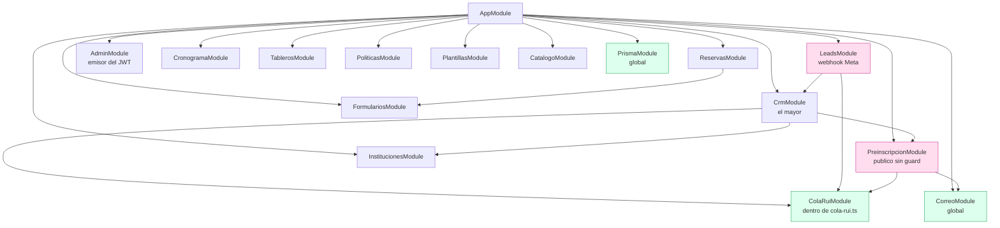
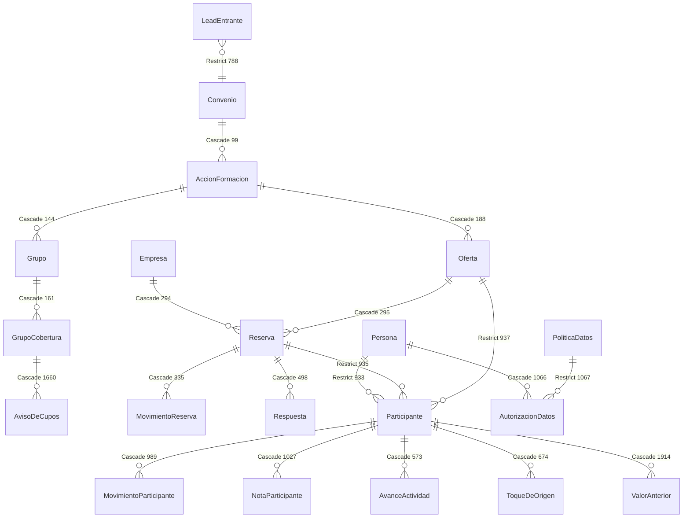

# 00 · Mapa actual del repositorio

**Fase 0 — inventario. Solo lectura: no se modificó ni una línea de código de producción.**

| | |
|---|---|
| Rama | `arq/crm-hardening`, creada desde `buscador-nit-port` con el árbol limpio |
| Método | 9 agentes de inventario en paralelo + 3 de contraste adversarial + 1 crítico de completitud |
| Coste | 13 agentes, 0 fallos, 567 usos de herramienta |
| Corrección | El contraste encontró **33 errores y 41 omisiones** en el inventario. Este documento recoge la versión corregida, no la primera |

## Cómo leer las marcas de confianza

- **`CONFIRMADO EN CÓDIGO`** — se abrió el archivo y se leyó la línea.
- **`INFERIDO`** — se deduce de varias evidencias, ninguna concluyente por sí sola.
- **`SUPUESTO`** — no está en el repo; lo asumí. Todos van listados al final.

Toda cita es `ruta:línea` relativa a la raíz. Donde no encontré algo, lo digo con el comando
que usé, no con un silencio.

---

## 1. Estructura y puntos de entrada

`CONFIRMADO EN CÓDIGO`

Monorepo pnpm con dos paquetes: `backend/` (NestJS) y `frontend/` (Next.js).

**Un solo punto de entrada de aplicación.** `NestFactory` aparece únicamente en
`backend/src/main.ts:93`. No hay segundo bootstrap, ni proceso worker aparte, ni Dockerfile de
worker: los ~20 guiones de `backend/prisma/` son `ts-node` sueltos.

En contenedor, antes de `main.ts` corre `backend/arrancar.sh`, que hace tres cosas en orden:
Xvfb en `:99` solo si `WEB_CON_CABEZA=1` (`arrancar.sh:16-26`), luego
**`pnpm exec prisma migrate deploy` (`arrancar.sh:29`)** y por último `exec node dist/main.js`.

> **Las migraciones se aplican en cada arranque del contenedor.** No hay paso manual ni
> aprobación: si la imagen sube, la migración corre. Es el mecanismo que falló con el enum
> `toques_de_origen`.

### Módulos (16 `@Module`)

`AppModule` (`backend/src/app.module.ts:24`) importa 14 de dominio más `ConfigModule` y
`ThrottlerModule` (60 peticiones/minuto, guard global `ThrottlerIpGuard`).

Dos módulos son `@Global` y no hace falta importarlos: `PrismaModule`
(`backend/src/prisma/prisma.module.ts:6`) y `CorreoModule` (`backend/src/correo/correo.module.ts:19`).

**`ColaRuiModule` no tiene archivo propio**: vive al final de `backend/src/crm/rui/cola-rui.ts:128`.
Existe para romper un ciclo — `CrmModule` importa `PreinscripcionModule`, y preinscripción
necesita encolar sin arrastrar el CRM entero.



### Cinco piezas periódicas, ningún planificador

`NO ENCONTRADO: @nestjs/schedule, @Cron, bull, bullmq, agenda ni node-cron.`
Comprobado con `grep -rn "@Cron|@Interval|ScheduleModule"` sobre `backend/src` y con búsqueda en
los tres `package.json`. Todo lo periódico está hecho a mano dentro del proceso del backend:

| Pieza | Cadencia | ¿Interruptor? |
|---|---|---|
| `RuiWorker` | bucle | apagado salvo variable de entorno |
| `WebWorker` | 6 s / 10 s | apagado salvo variable de entorno |
| `CampanasWorker` | 1-3 s / 60 s | apagado salvo variable de entorno |
| **`Matricula`** | `setInterval` cada 1 h | **arranca SIEMPRE** |
| **`VigiaDeCupos`** | `setInterval` cada 12 h | **arranca SIEMPRE** |

`NO ENCONTRADO: cualquier advisory lock, elección de líder o candado que impida que dos
backends corran los mismos workers.`

**Dentro de una sede eso no puede pasar**: `container_name: reservasae_backend`
(`docker-compose.yml:18`) impide escalar el servicio. **El riesgo está entre sedes** — ver el
hallazgo crítico 10 y
[`docs/operacion/comprobaciones-en-servidor.md`](../operacion/comprobaciones-en-servidor.md).

El cron real de la instalación son **seis timers de systemd** en `docs/systemd/`, y son de
infraestructura (túnel, base, conmutación entre sedes), no de negocio.

---

## 2. Esquema de datos

`CONFIRMADO EN CÓDIGO` — `backend/prisma/schema.prisma`, 1921 líneas leídas enteras.

| Métrica | Valor |
|---|---|
| Modelos | 43 (todos con `@@map`) |
| Enums | 31 |
| `@@unique` de tabla | **22** (decía 23; corregido en Fase 1) · más 6 `@unique` en línea |
| `@@index` | 62 |
| Claves primarias compuestas | 0 |
| Migraciones | 43 |
| **Triggers, funciones y vistas** | **0** — toda la lógica vive en el backend |
| `CHECK` constraints | **17**, y solo existen en el `.sql` |

### El reparto de `onDelete` (68 relaciones)

- **36 `Cascade`** — el riesgo principal para INV-1.
- **24 `SetNull`**
- **8 `Restrict`** — el muro. Cinco están en `Participante` (`schema.prisma:933-938`:
  persona, convenio, reserva, oferta, accionFormacion) y tres en otros modelos:
  `CargaDeParticipantes.convenio` (`:650`), `LeadEntrante.convenio` (`:788`) y
  `AutorizacionDatos.politica` (`:1067`).
- **8 sin declarar** (`:145, :162, :189, :296, :336, :499, :1126, :1287`) — rige el implícito
  de Prisma, que en relación obligatoria es `Restrict`.

> **El muro funciona a medias.** En una base con fichas de participante, borrar un Convenio,
> una Oferta o una Persona **aborta**, no cascadea. Pero donde sí cascadea —borrar una
> `Empresa` arrastra sus `Reserva`— el contador `Oferta.cuposOcupados` **queda inflado y
> ningún CHECK lo detecta**. `CONFIRMADO EN CÓDIGO` (`schema.prisma:294-295`).

### Diagrama ER — la cadena de INV-7

Solo el núcleo. Los 43 modelos completos no caben en un diagrama legible.



> ### ⚠️ Corregido en Fase 1 — esto que sigue era FALSO
>
> Escribí aquí que `LeadEntrante` no apuntaba a `Persona` ni a `Participante`, y que por eso la
> cadena de INV-7 estaba rota en el primer eslabón. **No es cierto.** `schema.prisma:783` tiene
> `participanteId String? @unique`, con su FK en
> `migrations/20260828090000_mesa_de_entrada_de_leads/`.
>
> Lo que **sí** falta es la relación con `Persona`. Y ese `@unique` resulta ser un problema
> peor: revienta con 500 el segundo lead de la misma persona — hallazgo **A-03** de
> [`01-auditoria.md`](01-auditoria.md).
>
> Lo dejo escrito en su sitio en vez de borrarlo, porque saber qué dimos por bueno y no lo era
> vale más que un documento que parezca no haberse equivocado nunca.

### Ausencias estructurales

- **`NO ENCONTRADO`: control optimista.** Ningún modelo tiene columna `version` usada como tal.
  La concurrencia es pesimista: `SELECT … FOR UPDATE`, más un `UPDATE` condicional en SQL crudo
  (`backend/src/reservas/reservas.service.ts:369-380`) que compara
  `"cuposOcupados" + delta <= "cuposMaximos"` **dentro de la propia sentencia**. Eso último es
  una garantía real, no un `if`.
- **`NO ENCONTRADO`: campo de borrado lógico estándar.** Hay 12 marcas distintas
  (`visible`, `activo`, `anulada`, `vigenteHasta`…) y ningún `archivadoEn`/`archivadoPor`
  uniforme. INV-2 no tiene dónde apoyarse hoy.
- **`NO ENCONTRADO`: outbox.** `grep -rniE "outbox|evento_pendiente"` sobre backend, frontend,
  docs, scripts y docker → cero ficheros.
- **`NO ENCONTRADO`: tabla de eventos crudos de webhook, DLQ o cuarentena.**

### Un precedente bueno que conviene copiar

`backend/prisma/migrations/20260814120000_politica_por_destinatario/migration.sql:19-21` crea
un **índice único parcial**:

```sql
CREATE UNIQUE INDEX "politicas_datos_una_vigente"
  ON "politicas_datos"("convenioId","destinatario") WHERE "vigenteHasta" IS NULL;
```

Es exactamente el patrón que INV-2 pide para la papelera. Ya existe en la casa. `CONFIRMADO EN CÓDIGO`.

### Un agujero de unicidad

`schema.prisma:955` declara `@@unique([accionFormacionId, personaId])`, pero
`accionFormacionId` es **anulable** (`:875`). Postgres trata los NULL como distintos, así que
**la misma persona puede tener N fichas de participante** mientras ese campo sea NULL.
`CONFIRMADO EN CÓDIGO`.

---

## 3. Endpoints

`CONFIRMADO EN CÓDIGO` — 19 ficheros `*.controller.ts`, **25 clases `@Controller`**.

- **14 clases** con `@UseGuards(AdminGuard)`.
- **10 clases sin guard ninguno** — públicas de verdad.
- **`LeadsController` es mixto**: `POST /webhooks/leads` va con `LlaveDeLeadsGuard`; las dos
  rutas de Meta se autentican **dentro del handler** (verify_token y HMAC sobre `rawBody`).

`NO ENCONTRADO: setGlobalPrefix, useGlobalGuards ni enableCors.` El `/api` que ve el navegador
lo pone **nginx** con un rewrite (`docker/nginx/default.conf:53-56`), no el backend.

`NO ENCONTRADO: ningún método PUT en todo el backend.` Solo `@Get`, `@Post`, `@Patch` y `@Delete`.

`NO ENCONTRADO: endpoint de lectura de la mesa de entrada de leads bajo 'admin/leads'.`
No hay pantalla para ver lo que entró por el webhook.

### Las diez puertas públicas

| Puerta | Credencial |
|---|---|
| `POST /webhooks/leads` | llave en cabecera |
| `GET`/`POST /webhooks/leads/meta` | verify_token · firma HMAC |
| `GET`/`POST /catalogo/:slug`, `/preinscripcion/:slug` | ninguna |
| `POST /reservas` | ninguna |
| `GET /reservas?nit=` · `PATCH /reservas/:id` · `POST /reservas/:id/cancelar` | **el NIT** |
| `GET`/`PATCH /completar/:token` (4 rutas) | **el token de la URL** |
| `/politicas/*`, `/marca/*`, directorio público | ninguna |

> Dos de ellas merecen su propio renglón en Fase 1: **el NIT como única credencial** devuelve
> razón social, número de colaboradores y todas las reservas de esa empresa sin sesión
> (`backend/src/reservas/reservas.service.ts:272-320`); y **el enlace mágico** permite escribir
> datos personales con solo la URL.

---

## 4. Webhooks

`CONFIRMADO EN CÓDIGO` — un solo módulo (`backend/src/leads/`), tres puertas entrantes,
**cero webhooks salientes**.

Las tres comparten el mismo perfil, y es malo para INV-5 e INV-6:

| Pregunta del §4.A | Respuesta |
|---|---|
| ¿Se persiste el crudo **antes** de validar? | **No.** Se guarda **después** |
| ¿Idempotencia? | Sí — `@@unique(origenSistema, externoId)` en `leads_entrantes` |
| ¿2xx antes o después de procesar? | **Después**. No hay "aceptar rápido y procesar async" |
| ¿Cola, DLQ, cuarentena? | **`NO ENCONTRADO`** |
| ¿Reintento propio si falla el guardado? | **No.** Se depende de que Meta reenvíe |

> **Lo que no cuadra la firma no deja rastro.** Y lo que no se puede guardar solo va al log
> (`backend/src/leads/leads.service.ts:272`). INV-6 no se cumple hoy.

`docs/webhook-meta.md` coincide con el código en casi todo, salvo dos puntos: habla de tres
migraciones posteriores cuando ya hay ocho, y describe una comprobación cruzada por `page_id`
que **no existe**.

`docs/crm-plan.md:208` exige `@SkipThrottle` en las rutas de webhook y **no está puesto**: el
throttler global de 60/min se aplica también a Meta.

---

## 5. Borrado físico — el frente de INV-1

`CONFIRMADO EN CÓDIGO`. Censo rehecho desde cero por el agente de contraste, incluidas las
escrituras anidadas de Prisma (`deleteMany:` dentro de un `update`, `set: []`, `disconnect`),
que no aparecen en código vivo.

**45 borrados físicos de Prisma**: 18 en `backend/src` (7 de negocio, 11 accesorios) y 27 en
guiones de `backend/prisma` (20 de negocio, 7 accesorios).

### Lo que más importa

1. **Solo UNO de los 18 del código vivo deja rastro**: `PARTICIPANTE_BORRADO`
   (`backend/src/crm/crm.service.ts:1775-1787`). Es la única acción de borrado que existe en
   todo el catálogo de auditoría.
2. **Ese mismo borrado declara 3 tablas y arrastra 5 más por cascada**, entre ellas
   `valores_anteriores` — que es el historial para deshacer cambios. Las tres `deleteMany`
   explícitas (`crm.service.ts:1750-1752`) son además **redundantes**: la cascada se las
   llevaría igual.
3. **Y filtra el documento en claro.** La huella lo tapa con `taparDocumento` (`:1783`), pero
   el `return` del mismo método devuelve `documento: p.persona.numeroDocumento` sin tapar
   (`:1792`).
4. **Tres borrados salen de rutas públicas sin sesión**: respuestas de reserva
   (`reservas.service.ts:129`), caracterizaciones sensibles (`preinscripcion.service.ts:901`)
   y propuestas (`leads.service.ts:371`).
5. **El borrado de mayor alcance del repo no es de Prisma**: `scripts/rendirse.sh:85-92` hace
   `docker compose down` y `docker volume rm` **sobre el volumen de datos de Postgres**, y
   luego lo recrea vacío. Destruye la base entera. Y `:76-80` ejecuta
   `pg_drop_replication_slot` por SSH contra la otra sede.

### Guardias, y sus huecos

- `pnpm prisma:deploy` **sí** pasa por la guardia (`backend/package.json:22`:
  `pnpm db:guardia && prisma migrate deploy`).
- `exigirBaseSegura` aborta por dos motivos, no uno: puerto 5433 **y** ausencia de
  `DATABASE_URL` (`backend/prisma/guardia-de-base.ts:64-69`).
- **Cuatro guiones que borran no la tienen**: `probar-buscador-web.ts`, `probar-cola-rui.ts`,
  `probar-propuestas.ts` y `aplicar-migracion.mjs` —este último además ejecuta **SQL arbitrario
  con `$executeRawUnsafe`** (`:43`).
- `seed/prueba.ts` borra 12 tablas (11 sin `where`), pero está bien frenado: exige `--rehacer`
  por argv o sale con `process.exit(1)` (`:921-927`).

`NO ENCONTRADO: ningún TRUNCATE, ningún DELETE FROM en migraciones, ningún DROP TABLE real`
(la única coincidencia es un comentario que explica por qué se evitó), y **ningún endpoint que
borre una reserva** — cancelar es un cambio de estado.

---

## 6. Cupos — el frente de INV-4

Aquí está el hallazgo estructural de la Fase 0.

### Hay DOS sistemas de aforo, y no se hablan

| | **Reservas** | **Inscripción** |
|---|---|---|
| Cómo cuenta | contador materializado `Oferta.cuposOcupados` | conteo en vivo de participantes en `OCUPAN_SILLA` |
| Protección | `FOR UPDATE` + `UPDATE` condicional en SQL + `CHECK` | ninguna en base |
| Prueba | avalancha real (`prueba-carga.ts`) | specs unitarios con dobles |
| Qué suma | `cuposSolicitados` (incluye lista de espera) | sillas ocupadas |

**La capa de reservas está mejor de lo que temías.** No es un `if` en Node: es un `if`
respaldado por tres capas reales.

```
1. SELECT … FOR UPDATE de la oferta          reservas.service.ts (bloquearOferta)
2. UPDATE … AND "cuposOcupados" + N <= "cuposMaximos"   :369-380  <- decide la BD
3. CHECK constraints en la migración inicial            :389-411
```

Y hay **prueba de concurrencia real**: `backend/prisma/prueba-carga.ts:100-104` lanza
`cuposMaximos + 7` POST simultáneos y comprueba **ocho** invariantes, entre ellos que el
contador cuadra con `SUM(cuposConfirmados)` (`:140-144`) y que el cupo liberado no queda muerto.

### Pero el invariante que el propio plan declara NO está implementado

`docs/crm-plan.md:30-36` exige `COUNT(participantes vivos) <= Reserva.cuposConfirmados`.
**Tres caminos lo rompen**, y ninguno lo comprueba:

1. **`POST /preinscripcion/:slug` — público, sin guard.** Crea un `Participante` colgado de una
   oferta con etapa `INTERESADO` y **cero comprobación de cupo**
   (`backend/src/preinscripcion/preinscripcion.service.ts:190-344`).
2. **El cargue masivo de reservas.** `backend/src/plantillas/catalogo.ts:116-146` publica una
   plantilla para la entidad `reservas`. Todas sus columnas llevan `soloLectura: true` **menos
   `cuposSolicitados`**, que es editable a propósito — el propio texto dice *"Se corrige la
   cantidad de cupos"*. Y `plantillas.service.ts:400-405` la escribe así:

   ```ts
   for (const f of lectura.filas) {
     await this.prisma.reserva.update({
       where: { id: f.valores.id },
       data: this.aDatos(f.valores, campos, 'reservas'),
     });
   }
   ```

   Un `for` pelado: **sin transacción, sin bloquear la oferta, sin mover `cuposOcupados`, sin
   `MovimientoReserva` y sin promover la lista de espera.** Es un cuarto camino de escritura a
   los cupos, y el único que no pasa por ninguna de las tres capas de defensa.
   *(Verificado por mí directamente, no solo por los agentes.)*
3. **`PATCH admin/participantes/:id/formacion`** (`crm.controller.ts:452-453`) va solo con
   `@Requiere('inscripciones','ESCRIBIR')`, **sin** el filtro `conveniosQueMuevenInscrito` que
   sí se le pasa a `cambiarEtapa` (`:448`). Un gestor puede mover de oferta a alguien ya
   `INSCRITO`. Y `asignar()` (`crm.service.ts:3353`) escribe `coberturaId: dto.coberturaId ?? null`
   —**opcional**—, así que alguien puede contar a nivel de oferta y no a nivel de cobertura.

### Otras ausencias

- **`NO ENCONTRADO`: job de reconciliación.** Solo un detector manual que imprime el descuadre
  (`backend/prisma/estado.ts:43-57`).
- **`NO ENCONTRADO`: ningún `CHECK` sobre `grupos_cobertura`** en las 43 migraciones. Ni
  `cuposBase >= 0` ni `cuposMaximos >= cuposBase`.
- **`NO ENCONTRADO`: `ExceptionFilter` global.** Una violación de `CHECK` sale como **500 crudo**,
  no como 409 legible.
- **`NO ENCONTRADO`: ruta de escritura para `Oferta.abierta`.** Solo lecturas. No hay forma de
  cerrar una oferta desde la aplicación.
- **`AJUSTE_ADMIN`** está en el enum `AccionMovimiento` (`schema.prisma:315`) y **no lo escribe
  nadie**: `grep` sobre `backend/src` y `frontend/src` → 0 resultados. Un camino de ajuste
  manual declarado en el modelo y sin código detrás.
- La promoción de lista de espera va **"en absoluto silencio"** (`docs/crm-plan.md:209`): a la
  empresa promovida no se le avisa.

---

## 7. Pruebas

`CONFIRMADO EN CÓDIGO`.

| | |
|---|---|
| Specs en `backend/` | 82 ficheros, **853 bloques `it`** |
| Specs en `frontend/` | **0** |
| Base de datos real en pruebas | **ninguna** — ni un `new PrismaClient()` en un spec |
| `testcontainers` | `NO ENCONTRADO` |
| Umbral de cobertura | `NO ENCONTRADO` — hay `test:cov`, sin `coverageThreshold` |
| **Integración continua** | **`NO ENCONTRADO`** — no existe `.github/` ni equivalente |
| Tests apagados | ninguno (`.skip`/`.only`/`xit`: cero) |

Lo bueno: 853 pruebas es mucho, y no hay ninguna apagada a escondidas.

Lo malo, y es serio:

- **Nada corre solo.** Sin CI, las 853 pruebas, el lint y el build solo corren si alguien los
  invoca a mano. Es la explicación estructural del fallo del enum en producción.
- **Los seis `FOR UPDATE` del código no se ejercitan.** `cambiar-etapa.spec.ts` y
  `cupos-editables.spec.ts` sustituyen `$queryRaw` por `[]`.
- **La única prueba de concurrencia real está fuera de jest**: `backend/prisma/prueba-carga.ts`,
  un guion `ts-node` manual contra API y base de verdad.
- `host-recorta-el-ambito.spec.ts` tiene **6 tests con cero `expect()`**, solo `console.log`.
- El único e2e (`backend/test/app.e2e-spec.ts`) espera un `'Hello World!'` que el controlador ya
  no sirve, y queda **fuera de `pnpm test`**.
- Sin specs propios: `reservas/`, `politicas/`, `plantillas/` y `catalogo/`.

---

## 8. Configuración y zona horaria

`CONFIRMADO EN CÓDIGO`.

- **40 variables consumidas** desde el código; **14 no están en ningún `.env.example`**.
- **La peor ausencia es `ENTORNO`**, que gobierna franja horaria, desvío de correo, siembra y
  barrera del RUI. Solo aparece en `.env.prueba.example:9`.
- `NO ENCONTRADO: .env.example en la raíz`, pese a que `docker-compose.yml` y los guiones de
  sede leen un `.env` de raíz.
- **No hay secretos hardcodeados** — comprobado con grep sobre `backend/src` y `backend/prisma`.
  Los dos críticos detienen el arranque (`exigirSecretoDeSesion`, `exigirSecretoDeLeads` en
  `main.ts`). Cuatro variables fallan en silencio al faltar.
- El README **contradice al código en tres puntos**, incluido mandarte al puerto 5433 que la
  guardia rechaza como producción.
- `NO ENCONTRADO: healthcheck` para backend, frontend, nginx ni cloudflared en ninguno de los
  dos compose. El `/health` de nginx devuelve la cadena `OK` fija **sin tocar la aplicación**
  (`docker/nginx/default.conf:76-80`).

### Fechas — mejor de lo esperado

`NO ENCONTRADO: dayjs, date-fns, luxon ni moment.` Todo con `Date` nativo, `Intl` y SQL.
Las fechas se guardan **en UTC como `TIMESTAMP(3)` sin zona** y se traducen a Bogotá en **un
solo sitio**: `backend/src/comun/dia-bogota.ts`, aplicado de forma consistente y con spec propio.

El archivo documenta el porqué: `date_trunc('day')` a secas parte los días a las 19:00 de
Bogotá, y las cinco horas en que la gente diligencia se cargaban al día siguiente.

`NO ENCONTRADO: variable TZ en los contenedores.`

---

## 9. Tabla entidad → dónde se crea, se modifica y se borra

Solo las entidades de negocio de INV-7. `CONFIRMADO EN CÓDIGO`.

| Entidad | Tabla | Se crea en | Se modifica en | Se borra en |
|---|---|---|---|---|
| `LeadEntrante` | `leads_entrantes` | `leads.service.ts` (webhook) | — | `meta-pruebas.controller.ts` (solo `ENTORNO` de pruebas) |
| `Persona` | `crm_personas` | `crm.service.ts:892` · `preinscripcion.service.ts` | `crm.service.ts` | — (protegida por `Restrict`) |
| `Participante` | `participantes` | `crm.service.ts:892` · `preinscripcion.service.ts:190-344` | `crm.service.ts` (`cambiarEtapa`, `asignar:3353`) | **`crm.service.ts:1755`** (`DELETE` real, `SUPERADMIN`) |
| `Reserva` | `reservas` | `reservas.service.ts` (público) | `reservas.service.ts:159` · **`plantillas.service.ts:400-405`** | — (se cancela) |
| `Oferta` | `ofertas` | seed | `reservas.service.ts:369` (contador) · `cronograma.service.ts` | — |
| `AccionFormacion` | `acciones_formacion` | **solo seed** (`seed/index.ts:158`) | `admin.service.ts:806` (solo `visible`) | — |
| `Grupo` / `GrupoCobertura` | `grupos`, `grupos_cobertura` | seed | `cronograma.service.ts` (cupos) | — |
| `RegistroAuditoria` | `registros_auditoria` | `auditoria.service.ts` | — | — |

> Dos huecos que saltan solo al montar la tabla: **`AccionFormacion` y `Grupo` no se pueden
> crear desde la aplicación** —no hay `POST` ni `PUT` en todo el backend—, y
> **`Participante` es la única entidad de negocio con borrado físico vivo.**

---

## 10. Zonas oscuras

Cosas que existen y cuyo propósito no se deduce leyendo el código.

| # | Qué | Dónde |
|---|---|---|
| 1 | **Seis carpetas `bosquejo*`** — lienzos de diseño (`canvas.json` + artboards `.dc.html`). Versionadas, **fuera de `pnpm-workspace`, fuera de todo `tsconfig`, nadie las importa**. No entran en ningún build. Falta su `support.js` | `bosquejo*/` |
| 2 | **`cap-C`**, archivo huérfano de 0 bytes | `backend/cap-C` |
| 3 | `AdminConvenio.otorgadoPorId` es `String?` **sin `@relation` y sin FOREIGN KEY** en SQL | `schema.prisma:1230` |
| 4 | `AvisoDeCupos.canal` enumera sus valores **en un comentario** (`CORREO, WHATSAPP, PANEL`) en vez de un enum, y el modelo dice que el aviso "se guarda como fila y no se manda" | `schema.prisma:1656` |
| 5 | **`Empresa` e `Institucion` modelan lo mismo** con tipos distintos (NIT, razón social, dirección, teléfono, `departamentoSepId`…) | `schema.prisma:203` y `:1341` |
| 6 | **`Participante.origen` y `ToqueDeOrigen` guardan lo mismo.** El comentario explica que la columna sola era falsa, pero **no dice cuál manda al reportar** | `schema.prisma:879` y `:670` |
| 7 | `CargaDeParticipantes` **no tiene enum de estado**: si una importación se cae a la mitad —el escenario que motiva la tabla— la fila queda con contadores en cero e indistinguible de una vacía | `schema.prisma:622` |
| 8 | `RegistroAuditoria.accion/entidad` son **String libres** validados contra un catálogo en código, no un enum de PG. Leyendo el schema no se sabe qué valores son legales | `schema.prisma:1560` |
| 9 | **Los 17 CHECK son invisibles desde Prisma.** Quien lea `schema.prisma` para entender las reglas de cupos no los verá, y `prisma migrate diff` no los conoce | `migrations/*.sql` |
| 10 | Cuatro modelos **sin ninguna marca temporal**: `Ubicacion`, `GrupoCobertura`, `Seccion`, `Opcion` | `schema.prisma:112, 153, 390, 466` |
| 11 | `formularios.service.ts:480` — el comentario dice *"se borra si nunca se usó; si no, se despublica"*, pero **el código no despublica nada**: lanza `ConflictException` | `formularios.service.ts:480` |
| 12 | **Código generado por Python fuera de todo build**: `catalogos-sep.generado.ts` (1302 renglones) se rehace con `python scripts/generar-catalogos-sep.py`, que nadie invoca automáticamente | `scripts/*.py` |

---

## 11. Lo que ningún frente inventarió

El crítico de completitud encontró **22 áreas** fuera de cobertura. Las que cambian el alcance
de las fases siguientes:

| Área | Por qué importa | Dónde |
|---|---|---|
| **Todo el reporte al SEP/SENA** | Es el entregable real del producto. Genera `.xlsx` con **cédulas en claro** | `backend/src/crm/sep/` |
| **Sesión de administrador** | JWT de 8 h en cookie. **No hay lista de revocación**: cerrar sesión solo borra la cookie | `admin.controller.ts:75-113` |
| **Multi-inquilino por cabecera `Host`** | La etiqueta del dominio decide convenio, marca, ámbito y **a quién pertenece un webhook** | `admin/gremio-del-host.ts` |
| **Respaldo y restauración** | **No existen como proceso.** El único `pg_dump` del repo corre una vez, cuando una sede se rinde | `scripts/rendirse.sh:57-63` |
| **Conmutación entre tres sedes** | Replicación en streaming, promoción automática por timer, rendición automática | `scripts/*.sh`, `docs/systemd/` |
| **Observabilidad** | Solo `GET /estado`. Sin métricas, trazas ni Sentry | `app.controller.ts:9-13` |
| **Consentimiento (habeas data)** | La autorización apunta a la versión exacta del texto, canal y prueba | `crm/constancia-de-autorizacion.ts` |
| **Subida de archivos** | Cuatro `FileInterceptor`; la validación de tipo es **la cadena `mimetype` que manda el cliente** | `campanas.controller.ts:191` |
| **`CLAUDE.md`, 3380 líneas** | Es la especificación de facto y declara que `docs/diseno/DECISIONES.md` "manda sobre todo lo demás". **Sin contrastar con el código** | `CLAUDE.md:25-40` |
| **El frontend entero** | 44 pantallas, 40 componentes, 20 clientes de API, **cero specs**. La protección de rutas es solo de servidor | `frontend/src/` |
| **PDF** | No existe en servidor: es `window.print()` | `boton-pdf.tsx:6` |

---

## HALLAZGOS CRÍTICOS

Ordenados por lo que cuesta si pasa.

1. **El cargue masivo de reservas salta todo el control de cupos.**
   `plantillas/catalogo.ts:116-146` deja `cuposSolicitados` editable (es la única columna sin
   `soloLectura`); `plantillas.service.ts:400-405` lo escribe con `reserva.update()` en un `for`
   sin transacción: sin candado, sin mover el contador, sin `MovimientoReserva` y sin promover
   la lista de espera. **Basta un `.xlsx` para descuadrar el aforo en silencio**, y bajarlo por
   debajo de `cuposConfirmados` viola el CHECK `reservas_reparto_coherente` → **500 crudo**.
   Permiso: `@Requiere('reserva','ESCRIBIR')` — el mismo que descargar el formato.

   Matiz importante: **sí registra en auditoría** (`plantillas.service.ts:407-410`), pero con
   `accion: 'PARTICIPANTE_EDITADO'` sobre `entidad: RESERVA` —nombre equivocado— y una sola
   entrada para todo el lote, sin `antes`/`después` por fila. **Viola INV-4; cumple INV-3 solo
   de nombre.** `CONFIRMADO EN CÓDIGO`, verificado a mano.

2. **`POST /preinscripcion/:slug` crea participantes sin mirar el cupo. Es público y sin guard.**
   `preinscripcion.service.ts:190-344`. **Viola INV-4.** `CONFIRMADO EN CÓDIGO`.

3. **No hay CI.** Las 853 pruebas solo corren si alguien las invoca. Es la causa raíz del fallo
   del enum en producción, y volverá a pasar. `CONFIRMADO EN CÓDIGO`.

4. **`scripts/rendirse.sh:85-92` borra el volumen de datos de Postgres.** `docker volume rm` sobre
   `/var/lib/postgresql/data`. Es el borrado de mayor alcance del repositorio y no está en
   ningún censo. **Viola INV-1.** `CONFIRMADO EN CÓDIGO`.

5. **El borrado de participante se lleva el historial.** Arrastra por cascada `valores_anteriores`
   —el mecanismo para deshacer— y devuelve el documento en claro (`crm.service.ts:1792`).
   **Viola INV-1 e INV-3.** `CONFIRMADO EN CÓDIGO`.

6. **Las migraciones corren solas en cada arranque del contenedor** (`arrancar.sh:29`), sin
   guardia, sin verificación previa ni posterior, sin rollback. **Viola INV-8.** `CONFIRMADO EN CÓDIGO`.

7. **El webhook guarda después de validar y responde después de procesar.** Sin cola, sin DLQ,
   sin cuarentena. Lo que no cuadra la firma no deja rastro. **Viola INV-6.** `CONFIRMADO EN CÓDIGO`.

8. **La cadena de INV-7 está rota en el primer eslabón.** `LeadEntrante` no apunta a `Persona`
   ni a `Participante`. No se puede ir del webhook a la ficha con una consulta. `CONFIRMADO EN CÓDIGO`.

9. **Una violación de `CHECK` sale como 500 crudo.** No hay `ExceptionFilter` global. Las 17
   barreras de la base existen, pero al usuario le llegan como error del servidor. `CONFIRMADO EN CÓDIGO`.

10. **`Matricula` y `VigiaDeCupos` arrancan siempre y sin candado**, a diferencia de los tres
    workers, que sí tienen interruptor (`matricula.ts:35-38`, `vigia-de-cupos.ts:34-37`,
    providers incondicionales en `crm.module.ts:41` y `:43`).

    Dentro de una sede no hay duplicado: `container_name: reservasae_backend` impide escalar.
    **El riesgo está entre sedes.** `promover.sh` **no apaga a la sede relevada** — deja un
    PENDIENTE por escrito (`:97-103`) para que un humano entre por ssh a rendirla, y avisa:
    *"la sede caída seguirá escribiendo en su propia base hasta que se rinda"*. Y
    `recuperar-mando.sh:85` promueve con `FORZAR=si`, que anula el guardia
    *"el principal sigue atendiendo"* de `promover.sh:33-39`.

    Es decir: **hay ventanas reales con dos backends escribiendo**, acotadas por
    `autorendirse.timer` si está instalado, o indefinidas si no.
    **Viola INV-9.** `CONFIRMADO EN CÓDIGO`. Cómo comprobarlo en la máquina real:
    [`docs/operacion/comprobaciones-en-servidor.md`](../operacion/comprobaciones-en-servidor.md).

---

## SUPUESTOS

Lo que asumí por falta de información.

> **Los supuestos 1, 2 y 3 ya están cerrados** hasta donde el repositorio puede cerrarlos. El
> dueño del proyecto no construyó la infraestructura, así que se investigaron en vez de
> preguntarse. Lo que queda de ellos son comprobaciones en la máquina real, con los comandos
> escritos en
> [`docs/operacion/comprobaciones-en-servidor.md`](../operacion/comprobaciones-en-servidor.md).
> **Mientras no se ejecuten, se opera dando por hecho el caso pesimista.**

1. **~~Producción corre una sola réplica del backend~~ · CERRADO.** Dentro de una sede, sí:
   `container_name: reservasae_backend` (`docker-compose.yml:18`) impide escalar, y nginx
   apunta a uno solo. **Pero entre sedes hay ventana de split-brain**: ver hallazgo crítico 10.
2. **~~El cargue masivo de reservas no se usa todavía~~ · CERRADO como pregunta, abierto como
   dato.** Sí deja rastro: una fila con `entidad='reserva'` y `entidadId='cargue-masivo'`
   (`plantillas.service.ts:407-414`). **Pero es cota inferior, no prueba**: se escribe fuera
   de transacción y `AuditoriaService.registrar` se traga sus excepciones
   (`auditoria.service.ts:116-135`). La consulta que sí lo detecta —tandas de reservas
   tocadas sin `MovimientoReserva`— está en el documento de comprobaciones.
3. **~~`rendirse.sh` solo lo ejecuta un operador~~ · CERRADO.** Existe `autorendirse.timer`
   (cada 2 min) en `docs/systemd/`. Si está instalado, **la destrucción del volumen de
   Postgres (`rendirse.sh:90-92`) puede ocurrir automática y desatendida.** Queda comprobar si
   lo está.
4. **`SUPUESTO`: el reporte al SEP es el entregable contractual con el SENA.** Ningún frente lo
   inventarió a fondo. *Necesito: confirmarlo, para priorizarlo en Fase 1.*
5. **`SUPUESTO`: `CLAUDE.md` y `docs/diseno/DECISIONES.md` siguen vigentes.** `CLAUDE.md` declara
   que DECISIONES.md manda sobre todo. *Necesito: ¿sigue siendo así, o han quedado atrás?*
6. **`SUPUESTO`: las carpetas `bosquejo*` son historia y se pueden ignorar.** No entran en ningún
   build. *Necesito: confirmar que no hay nada vivo ahí antes de tratarlas como ruido.*
7. **~~No hay copia de seguridad automática~~ · CERRADO en el repositorio, pendiente en el
   servidor.** Ninguno de los seis `.timer` usa `OnCalendar` y ninguno respalda nada. El único
   `pg_dump` (`rendirse.sh:57-63`) lo dispara un failover —no el reloj—, escribe sin comprimir
   en el home de la máquina cuyo volumen se borra 30 líneas después, y **se autoborra si sale
   vacío** (`:63`).

   **Y la replicación no tapa ese hueco.** Es física: replica también el DDL — el propio
   `CLAUDE.md:2804-2806` lo dice, comprobado creando y borrando una tabla. Un `DROP TABLE` o
   un `DELETE` **llega a las tres sedes en segundos**. Protege contra que se queme un
   servidor; no contra un error humano ni contra una migración mala.

   `NO ENCONTRADO`: archivado de WAL, PITR, `pgbackrest`, `barman`, `wal-g`, ni una sola línea
   sobre cómo restaurar. *Queda comprobar en el servidor si hay algo fuera del repo.*

---

## SIGUIENTE PASO

**Fase 1 — auditoría por dominio (A→G), también de solo lectura.**

Lo que haré, si lo apruebas:

- Los siete dominios del §4 con evidencia, severidad y probabilidad.
- Entregables: `docs/arquitectura/01-auditoria.md` y `01-riesgos.csv`.
- **Antes de empezar, crear los subagentes del §9** en `.claude/agents/` — hoy ese directorio
  no existe. Los necesito para que `revisor-seguridad` y `auditor-datos` trabajen en paralelo y
  se revisen entre sí, como pides.

**Lo que necesito aprobado:**

1. Luz verde para Fase 1.
2. Luz verde para crear `.claude/agents/` (es escritura, pero no de código de producción).
3. Respuesta a los supuestos **1, 2 y 7** — son los que cambian la prioridad del backlog.

**Lo que NO haré sin tu aprobación de Fase 2:** tocar código de producción, migraciones o
esquema. Nada de lo de arriba se ha modificado.
