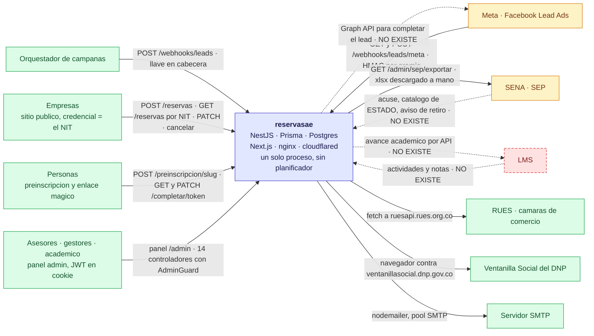
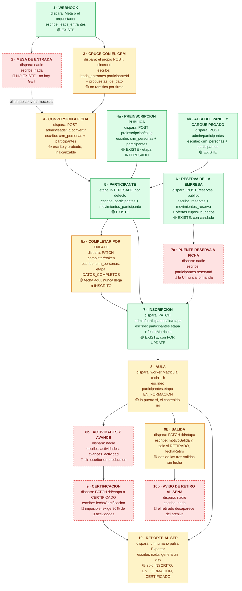
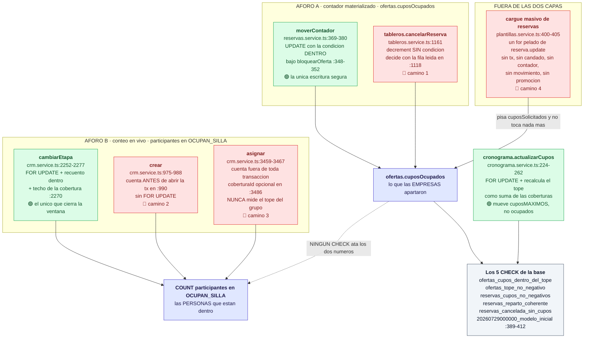

# 02 · Contexto y flujo end-to-end

**Fase 2, entrega 1. Solo lectura: no se modificó ni una línea de `backend/` ni de `frontend/`.**

| | |
|---|---|
| Entrada | `00-mapa-actual.md`, `01-auditoria.md`, `respuesta-a-jose.md` y los dos borradores |
| Método | Verificación directa contra el código de cada paso que aparece dibujado. Ningún nodo del diagrama se pintó sin abrir el archivo |
| Alcance | Los tres diagramas y su lectura. **No hay esquema propuesto, ni migración, ni contrato de API**: eso es la entrega 2 |
| Qué corrige | Tres afirmaciones de Fase 0/1 que el código no sostiene. Van marcadas ⚠️ y con su cita |

## Cómo leer las marcas

- 🟢 **EXISTE** — hay código que lo hace, y se leyó.
- 🟡 **A MEDIAS** — existe el camino pero le falta un tramo, o funciona por un lado y no por el otro.
- 🔴 **NO EXISTE** — no hay código. Se dice con el comando que lo comprueba.
- ⚖️ **DECISIÓN ABIERTA** — la evidencia está, pero cerrarlo exige que lo apruebe una persona. Son tres y van recogidas al final.

Toda cita es `ruta:línea`. La ruta va abreviada a su tramo final cuando eso la identifica sin ambigüedad en el repositorio —`crm.service.ts` es `backend/src/crm/crm.service.ts`—; cuando no la identifica, o cuando el nombre suelto se leería como un archivo de la raíz, va completa.

---

## 1 · Diagrama de contexto

Quién habla con el sistema, por dónde, y con qué credencial.



### Lectura del contexto

| Actor | Puerta | Credencial | Dónde | ¿Existe? |
|---|---|---|---|---|
| **Orquestador** | `POST /webhooks/leads` | llave en cabecera, comparada con `timingSafeEqual` | `leads.controller.ts:66-92` · `llave-de-leads.guard.ts:30-34` · `secreto-de-leads.ts:52-62` | 🟢 |
| **Meta — entrada** | `GET`/`POST /webhooks/leads/meta` | verify_token · HMAC-SHA256 sobre `rawBody`, **secreto por gremio** | `leads.controller.ts:105-185` · `leads/meta.ts:35-59` | 🟢 |
| **Meta — salida** | Graph API para pedir los datos de la persona | — | solo comentarios: `leads.service.ts:181-188`, `:266-268`, `meta.ts:10-17` | 🔴 |
| **Empresas** | `POST /reservas`, `GET /reservas?nit=`, `PATCH /reservas/:id`, `POST /reservas/:id/cancelar` | **el NIT y nada más** | `reservas.controller.ts:27-58` · `reservas.service.ts:272-301` | 🟢 |
| **Personas** | `POST /preinscripcion/:slug` y las cuatro rutas de `/completar/:token` | ninguna · el token de la URL | `preinscripcion.controller.ts:13-72` | 🟢 |
| **Asesores** | panel `/admin` | JWT de 8 h en cookie, **sin lista de revocación** | 14 clases con `AdminGuard` (Fase 0 §3) | 🟢 |
| **SENA / SEP** | `GET /admin/sep/exportar` → `.xlsx` por navegación | rol + `@Requiere('reportes','ESCRIBIR')` | `crm/sep/sep.controller.ts:44-86` | 🟡 |
| **LMS** | — | — | — | 🔴 |
| **RUES** | `fetch` a `ruesapi.rues.org.co` | ninguna | `instituciones/web/proveedor-rues.ts:45,:145` | 🟢 |
| **RUI (DNP)** | navegador headless contra `ventanillasocial.dnp.gov.co` | ninguna | `crm/rui/proveedor-ventanilla.ts:16` | 🟢 |
| **SMTP** | `nodemailer` con pool | usuario y clave del entorno | `correo/correo.service.ts:112-129` | 🟢 |

**Tres cosas que el diagrama enseña y las listas no:**

1. **El sistema no habla con nadie por iniciativa propia salvo RUES y RUI.** Cero webhooks salientes (Fase 0 §4). Al SENA se le entrega un archivo que un humano descarga; al LMS no se le habla; a Meta tampoco, ni siquiera para completar el lead que ella misma anunció.
2. **La flecha de Meta es de ida y no de vuelta, y ahí muere el lead pagado.** Meta manda un `leadgen_id` y nada más (`leads.service.ts:254-269`). Sin la llamada a la Graph API, esa fila queda `PENDIENTE` con el motivo escrito en la propia columna: *"Meta solo manda el identificador. Faltan sus datos"*. Y como tampoco hay pantalla que la enseñe (§2, paso 2), nadie ve nunca ese motivo.
3. **El LMS no es una integración pendiente: es el desbloqueo de Gestión Académica entera.** Ver §2, pasos 8 y 9.

---

## 2 · El flujo end-to-end

Desde que entra un lead hasta que la persona sale certificada o retirada. Cada nodo lleva **qué lo dispara**, **qué tabla escribe** y **si existe**.



### Paso a paso, con la evidencia

| # | Paso | Qué lo dispara | Qué tabla escribe | ¿Existe? | Cita |
|---|---|---|---|---|---|
| 1 | Webhook | `POST` de Meta o del orquestador | `leads_entrantes` | 🟢 | `leads.service.ts:126-143` (orquestador) · `:243-270` (Meta, `upsert` idempotente) |
| 2 | Mesa de entrada | — | — | 🔴 | Ver «NO ENCONTRADO» 1 |
| 3 | Cruce con el CRM | el mismo `POST`, **síncrono, dentro de la petición** | `leads_entrantes.participanteId`, `estado='CONVERTIDO'`, propuesta | 🟡 | `leads.service.ts:148-167` · `avisarQueYaEstaba` en `:297` |
| 4 | Conversión a ficha | `POST /admin/leads/:id/convertir` | `crm_personas`, `participantes`, `leads_entrantes` | 🟡 | `conversion.controller.ts:30-40` · `conversion.service.ts:57,:68,:176` |
| 4a | Preinscripción pública | `POST /preinscripcion/:slug`, **sin guard** | `crm_personas` (upsert), `participantes`, `movimientos_participante` | 🟢 | `preinscripcion.service.ts:190`, `:269`, `:328-344` |
| 4b | Alta del panel / cargue pegado | `POST /admin/participantes` · `POST /admin/participantes/carga/confirmar` | igual + `cargas_de_participantes` | 🟢 | `crm.service.ts:1038-1051` · `confirmarCarga` en `:2751`, bucle en `:2797-2799` |
| 5 | Participante | los tres anteriores | `participantes` con `etapa @default(INTERESADO)` | 🟢 | `schema.prisma:878` |
| 5a | Completar por enlace | `PATCH /completar/:token`, **sin guard** | `crm_personas`, etapa → `DATOS_COMPLETOS` | 🟡 | `preinscripcion.service.ts:1352-1366` |
| 6 | Reserva de la empresa | `POST /reservas`, público, throttle 10/min | `reservas`, `movimientos_reserva`, `ofertas.cuposOcupados`, `respuestas` | 🟢 | `reservas.controller.ts:27-28` · `reservas.service.ts:73-155` |
| 7 | Inscripción | `PATCH /admin/participantes/:id/etapa` → `INSCRITO` | `participantes.etapa`, `fechaMatricula`, `movimientos_participante` | 🟢 | `crm.service.ts:2063`, candado en `:2252-2277` |
| 7a | Puente reserva → ficha | — | `participantes.reservaId` | 🔴 | Ver «NO ENCONTRADO» 2 |
| 8 | Aula | `setInterval` de 1 h en `Matricula`, **arranca siempre** | `participantes.etapa`, `fechaMatricula` | 🟡 | `matricula.ts:35-39`, **filtro en `:70-71`**, escritura en `:88-108` |
| 8b | Actividades y avance | — | `actividades`, `avances_actividad` | 🔴 | Ver «NO ENCONTRADO» 3 |
| 9 | Certificación | `PATCH :id/etapa` → `CERTIFICADO` | `fechaCertificacion` | 🔴 | La regla está: `crm.service.ts:2147-2188`. Los datos no |
| 9b | Salida | `PATCH :id/etapa` → `RETIRADO`/`DESERTO`/`ABANDONO`/`NO_APROBO` | `motivoSalida`; `fechaRetiro` **solo** si `RETIRADO` | 🟡 | `crm.service.ts:2283-2308` |
| 10 | Reporte al SEP | un humano pulsa Exportar en el panel | ninguna — genera el `.xlsx` en memoria | 🟡 | `sep.controller.ts:44-86` · filtro en `sep.service.ts:188` y `:376` |
| 10b | Aviso de retiro al SENA | — | — | 🔴 | Ver «NO ENCONTRADO» 4 |

### Los siete huecos del flujo, en orden de aparición

**Hueco 1 · El lead entra, se cruza, y nadie puede verlo.**
`grep -rn "leadEntrante.findMany|findFirst|findUnique" backend/src` da tres resultados y **ninguno es una ruta de consulta**: `leads.service.ts:116` es la guarda de idempotencia, `conversion.service.ts:68` busca por el `id` que hay que tener de antemano, y `meta-pruebas.controller.ts:355` es el banco de pruebas, bajo `admin/pruebas/meta`. El único controlador en `admin/leads` expone `POST :id/convertir` (`conversion.controller.ts:30`) — y `grep -rn "reservaId\|leadEntrante" frontend/src` confirma que **no hay pantalla**: no existe `frontend/src/app/admin/leads/`.

> `POST /admin/leads/:id/convertir` está escrito, probado, protegido por rol… y es código muerto, porque el `id` no lo devuelve ninguna API.

**Hueco 2 · El cruce se calcula bien y se aplica mal.**
`cruzarConElCrm` devuelve `firme: true` solo para el documento (`cruzar-con-el-crm.ts:74`, frente a `:93` y `:110`). `leads.service.ts:155-156` llama a `avisarQueYaEstaba` **con cualquier coincidencia**, sin mirar `firme`. Y `LeadEntrante.participanteId` es `String? @unique` (`schema.prisma:783`): el segundo lead de la misma persona revienta el índice. Los dos defectos son el mismo nodo del diagrama.

**Hueco 3 · Las dos mitades del sistema no se tocan.** ⚠️ **Corrige a Fase 0/1.**
El campo existe (`schema.prisma:869`, con la relación `Reserva ||--o{ Participante` y su `Restrict` en `:935`), el backend lo acepta y lo valida contra el convenio y la oferta (`crm.service.ts:949-970`), y lo escribe (`:1044`). Pero:

```
$ grep -rn "reservaId" frontend/src
   (sin resultados)
```

**Cero.** Ninguna pantalla lo manda nunca. Y el propio código lo dice en el reporte: *"`Participante.reservaId` no lo escribe NADIE en producción: solo lo pone la siembra de prueba"* (`crm/sep/sep.service.ts:168-172`) — el comentario está ahí porque el F7 exportaba **cero filas** en producción y en local la siembra tapaba el hueco.

> La empresa aparta 20 cupos. Veinte personas se inscriben. **Nada en la base dice que sean las mismas veinte.** El aforo de reservas y el aforo de inscripción no solo cuentan distinto (§3): no comparten ni una fila.

**Hueco 4 · La puerta pública no llega al aula.** ⚠️ **Corrige a Fase 0 (crítico 2) y a `respuesta-a-jose.md`.**
Se ha dicho tres veces que `POST /preinscripcion/:slug` «crea participantes sin mirar el cupo» y que viola INV-4. **El código no lo sostiene.** Escribe `etapa: 'INTERESADO'` (`preinscripcion.service.ts:335`), y `OCUPAN_SILLA` es `['INSCRITO','EN_FORMACION','CERTIFICADO']` (`crm/etapas.ts:30-34`): **`INTERESADO` no ocupa silla en ningún conteo del sistema.** Tampoco toca `cuposOcupados`. Y el camino público que sigue, `/completar/:token`, techa en `DATOS_COMPLETOS` y se niega explícitamente a tocar la etapa de quien ya está en el aula (`:1352-1354`).

El hallazgo real es otro, y sigue siendo un hallazgo: **la preinscripción crea demanda sin techo**. Miles de `INTERESADO` colgados de una oferta de 40 no rompen el aforo, pero sí rompen la promesa: cada uno recibió un enlace y espera un cupo que no existe. Es un problema de expectativa y de trabajo del asesor, no de sobreventa. **Y eso cambia la prioridad**: no es un crítico de INV-4 que haya que tapar con un candado; es una lista de espera de personas que hoy no está modelada.

**Hueco 5 · El aula existe como puerta y no como sitio.**

```
$ grep -rn "actividad.create|avanceActividad.create|avanceActividad.update|avanceActividad.upsert" backend/src backend/prisma
backend/prisma/seed/prueba.ts:643
backend/prisma/seed/prueba.ts:1283
$ grep -rn "actividades" backend/src --include=*.controller.ts
   (sin resultados)
```

**Los dos únicos escritores están en la siembra de prueba.** `Matricula` mete gente al aula cada hora (`matricula.ts:88-108`) y una vez dentro no hay nada que hacer: ni crear una actividad, ni marcar un avance, ni registrar asistencia. `Participante.porcentajeAsistencia` tiene su columna y su CHECK (`migrations/20260814140000_crm_personas_y_participantes/migration.sql:215`) y nadie la escribe.

**Y la puerta tiene además un filtro que no está dicho en ninguna parte.** ⚖️ **Decisión abierta 1.**
`Matricula` no recoge a cualquier `INSCRITO`: exige `cobertura: { grupo: { fechaInicio: { not: null, lte: hoy } } }` (`matricula.ts:71`). **Quien esté INSCRITO sin grupo no entra al aula jamás**, y nada avisa. Engancha directo con el camino 3 del §3: `const cobertura = dto.coberturaId ?? null` (`crm.service.ts:3486`) permite colocar a alguien en una oferta sin cobertura, así que la misma ruta que no mira el tope del grupo puede además dejar a una persona fuera del aula para siempre. Si eso es un defecto o es el estado de espera que se quiere —«inscrito, pero todavía sin grupo»— el código no lo dice, y no es una decisión que pueda cerrar este documento.

**Hueco 6 · Certificar es imposible por la vía normal, y certificar es lo que paga el SENA.**
La compuerta está bien construida — el numerador repite las tres condiciones del denominador, con el fallo real que corrigieron explicado en el comentario (`crm.service.ts:2156-2172`). Pero con las tablas vacías, `obligatorias === 0` y salta:

> *"Esta acción de formación no tiene actividades obligatorias cargadas: no hay contra qué medir si terminó."* — `crm.service.ts:2174-2179`

No falta la regla. **Faltan los datos.** Por eso el LMS del diagrama de contexto no es una mejora: es el único camino a la certificación.

**Hueco 7 · El retiro no llega al SENA, y la fila del retirado se evapora.**
`ETAPAS_DEL_REPORTE` se deriva de `OCUPAN_SILLA` (`crm/etapas.ts:45`), o sea `INSCRITO`, `EN_FORMACION`, `CERTIFICADO`. Las cuatro salidas quedan fuera. `sep.service.ts:188` y `:376` filtran por esa lista. Y la columna `ESTADO` del formato de cargue lleva `'ACTIVO'` **escrito a mano** (`formato-cargue-sep.ts:171`).

| Cargue | Qué ve el SENA |
|---|---|
| Enero | Fila de Juan, `ESTADO = 'ACTIVO'` |
| Febrero, Juan se retira | **La fila de Juan ya no está.** Nada dice por qué |

Y el dato para arreglarlo está a medias: `fechaRetiro` solo se escribe si la etapa es exactamente `RETIRADO` (`crm.service.ts:2308`, respaldado por el CHECK `participantes_retiro_fechado` de `migrations/20260814140000_crm_personas_y_participantes/migration.sql:228-230`). `DESERTO` y `ABANDONO` — las dos más frecuentes — se quedan sin fecha.

> **Nota de contrato:** el enganche existe y **no exige tocar ningún título de columna**. `ESTADO` ya es una columna del formato (`formato-cargue-sep.ts:81`). Lo que hay que cambiar es el **valor**, no el encabezado. Los títulos son el contrato con el SENA y siguen intactos.

⚖️ **Decisión abierta 2.** Que el retirado siga apareciendo en el cargue con su `ESTADO` calculado depende de dos cosas que hoy no existen: **el catálogo de valores que el SENA acepta en esa columna** (no lo tenemos — «NO ENCONTRADO» 4) y **si `DESERTO` y `ABANDONO` deben llevar fecha de salida**, que hoy el CHECK solo exige para `RETIRADO`. Lo primero hay que preguntárselo al SENA antes de escribir nada; lo segundo lo decide quien responde por el reporte, no este documento.

---

## 3 · El dinero de los cupos

Quién mueve `Oferta.cuposOcupados`, quién cuenta sillas en vivo, y dónde se saltan las capas.



### Los dos aforos, y por qué no se hablan

|  | **Aforo A · reservas** | **Aforo B · inscripción** |
|---|---|---|
| Qué mide | lo que las **empresas apartaron** | las **personas que están dentro** |
| Cómo | contador materializado `Oferta.cuposOcupados` | `COUNT` de participantes en `OCUPAN_SILLA` |
| Escritores | **dos**, y solo dos | cuatro métodos que cuentan |
| Defensa en base | 5 CHECK (`migrations/20260729000000_modelo_inicial/migration.sql:389-412`) | **ninguna** |
| Qué suma | `cuposSolicitados` — **incluye lista de espera** | sillas realmente ocupadas |

**Los escritores del contador son exactamente dos.** Verificado:

```
$ grep -rn "cuposOcupados" backend/src --include=*.ts | grep -v spec
   ... 39 líneas, y solo DOS escriben:
   reservas/reservas.service.ts:371   UPDATE ... SET "cuposOcupados" = "cuposOcupados" + delta
   tableros/tableros.service.ts:1161  data: { cuposOcupados: { decrement: cupos } }
```

Todo lo demás son lecturas: semáforos, tableros, paneles.

> **Y de ahí sale el descuadre estructural: inscribir a una persona no mueve el contador, y retirarla tampoco lo baja.** El aforo A solo se entera de lo que hace la empresa; el aforo B solo de lo que hace el asesor. **No hay un solo `CHECK`, trigger ni job que ate los dos números** — `NO ENCONTRADO: job de reconciliación` (Fase 0 §6). Y tampoco hay un detector manual que lo mire: el único script que compara contadores, `backend/prisma/estado.ts:44-51`, se queda **entero dentro del aforo A** —compara `ofertas.cuposOcupados` contra la suma de `cuposConfirmados` de las reservas no canceladas— y no menciona `participantes` ni una vez. Ver «NO ENCONTRADO» 6.

### Los cuatro caminos que se saltan las capas

**Camino 1 · `TablerosService.cancelarReserva` — toma el candado y no lo usa.**
La reserva se lee en `tableros.service.ts:1118-1124`, **fuera de la transacción**. La transacción se abre en `:1150`. El `FOR UPDATE` llega en `:1155` — pero el valor que se decrementa, `reserva.cuposConfirmados`, es el de la lectura vieja (`:1157`). Y el `decrement` de `:1161` **no lleva condición**, a diferencia del `UPDATE … AND "cuposOcupados" + delta >= 0` de reservas (`reservas.service.ts:373`).

**Y hay un quinto defecto que no estaba anotado:** este camino **es el único que devuelve cupos sin promover la lista de espera**.

```
$ grep -rn "promoverListaDeEspera" backend/src
reservas/reservas.service.ts:213   (editar, cuando baja)
reservas/reservas.service.ts:262   (cancelar)
reservas/reservas.service.ts:384   (la definición)
```

Cancelar desde la pantalla pública promueve. **Cancelar desde el panel de admin libera los cupos y deja a los que esperan esperando**, en silencio y para siempre — porque nada vuelve a mirar. Es el mismo defecto de F-01 llegando por otra puerta.

**Camino 2 · `crm.service.crear` — cuenta antes de abrir la transacción.**
`ocupadas` se calcula en `:975-977`; la transacción se abre en `:990`. **No hay `FOR UPDATE` en ningún punto de este método.** Dos altas simultáneas sobre la última silla ven las dos que cabe. La compuerta de sobrecupo (`:979-987`) es correcta y está bien pensada — *"pasarse del cupo se puede, pero deja rastro"* (`:972`) — pero decide sobre un número que ya puede estar obsoleto.

**Camino 3 · `crm.service.asignar` — el más expuesto.** `PATCH /admin/participantes/:id/formacion`.
- La oferta se lee en `:3376`, fuera de todo.
- Las sillas se cuentan en `:3459-3465`, **fuera de toda transacción**.
- Se compara contra `oferta.cuposMaximos` leído fuera (`:3467`).
- `$transaction` no aparece hasta `:3532`, y solo envuelve el array de escrituras.
- **Y `coberturaId` es opcional**: `const cobertura = dto.coberturaId ?? null` (`:3486`). Se valida que la cobertura pertenezca a la oferta (`:3479-3482`) pero **jamás se mira su `cuposMaximos`**.

Compárese con `cambiarEtapa`, que sí lo hace: `FOR UPDATE` en `:2254` y el techo del grupo comprobado dentro, en `:2270-2275`. Las dos rutas mueven a la misma persona al mismo grupo; una cierra la ventana y la otra no.

> Este no es un fallo de concurrencia. **Es determinista**: se puede llenar un grupo por encima de su tope llamando a esta ruta sin ninguna carrera, simplemente porque nadie mira el tope.

Y por el otro lado del mismo `?? null`: dejar la cobertura vacía saca a esa persona del barrido de `Matricula` para siempre (hueco 5).

**Camino 4 · El cargue masivo de reservas — el que no pasa por ninguna capa.**
`plantillas/catalogo.ts:116-146` publica una plantilla para `reservas` con **nueve columnas**. Una es la llave (`id`, `:126`), **tres** van bloqueadas con `soloLectura: true` —`nit` (`:131`), `organizacion` (`:132`) y `formacion` (`:133`)— y **cinco se escriben**: `cuposSolicitados` (`:135`), `contactoNombre` (`:140`), `contactoCargo` (`:141`), `contactoCorreo` (`:142`) y `contactoCelular` (`:143`). Y `plantillas.service.ts:400-405` las escribe así:

```ts
for (const f of lectura.filas) {
  await this.prisma.reserva.update({
    where: { id: f.valores.id },
    data: this.aDatos(f.valores, campos, 'reservas'),
  });
}
```

Un `for` pelado. **Sin transacción, sin candado, sin mover el contador, sin `MovimientoReserva` y sin promover la lista de espera.** Deja auditoría (`:407-414`) pero con `accion: 'PARTICIPANTE_EDITADO'` sobre `entidad: RESERVA` —nombre equivocado— y **una sola entrada para todo el lote**, con `entidadId: 'cargue-masivo'`, sin `antes`/`después` por fila.

Y bajar `cuposSolicitados` por debajo de `cuposConfirmados` viola `reservas_reparto_coherente` (`migrations/20260729000000_modelo_inicial/migration.sql:403-405`) → como no hay `ExceptionFilter` global, sale **500 crudo**.

Permiso exigido: `@Requiere('reserva','ESCRIBIR')` (`plantillas.controller.ts:97`). El mismo que descargar el formato (`:61`).

### Lo que en cambio está bien y no hay que tocar

- **`moverContador`** (`reservas.service.ts:362-381`): la condición vive **dentro del `UPDATE`**, no en un `if` de Node. Si la fila no cuadra, `filas === 0` y sale un 409 con mensaje accionable. Es una garantía real de la base.
- **`cronograma.actualizarCupos`** (`cronograma.service.ts:224-262`): toma `FOR UPDATE` sobre la oferta (`:242`) y **recalcula `Oferta.cuposMaximos` como la suma de los topes de sus coberturas** en la misma transacción, con el invariante explicado en `:180-185`. Mueve el techo, nunca el ocupado. Es el molde correcto.
- **El sobrecupo declarado**, con su CHECK `participantes_sobrecupo_justificado` (`migrations/20260814140000_crm_personas_y_participantes/migration.sql:222-225`): *«un sobrecupo sin motivo no es una autorización»*. **Ningún diagrama de aquí propone un CHECK duro de aforo**, porque mataría esta funcionalidad. Ver «Restricciones respetadas».
- **`promoverListaDeEspera`** filtra por `estado: { not: EstadoReserva.CANCELADA }` (`reservas.service.ts:397`), no por «está viva». La promoción parcial y por orden de llegada (`:403-434`) es deliberada y está bien.

---

## 4 · Fronteras: qué pasa si el otro lado no contesta

Una línea por frontera. Es la pregunta que ningún diagrama contesta solo.

| Frontera | Si el otro lado no contesta | Evidencia |
|---|---|---|
| **Meta → nosotros** | Meta reintenta; si insiste sin éxito **apaga el webhook**. Por eso se contesta 200 pase lo que pase **con el contenido** —son las palabras exactas del comentario— incluso cuando el subdominio no corresponde a un convenio activo: se registra `log.error` y se devuelve `{sinConvenio: true}` con 200. Lo que sí corta antes es la firma: una HMAC que no cuadra sale con **401** y no llega al servicio. Los leads de un lote sin convenio **se pierden** —hay que pedirle a Meta que los reenvíe— pero el canal sigue vivo | `leads.controller.ts:166-181` · `leads.service.ts:222-235` |
| **Nosotros → Meta (Graph API)** | **No hay llamada.** El lead queda `PENDIENTE` con solo el `leadgen_id`, para siempre. Nada reintenta porque nada intentó | `leads.service.ts:266-268` |
| **Orquestador → nosotros** | Si lanzamos —convenio inactivo da 400 (`:95-99`), contradicción host/cuerpo da 400 (`:74-79`)— **el lead se pierde salvo que quien llama reintente**. Un reenvío es seguro: `@@unique(origenSistema, externoId)` (`schema.prisma:791`) devuelve `repetido: true` sin duplicar | `leads.service.ts:74-99`, `:116-124` |
| **Empresa → nosotros** | Throttle 10/min en `POST /reservas`. Si el contador cambió entremedias, 409 con mensaje accionable. **Si salta un CHECK, 500 crudo**: no hay `ExceptionFilter` global | `reservas.controller.ts:28` · `reservas.service.ts:376-379` |
| **Nosotros → SMTP** | **`enviar` nunca lanza**: devuelve `{estado: 'APAGADO' \| 'FALLO' \| 'ENVIADO'}`. Sin credenciales, un `log.warn` y sigue. Si el envío falla, `log.error` y sigue. **No hay cola, ni reintento, ni outbox**: el correo que no sale se pierde con una línea de log | `correo.service.ts:165-217` · uso en `preinscripcion.service.ts:418-428` |
| **Nosotros → RUES** | Reintenta hasta `INTENTOS_MAXIMOS` y se rinde marcando `EstadoConsultaRues.FALLIDA`; el proveedor puede decir `reintentar: false` para no insistir contra quien ya nos marcó. **Pero el worker solo corre con `WEB_WORKER=1`**: apagado, la cola crece y nadie mira | `web.service.ts:216`, `:256-267` · `web.worker.ts:18,:37` |
| **Nosotros → RUI (DNP)** | **Encolar nunca bloquea el guardado**: `pedirElRui` se traga la excepción con un `warn`. El worker solo corre con `RUI_WORKER=1`. Apagado, `consultas_rui` crece en silencio | `preinscripcion.service.ts:481-490` · `rui.worker.ts:18,:49-52` |
| **Disparador de institución al inscribir** | Va **fuera de la transacción y en `try/catch`**: si falla, solo queda un `warn` y **el cambio de etapa se mantiene**. Está razonado en el código: *"completar la ficha es un complemento, no un requisito"* | `crm.service.ts:2334-2356` |
| **Nosotros → SENA/SEP** | **No hay canal.** El `.xlsx` es una descarga por navegación que un humano dispara. **Cero acuse, cero estado de cargue, cero reintento.** Si el SENA rechaza el archivo, el sistema no se entera nunca. Los errores se pintan como página HTML porque un JSON sustituiría la pantalla del panel | `sep.controller.ts:44-86`, `paginaDeError` en `:105` |
| **SENA → nosotros** | No existe. Ni acuse, ni catálogo de valores de `ESTADO`, ni formato de retiro | Ver «NO ENCONTRADO» 4 |
| **LMS ↔ nosotros** | No existe en ninguna dirección | — |
| **Nosotros → Postgres** | Las migraciones corren en **cada arranque del contenedor**, con `set -e`. **Una migración que falle deja el backend en ciclo de reinicios.** El `healthcheck` de compose solo cubre `db` (`pg_isready`); backend, frontend, nginx y cloudflared no tienen ninguno | `backend/arrancar.sh:7`, `:29` · `docker-compose.yml:59-64` |
| **Quien vigila desde fuera** | `GET /health` de nginx devuelve la cadena `OK` fija **sin tocar la aplicación**. Un backend muerto se ve sano desde fuera | `docker/nginx/default.conf:76-80` |
| **Entre sedes** | Ventana real de dos backends escribiendo: `scripts/promover.sh` no apaga a la sede relevada y `scripts/recuperar-mando.sh:85` promueve con `FORZAR=si`. `Matricula` y `VigiaDeCupos` **arrancan siempre y sin candado**, así que se duplican en esa ventana | Fase 0, crítico 10 · `matricula.ts:35-39` · `vigia-de-cupos.ts:34-38` |

**El patrón, dicho de una vez:** el sistema es muy cuidadoso con no perder la escritura propia —el encolado nunca bloquea, el disparador nunca tumba la etapa, el correo nunca lanza— y **no tiene ni un solo mecanismo de recuperación**. Todo lo que falla hacia fuera acaba en un `log.warn` que nadie lee, porque `NO ENCONTRADO: métricas, trazas ni Sentry` (Fase 0 §11). No hay outbox, ni DLQ, ni cuarentena, ni cola de reintento en ninguna de las once fronteras.

---

## NO ENCONTRADO

Con el comando, no con un silencio.

**1 · Endpoint de lectura de la mesa de entrada de leads.**
```
$ grep -rn "leadEntrante.findMany\|leadEntrante.findFirst\|leadEntrante.findUnique" backend/src --include=*.ts | grep -v spec
backend/src/leads/conversion.service.ts:68      ← exige el id de antemano
backend/src/leads/leads.service.ts:116          ← guarda de idempotencia
backend/src/leads/meta-pruebas.controller.ts:355 ← banco de pruebas, admin/pruebas/meta
$ ls frontend/src/app/admin/leads
   (no existe el directorio)
```

**2 · Escritura de `Participante.reservaId` desde la aplicación.**
```
$ grep -rn "reservaId" frontend/src
   (sin resultados)
```
El backend lo acepta (`crm.service.ts:1044`); la UI no lo manda nunca. Confirmado también por el comentario de `crm/sep/sep.service.ts:168-172`.

**3 · Escritor de `actividades` y `avances_actividad` en producción.**
```
$ grep -rn "actividad.create\|avanceActividad.create\|avanceActividad.update\|avanceActividad.upsert" backend/src backend/prisma --include=*.ts | grep -v spec
backend/prisma/seed/prueba.ts:643
backend/prisma/seed/prueba.ts:1283
$ grep -rn "actividades" backend/src --include=*.controller.ts
   (sin resultados)
```

**4 · Cualquier canal de vuelta desde el SENA.** Ni acuse de cargue, ni catálogo de valores de la columna `ESTADO`, ni formato de aviso de retiro. `grep -rniE "acuse|radicado|respuesta.*sena"` sobre `backend/src` y `docs/` → nada aplicable.

**5 · Consumidor de `AvisoDeCupos`.**
```
$ grep -rn "avisoDeCupos" backend/src --include=*.ts | grep -v spec
   → las cinco líneas están dentro de crm/vigia-de-cupos.ts
```
Se escribe una fila cada 12 h y **no la lee ningún endpoint, ninguna pantalla y ningún correo**. El propio archivo lo dice: *"No manda nada: no hay canal todavía"* (`vigia-de-cupos.ts:4-5`).

**6 · Job de reconciliación entre los dos aforos — y tampoco un detector.**
El único script que compara contadores en todo el repositorio vive en `backend/prisma/estado.ts` y **compara dentro del aforo A**: contador contra reservas.

```
$ find . -name estado.ts -not -path '*/node_modules/*'
./backend/prisma/estado.ts
$ sed -n '44,51p' backend/prisma/estado.ts
  const descuadres = await prisma.$queryRaw<...>`
    SELECT o."id",
           o."cuposOcupados" AS contador,
           COALESCE(SUM(r."cuposConfirmados"), 0)::int AS suma
      FROM "ofertas" o
      LEFT JOIN "reservas" r ON r."ofertaId" = o."id" AND r."estado" <> 'CANCELADA'
     GROUP BY o."id", o."cuposOcupados"
    HAVING o."cuposOcupados" <> COALESCE(SUM(r."cuposConfirmados"), 0)`;
```

Ni `participantes`, ni `OCUPAN_SILLA`, ni el aforo B aparecen en ninguna parte. Es un script de consola —imprime el descuadre y no lo corrige— y **el descuadre que imprime no es el de §3**. Del hueco entre los dos aforos no hay ni siquiera un detector manual.

**7 · `ExceptionFilter` global.** Confirmado en Fase 0 §6 y relevante aquí: los cinco CHECK de cupos existen y le llegan al usuario como **500 crudo**.

---

## Restricciones respetadas

Las siete reglas del dominio, y qué hizo cada una en este documento.

| Regla | Cómo se respetó |
|---|---|
| **1 · Nada se borra** | El único borrado físico vivo va **documentado como defecto**, no como paso del flujo — no está dibujado en ninguno de los tres diagramas, y esta fila es el único sitio del entregable donde se nombra: `crm.controller.ts:415-430` (`@Delete`, solo `SUPERADMIN`) → `crm.service.ts:1749-1756`, que arrastra 8 tablas por cascada (`schema.prisma:573`, `:674`, `:989`, `:1027`, `:1216`, `:1617`, `:1832`, `:1914` — tres de ellas vaciadas a mano dentro de la transacción) y pone a `NULL` `leads_entrantes.participanteId` (`:789`). No se propone ningún borrado nuevo |
| **2 · El sobrecupo es deliberado** | El diagrama 3 pinta el sobrecupo declarado como **camino legítimo**, con su CHECK `participantes_sobrecupo_justificado`. **No se propone ningún CHECK duro de aforo.** El descuadre que sí se señala es entre los dos contadores, no un techo nuevo |
| **3 · La lista de espera es deliberada** | **No se propone ni un valor nuevo en `EstadoReserva`.** El predicado `estado: { not: CANCELADA }` (`reservas.service.ts:397`) queda citado explícitamente como restricción para cualquier diseño futuro. Y el hallazgo nuevo del camino 1 va **a favor** de la lista de espera: el panel la deja colgada |
| **4 · Los títulos SEP son el contrato** | Ni un título tocado. El hueco 7 distingue expresamente **valor** (`'ACTIVO'` fijo, `formato-cargue-sep.ts:171`) de **encabezado** (`ESTADO`, `:81`, que ya existe y se queda) |
| **5 · El webhook responde 200** | El flujo lo dibuja como contrato, con la cita de `leads.controller.ts:176-181`. **Nada de 202.** El 200 sobre lote sin convenio (`leads.service.ts:222-235`) se documenta como correcto, aunque pierda leads. La promesa es «200 pase lo que pase **con el contenido**»: la firma inválida sigue saliendo 401 en `:173`, y eso es de antes de este documento |
| **6 · Las migraciones corren solas** | Este entregable **no propone ninguna migración**. La frontera con Postgres recoge el riesgo: `backend/arrancar.sh:7` (`set -e`) + `:29` (`prisma migrate deploy`) |
| **7 · Los enums rompen los `Record`** | **No se propone ningún valor nuevo de enum.** Y una precisión sobre dónde hay que mirar, porque detrás de la regla hay **dos familias**, no una. Para **`EstadoReserva` el puntero de la regla es correcto**: lo declaran los dos archivos que nombra —`frontend/src/lib/api.ts:10` y `frontend/src/lib/tableros-api.ts:6`—, el `Record` exhaustivo de verdad está en `frontend/src/app/admin/reservas/page.tsx:23` (`Record<EstadoReserva, {texto, clase}>`, revienta en compilación) y hay **dos mapas más que fallarían en silencio, en ejecución**: `frontend/src/app/admin/acciones/[id]/page.tsx:31` (`Record<string, …>`) y `frontend/src/components/consulta-reservas.tsx:97` (objeto `as const`). Son cinco sitios. Para **`Etapa`** hay una segunda familia que la regla no nombra: el tipo en `frontend/src/lib/crm-api.ts:4-15`, `ETIQUETA_ETAPA: Record<Etapa,string>` en `:206`, `VARIABLE_ETAPA: Record<Etapa,string>` en `frontend/src/components/admin/etapa.tsx:6`, y **siete** listas `: Etapa[]` en `crm-api.ts` (`:30`, `:64`, `:72`, `:86`, `:186`, `:196`, `:199` — solo cuatro caen dentro de `:29-90`) más una octava fuera del archivo, `frontend/src/app/admin/control/page.tsx:52`. Los `Record<` de `api.ts` y `tableros-api.ts` sí son genéricos y no exhaustivos, pero no todos son `Record<string, unknown>`: solo `api.ts:116` lo es, y `tableros-api.ts:333`, `:354` y `:373` son `Record<string, string \| number \| undefined>`. ⚖️ **Decisión abierta 3** |

---

## Las tres decisiones abiertas

Van aquí juntas para que se puedan aprobar o rechazar de una vez. Ninguna se puede cerrar leyendo más código: las tres necesitan que una persona decida.

| # | Dónde | Qué hay que decidir | Por qué no la cierra este documento |
|---|---|---|---|
| 1 | Hueco 5 | Un `INSCRITO` **sin cobertura** nunca lo recoge `Matricula` (`matricula.ts:71`), y `asignar` permite dejarla vacía (`crm.service.ts:3486`). ¿Es un defecto, o es el estado de espera legítimo «inscrito, todavía sin grupo»? | Las dos lecturas son compatibles con el código. Si es defecto, cambia el camino 3; si es estado legítimo, hace falta una pantalla que lo enseñe |
| 2 | Hueco 7 | Reportar la salida al SENA calculando el valor de `ESTADO`, y si `DESERTO` y `ABANDONO` deben llevar fecha de salida como `RETIRADO` | El catálogo de valores que el SENA acepta en esa columna **no lo tenemos** («NO ENCONTRADO» 4). Inventárselo es peor que no mandarlo |
| 3 | Restricciones, regla 7 | Qué hacer con los dos mapas de `EstadoReserva` que fallan **en silencio** (`acciones/[id]/page.tsx:31`, `consulta-reservas.tsx:97`), y si la regla 7 debe nombrar también la familia de `Etapa` | Volverlos exhaustivos es tocar código de producción, y reescribir la regla es tocar el contrato del proyecto. Ninguna de las dos es de este entregable |

---

## Lo que este documento NO es

- **No es un diseño.** No hay esquema propuesto, ni contratos, ni máquinas de estado. Eso es la entrega 2 de Fase 2.
- **No propone remediaciones.** Los cuatro caminos del §3 se describen; arreglarlos es otra conversación, y G-01 y G-03 comparten causa —leer fuera del candado— así que van juntos.
- **No toca código.** Nada de `backend/` ni de `frontend/` se modificó.