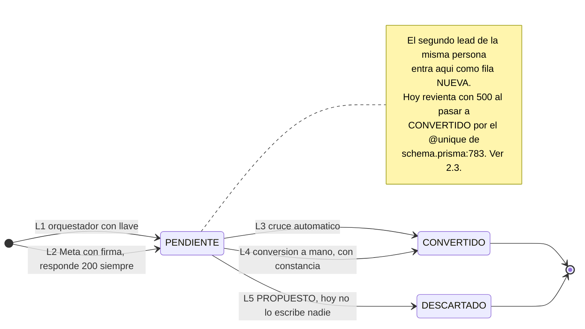
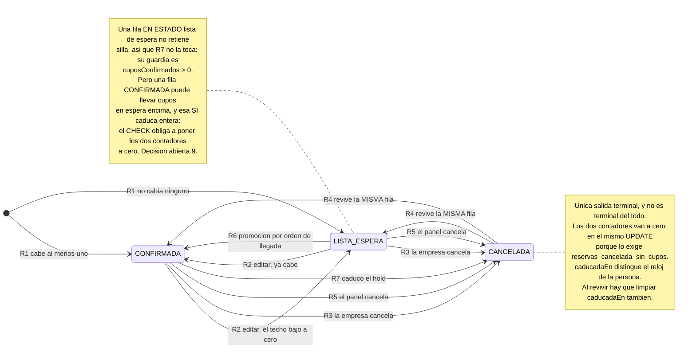
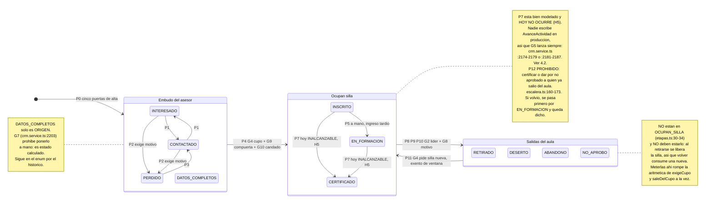
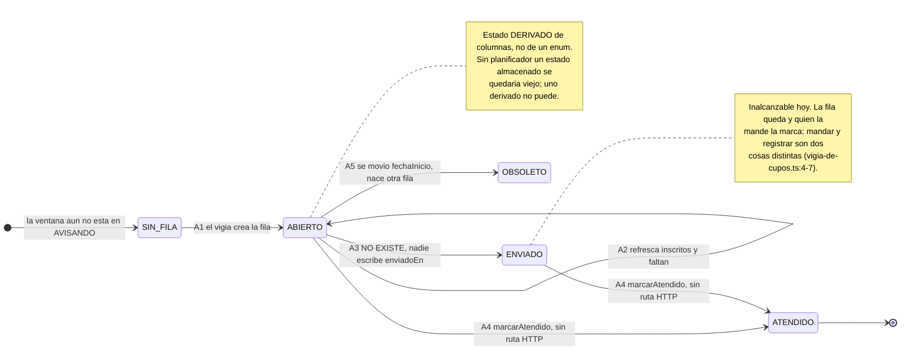

# Fase 2 · Las cuatro máquinas de estado (segunda versión, corregida)

> **Esta versión sustituye a la rechazada.** La diferencia de fondo cabe en una línea:
> **no se añade ni un solo valor a ningún enum de estado.** Ni `CADUCADA`, ni `EN_GESTION`,
> ni `DUPLICADO`. Lo que la primera versión quería resolver con un estado nuevo se resuelve
> aquí con columnas anulables y con estados que ya existen.
>
> Solo lectura. No se modificó ni una línea de `backend/` ni de `frontend/`.

---

## 0 · Lo que esta versión retira, y por qué

| Retirado | Motivo | Dónde está la prueba |
|---|---|---|
| El estado `CADUCADA` en `EstadoReserva` | Se resucita solo, cuenta como viva en 23 predicados y rompe los mapas de estado del frontend | `reservas.service.ts:397`; ver §3.1 |
| Quitar `@@unique([empresaId, ofertaId])` | Se lleva el `findUnique({ empresaId_ofertaId })` de `reservas.service.ts:77-79` y con él la única defensa contra el doble clic del formulario público | `schema.prisma:303` |
| Fundir las dos políticas de cupo | Mata el sobrecupo autorizado, que está modelado a propósito | ver §4.3 |
| Validar `CambiarEtapaDto.etapa` contra `ETAPAS_A_MANO` | Esa lista no tiene `CERTIFICADO`, `NO_APROBO`, `RETIRADO`, `DESERTO` ni `ABANDONO`: se gobierna por rol, no por lista | `crm.service.ts:149-158` vs `:162-167` |
| **La comprobación por área de la primera corrección de H1** | Reincidía en el mismo defecto: era **más restrictiva que el código**. Le quitaba `RETIRADO` y `DESERTO`/`ABANDONO` a `LIDER_INSCRIPCION`, que hoy los hace por `MUEVEN_INSCRITO`. Ver §4.6 | `permisos.ts:45` vs `:125-129` |
| `EstadoLeadEntrante.EN_GESTION` y `DUPLICADO` | No hacen falta: `PENDIENTE` + `motivo` ya lo dicen, y `DESCARTADO` ya existe sin escritor | `schema.prisma:738-745` |
| `LeadEntrante.participanteDuplicadoId` | Sin el `@unique` el segundo lead ya puede apuntar al mismo `participanteId` | ver §2.3 |
| «R8 · CONFIRMADA → CONFIRMADA» del cargue por plantilla | No es una transición: esa plantilla no expone `estado` | `catalogo.ts:116-146` |

---

## 1 · Regla de despliegue (aplica a las cuatro máquinas)

Las migraciones corren solas en cada arranque —`backend/arrancar.sh:29`, bajo el `set -e` de
`:7`—. **Una migración que falla deja el backend en ciclo de reinicios.** De ahí tres reglas
que este diseño cumple:

1. **`ALTER TYPE ... ADD VALUE` va SIEMPRE en su propio fichero de migración**, anterior a
   cualquiera que use el valor. Está escrito en el repositorio:
   `prisma/migrations/20260830185000_origen_lead_importacion/migration.sql:3-7` dice literal
   que Postgres no deja usar un valor de enum recién añadido dentro de la misma transacción,
   que Prisma corre cada migración en una, y que juntarlas es lo que hizo reventar aquella con
   «invalid input value for enum "OrigenLead": "IMPORTACION"».
2. **Ninguna migración de este diseño añade valores a un enum de estado.** La única DDL es de
   columnas anulables y un `CHECK`, y ambas cosas son válidas para todas las filas existentes
   en el instante de aplicarse — así que la migración no puede fallar por datos.
3. **Ningún predicado de índice nombra un valor de enum nuevo.** El único `CHECK` que se añade
   menciona `'CANCELADA'`, que existe desde `20260729000000_modelo_inicial/migration.sql:11`.

### 1.1 · El SQL

```sql
-- El hold con TTL de F-01, SIN tocar EstadoReserva.
-- Anulables: todas las filas existentes quedan en NULL, que
-- significa «sin vencimiento» — el comportamiento de hoy.
ALTER TABLE "reservas" ADD COLUMN "venceEn"    TIMESTAMP(3);
ALTER TABLE "reservas" ADD COLUMN "caducadaEn" TIMESTAMP(3);

-- Caducar es una forma de cancelar, no un estado aparte. Este
-- CHECK impide que quede marcada como caducada una fila que no
-- esté realmente cancelada. Se cumple trivialmente al aplicarlo:
-- caducadaEn acaba de nacer NULL en todas.
ALTER TABLE "reservas"
  ADD CONSTRAINT "reservas_caducada_es_cancelada"
  CHECK ("caducadaEn" IS NULL
         OR ("canceladaEn" IS NOT NULL AND "estado" = 'CANCELADA'));

CREATE INDEX "reservas_venceEn_idx" ON "reservas"("venceEn")
  WHERE "venceEn" IS NOT NULL;
```

### 1.2 · El `schema.prisma`, que es parte de la misma migración

**Sin esto la migración no está entera.** El modelo `Reserva` va de `schema.prisma:264` a
`:308` y hoy no tiene ninguna de las dos columnas. Si solo se aplica el SQL, el Prisma Client
no las expone —no hay forma de escribirlas salvo `$executeRaw`— y el siguiente
`prisma migrate dev` ve *drift* y genera la migración que **las tira**. Es un fallo distinto
del de enum de la regla 6, y acaba igual de mal.

```prisma
// Reserva — junto a canceladaEn, schema.prisma:292
  venceEn    DateTime? /// hasta cuándo se retiene la silla; NULL = sin vencimiento
  caducadaEn DateTime? /// se rellena con canceladaEn cuando la causa fue el reloj

// y con los demás @@index, schema.prisma:304-306
  @@index([venceEn])
```

Y el cambio para A-03 (§2.3), que **no es solo quitar el `@unique`**:

```prisma
// LeadEntrante — schema.prisma:783
  participanteId String?          // ← se le quita @unique

// Participante — schema.prisma:952
  leads      LeadEntrante[]       // ← era `lead LeadEntrante?`
```

Sin editar `:952` Prisma se niega a validar el 1-1 al desaparecer el `@unique` del lado FK.
No rompe lectores: `grep -rn "lead: true\|lead: {" backend/src | grep -v spec` devuelve
**cero** (sin el `grep -v` salen tres, y las tres son mocks de
`backend/src/leads/conversion.spec.ts:171`, `:183` y `:211`).

### 1.3 · Un cambio de código que la migración obliga, y que hay que escribir a la vez

El `CHECK` de §1.1 **rompe R4 si no se toca `reservas.service.ts`.** R4 revive la misma fila
con el objeto `datos` de `reservas.service.ts:102-117`, que pone
`estado: CONFIRMADA|LISTA_ESPERA` (`:107`) y `canceladaEn: null` (`:116`) y **no toca
`caducadaEn`**; el `update` es `:119-124`. Una reserva caducada por R7 y revivida por R4
quedaría con `caducadaEn NOT NULL`, `canceladaEn NULL` y `estado CONFIRMADA`: el `CHECK` falla,
y falla en `POST /reservas`, que es público y sin guard (`reservas.controller.ts:27-35`) y no
tiene `ExceptionFilter` detrás — **500 crudo**. Y no es un caso raro, es EL caso: la empresa a
la que se le venció el hold volviendo a reservar.

```ts
// reservas.service.ts:102-117, dentro del objeto `datos`
  canceladaEn: null,
  caducadaEn: null,   // ← NUEVO, sin esto el CHECK revienta el revivir
```

**Es el único sitio que lo necesita**, y se puede comprobar: los escritores de `estado` sobre
una fila de reserva son `:107`, `:194`, `:244`, `:414` y `tableros.service.ts:1170`. De ellos,
`:194` (editar) no corre sobre una fila cancelada porque `:166-170` lanza antes; `:414`
(promover) solo toca filas que `:397` ya excluyó por `CANCELADA`; y `:244` y `tableros:1170`
ponen `CANCELADA`, que el `CHECK` admite. Solo `:107` lleva una fila de `CANCELADA` a viva.

### 1.4 · Lo que falta para que la migración esté completa

R1 calcula `venceEn = ahora + TTL`, y **ese TTL no tiene columna todavía**:
`grep -rn "diasDeReserva" backend/prisma backend/src` da **cero**. Así que la migración de
§1.1 es la mitad de la que se va a desplegar: **la otra mitad depende de la decisión 1 de §7**
(¿el TTL vive en `Convenio` o en `Oferta`?). Hasta que esa decisión se tome, **R7 no se puede
encender** y esta migración no se puede dar por cerrada. Se dice aquí y no en una nota al pie
porque es la diferencia entre un diseño desplegable y uno que no arranca.

---

## 2 · Máquina 1 · `LeadEntrante` — la mesa de entrada

**Estados: los tres que ya existen** (`schema.prisma:738-745`). `PENDIENTE` (por defecto),
`CONVERTIDO`, `DESCARTADO`. No se añade ninguno.

### 2.1 · Tabla de transiciones

| # | Desde | Hacia | Guardia | Efecto | Quién puede |
|---|---|---|---|---|---|
| **L1** | — | `PENDIENTE` | Convenio activo (`leads.service.ts:87-99`) · host y cuerpo no se contradicen, si no **400** (`:74-79`) · `(origenSistema, externoId)` no visto antes (`:116-124`) | Crea la fila con `motivo` = lo que le falta, calculado al entrar (`:140`, `:426-445`). Nunca lanza por datos flojos (`:44-54`) | El orquestador, con la llave en cabecera. `LlaveDeLeadsGuard` (`leads.controller.ts:66-68`), que compara en tiempo constante **incluso cuando los largos no cuadran**: el guard llama a `claveCorrecta` en `llave-de-leads.guard.ts:34` y la comparación vive en `secreto-de-leads.ts:52-62` |
| **L2** | — | `PENDIENTE` | Firma HMAC-SHA256 sobre el `rawBody`, con el secreto **del gremio** (`leads.controller.ts:163-174`) · el gremio lo dice el subdominio (`leads.service.ts:214-235`) | `upsert` con `update: {}`: el reintento no pisa lo ya completado (`:243-270`). Uno a uno con su propio `try` (`:239-277`) | Meta. **Se responde 200 pase lo que pase con el contenido**: `@HttpCode(200)` en `leads.controller.ts:150`, razonado en `:176-181`. Nada de 202 |
| **L3** | `PENDIENTE` | `CONVERTIDO` | Hoy: **cualquier** coincidencia del cruce (`:148-156`). **PROPUESTO**: solo si `coincide.firme` — documento sí, correo y celular no | `participanteId` + `motivo = porDondeSeEncontro` (`:339-349`) · toque de origen siempre (`:354-358`) · `origenLead` solo si estaba `null`, el primer origen no se pisa (`:364-367`) · propuesta de datos con lo distinto (`:369-383`) | El sistema, dentro de L1 |
| **L4** | `PENDIENTE` | `CONVERTIDO` | Fuera de ámbito **404 y no 403** (`conversion.service.ts:68-84`) · sin `participanteId` previo (`:86-90`) · documento admitido y válido (`:97-114`) · **política publicada**, si no no hay contra qué dejar constancia (`:123-130`) · nombre y apellido (`:132-137`) | `crm.crear` — la misma puerta del asesor (`:143-159`) · `dejarConstancia` (`:168-174`) · `estado`, `procesadoEn`, `motivo` (`:176-184`) · el RUI **después**, nunca antes (`:186-198`) | `SUPERADMIN`\|`GESTOR` + `inscripciones:ESCRIBIR` (`conversion.controller.ts:24, 31`). **VERIFICADO**. Y hoy es **código muerto**: ninguna API devuelve el `id` del lead (A-01). La prueba, con su comando, en §8 |
| **L5** | `PENDIENTE` | `DESCARTADO` | **NO EXISTE HOY.** `grep -rn "DESCARTADO" backend/src --include=*.ts \| grep -v spec` solo encuentra `crm/tablero-af.ts:109` y su uso en `:178`, que son una constante local de *etapas*, no del enum de leads | **PROPUESTO**: `motivo` obligatorio + `procesadoEn`. La fila no se borra (regla 1) | **PROPUESTO**: `inscripciones:ESCRIBIR`. **INFERIDO** — no hay ruta |
| **L6** | `CONVERTIDO` | — | Terminal | — | — |

**Un agujero que la tabla no cierra y hay que decir:** `schema.prisma:789` es
`onDelete: SetNull`. Borrar el participante deja un lead en `CONVERTIDO` **sin ficha a la que
apuntar**, en silencio. Es D-01 visto desde aquí; se arregla con la papelera, no con esta
máquina.

### 2.2 · El diagrama



### 2.3 · A-03 sin estado nuevo

El segundo lead de una persona ya fichada revienta con **500 crudo** —no hay `ExceptionFilter`
en todo el backend: `grep -rn "ExceptionFilter\|useGlobalFilters" backend/src` da **cero**— y
queda atrapado en `PENDIENTE` para siempre. Y se autooculta: el reintento del emisor entra por
la guarda de idempotencia de `leads.service.ts:116-124` y devuelve **200 con `repetido: true`**.

**El arreglo es el `@unique`, no un estado.** Con `participanteId` sin `@unique` y `:952`
convertido en lista, el segundo lead escribe `CONVERTIDO` apuntando al mismo participante, y
`motivo` —que `porDondeSeEncontro` ya rellena— dice que casó con una ficha que ya estaba.
No hace falta `DUPLICADO` ni `participanteDuplicadoId`.

---

## 3 · Máquina 2 · `Reserva`

**Estados: los tres que ya existen** (`schema.prisma:257-261`). `CONFIRMADA`, `LISTA_ESPERA`,
`CANCELADA`.

### 3.1 · Por qué el hold con TTL NO puede ser un estado nuevo

Lo pide el enunciado explícitamente, así que va con nombre y apellidos.

**(a) Se deshace solo.** `promoverListaDeEspera` filtra
`estado: { not: EstadoReserva.CANCELADA }` en `reservas.service.ts:397`. **No filtra «los
estados vivos».** Una reserva recién caducada tendría `cuposEnEspera > 0` y no sería
`CANCELADA`, así que casa ahí, y `:409-416` la devuelve a `CONFIRMADA` **dentro de la misma
transacción** — porque promover la lista de espera es justamente el efecto que la caducidad
tiene que disparar.

**(b) Los veintitrés predicados que preguntan «¿no es CANCELADA?».** Ninguno pregunta «¿está
viva?». Con un estado nuevo, los veintitrés lo cuentan como vivo:

| # | Dónde | Qué se rompe |
|---|---|---|
| 1 | `crm/panel-de-cupos.ts:68` | Infla `apartados` → `exigirQueQuepa` (`crm.service.ts:1884-1909`) bloquea inscripciones con sillas libres |
| 2-5 | `crm/control.ts:371`, `:412`, `:638`, `:646` | Las cifras de cumplimiento que se le enseñan al SENA |
| 6 | `crm/planeacion-de-pauta.ts:121` | El cálculo de cuánta pauta hace falta |
| 7 | `reservas/reservas.service.ts:81` | La protección contra el doble clic deja de dejar crear |
| 8 | `reservas/reservas.service.ts:166` | `editar` deja editar una reserva muerta |
| 9 | `reservas/reservas.service.ts:230` | La idempotencia de `cancelar` deja de ser idempotente |
| 10 | `reservas/reservas.service.ts:326` | El total de cupos que ve la empresa |
| 11 | `reservas/reservas.service.ts:397` | El (a) de arriba |
| 12-22 | `tableros/tableros.service.ts:69`, `:143`, `:307`, `:361`, `:392`, `:441`, `:593`, `:669`, `:725`, `:874`, `:899` | Todos los tableros: conteos, series, ritmo, organizaciones distintas |
| 23 | `tableros/tableros.service.ts:1151` | La idempotencia del cancelar del panel |

**(c) El frontend.** `frontend/src/lib/api.ts:10` y `frontend/src/lib/tableros-api.ts:6`
declaran `EstadoReserva = "CONFIRMADA" | "LISTA_ESPERA" | "CANCELADA"`.
`frontend/src/app/admin/reservas/page.tsx:23` es `Record<EstadoReserva, ...>` y
`frontend/src/components/consulta-reservas.tsx:97-101` es un `as const` accedido en `:118`:
añadir el valor sin la clave **no compila**.
`frontend/src/app/admin/acciones/[id]/page.tsx:31` es `Record<string, ...>`: **compila y
revienta en runtime** al leer `estado.texto` de un `undefined`. Y
`backend/src/tableros/tableros.controller.ts:27-31` devolvería etiqueta vacía.

**(d) El `CHECK`.** `20260729000000_modelo_inicial/migration.sql:410-412` dice
`estado <> 'CANCELADA' OR (cuposConfirmados = 0 AND cuposEnEspera = 0)`, y el comentario de
`:407-409` explica que existe porque una reserva muerta que retiene cupos deja el cupo muerto.
Un estado terminal nuevo que «libera solo los no usados» deja `cuposConfirmados > 0` en una fila
muerta, y el `CHECK` no lo atrapa porque solo nombra `CANCELADA`.

### 3.2 · La alternativa: dos columnas y `CANCELADA`

**Caducar es cancelar.** No es un estado distinto: es una cancelación cuyo autor es el reloj.

- `venceEn TIMESTAMP NULL` — hasta cuándo se retiene la silla. `NULL` = sin vencimiento, que
  es el comportamiento de hoy y el de todas las filas existentes.
- `caducadaEn TIMESTAMP NULL` — se rellena a la vez que `canceladaEn` cuando la causa fue el
  reloj. `canceladaEn NOT NULL AND caducadaEn NULL` = alguien la canceló;
  `canceladaEn NOT NULL AND caducadaEn NOT NULL` = caducó. Un `WHERE` lo distingue sin `JOIN`.

Con eso, **los cuatro problemas de §3.1 desaparecen a la vez**: la fila caducada es
`CANCELADA`, así que `promoverListaDeEspera` la excluye (no se resucita), los veintitrés
predicados la sacan de la ocupación (que es lo que se quería), los tres mapas de estado del
frontend —`reservas/page.tsx:23`, `consulta-reservas.tsx:97-101` y `acciones/[id]/page.tsx:31`—
ya tienen la clave `CANCELADA`, y el `CHECK` se cumple porque los dos contadores van a cero en
el mismo `UPDATE`.

**El movimiento** se escribe con `AccionMovimiento.CANCELACION` —que ya existe— más
`nota: 'Caducó: nadie confirmó antes de venceEn'`. `MovimientoReserva.nota` ya está en
`schema.prisma:332`. **Cero valores nuevos de enum.** Añadir `AccionMovimiento.CADUCIDAD` sería
defendible —ese enum no lo lee el frontend ni tiene ningún `Record` exhaustivo:
`grep -rn "AccionMovimiento\|PROMOCION_LISTA_ESPERA" frontend/src` da cero— pero exigiría su
propia migración y no compra nada que la `nota` no dé. **Queda como decisión a aprobar.**

### 3.3 · Tabla de transiciones

| # | Desde | Hacia | Guardias **previas** (fuera del candado) | Guardias **bajo candado** | Efecto | Quién puede |
|---|---|---|---|---|---|---|
| **R1** | — | `CONFIRMADA` si cabe alguno; `LISTA_ESPERA` si no | NIT válido (`:39`, `:333-341`) · oferta existe (`:41-47`) · `oferta.abierta && accionFormacion.visible` (`:48-50`) · `cuposSolicitados <= cuposMaximos` (`:51-56`) · empresa y política resueltas (`:59-60`) · respuestas del formulario **del mismo convenio** (`:63-70`) | `bloquearOferta` `FOR UPDATE` (`:75`, `:344-359`) · no hay reserva viva de esa empresa en esa oferta (`:77-94`) | Reparto (`:96-98`) · `moverContador`, con la condición **dentro del `UPDATE`** (`:100`, `:362-381`) · crea o revive (`:119-124`) · movimiento `CREACION` (`:138-149`) · **NUEVO**: `venceEn = ahora + TTL` cuando exista la columna del TTL (§1.4) | **Público, sin guard.** `reservas.controller.ts:27-35`, solo `@Throttle` 10/min. El NIT es la única credencial |
| **R2** | `CONFIRMADA`\|`LISTA_ESPERA` | `CONFIRMADA`\|`LISTA_ESPERA` | NIT válido · reserva de esa empresa, mismo error que «no existe» (`:164`, `:441-456`) · no `CANCELADA` (`:166-170`) | `bloquearOferta` (`:173`) · `cantidad <= cuposMaximos` (`:174-178`) · **CORRECCIÓN (G-01)**: la reserva se lee en `:164` con `reservaDeLaEmpresa` (`:441-456`), que es un `findUnique` **sin `FOR UPDATE`** —dentro de la `$transaction`, pero **antes** del candado de `:173`— y sus contadores se usan en `:181-184`. Hay que **releerla bajo el candado**. (Ojo: no es el defecto de R5, donde la lectura sí queda **fuera de la transacción**) | Techo = `máximos - ocupados + los suyos` (`:181`) · `moverContador(delta)` (`:186`) · `update` (`:188-196`) · movimiento `EDICION` (`:198-209`) · si `delta < 0`, `promoverListaDeEspera` (`:212-214`) · **NUEVO**: renueva `venceEn` — editar es señal de vida | **Público con NIT** (`reservas.controller.ts:44-53`) |
| **R3** | `CONFIRMADA`\|`LISTA_ESPERA` | `CANCELADA` | NIT válido · reserva de esa empresa (`:229`, `:441-456`) | **CORRECCIÓN (F-02)**: igual que R2 — `:229` lee con `reservaDeLaEmpresa`, sin `FOR UPDATE`, y el candado no se toma hasta `:234`. La guarda de idempotencia de `:230` opera sobre una lectura ya obsoleta: **dos cancelaciones a la vez devuelven el cupo dos veces.** Hay que releer bajo candado | `moverContador(-confirmados)` (`:237`) · `0 / 0 / CANCELADA / canceladaEn` en un solo `update`, que es lo que cumple el `CHECK` (`:239-247`) · movimiento `CANCELACION` (`:249-260`) · `promoverListaDeEspera` (`:262`) | **Público con NIT** (`reservas.controller.ts:56-66`) |
| **R4** | `CANCELADA` | `CONFIRMADA`\|`LISTA_ESPERA` | Lo mismo que R1 | Lo mismo que R1. La guardia de `:81` deja pasar **precisamente** cuando la existente sí es `CANCELADA` | Se **revive la misma fila** (`:119-124`): el `@@unique` se conserva, los `MovimientoReserva` se acumulan, el historial no se pierde. **OBLIGATORIO con el `CHECK` nuevo**: el objeto `datos` de `:102-117` limpia `canceladaEn` en `:116` y hay que añadirle `caducadaEn: null`, o revivir una reserva caducada revienta con 500 en la ruta pública (§1.3). **OJO también**: `:126-130` hace `deleteMany` de las respuestas viejas. Choca con la regla 1, y libera un formulario que `formularios.service.ts:483-491` y `:779-787` creían usado | **Público con NIT** |
| **R5** | `CONFIRMADA`\|`LISTA_ESPERA` | `CANCELADA` | Ámbito (`tableros.service.ts:1119`) · **sin participantes detrás** (`:1129-1134`), que es la misma regla que impone la base con `onDelete: Restrict` en `schema.prisma:935` | Toma `FOR UPDATE` en `:1155` y **condiciona el decremento** con `if (cupos > 0)` en `:1158`. **Esas dos cosas están bien y se quedan** | Decrementa (`:1159-1163`) · `0 / 0 / CANCELADA / canceladaEn` (`:1165-1173`) · movimiento `CANCELACION` (`:1175-1184`). **DOS DEFECTOS REALES**: la fila se lee en `:1118` **fuera de la transacción** —que abre en `:1150`— y su `cuposConfirmados` se usa en `:1157` dentro; y **no promueve la lista de espera** — la transacción cierra en `:1187` | `@Roles(SUPERADMIN)` + `@Requiere('reserva', 'VER')` (`tableros.controller.ts:112-116`). **VERIFICADO, y es una anomalía**: cancelar es escribir y pide nivel `VER`, que los seis roles tienen (`permisos.ts:28-79`). Lo salva el `@Roles(SUPERADMIN)`. **Debería ser `'reserva', 'ESCRIBIR'`** |
| **R6** | `LISTA_ESPERA` | `CONFIRMADA` | — | `libres > 0` (`:390-391`) · `cuposEnEspera > 0` **y** `estado NOT CANCELADA` (`:393-400`) · orden `creadoEn asc` (`:399`) | Mueve `min(libres, enEspera)` (`:407`) · `update` (`:409-416`) · movimiento `PROMOCION_LISTA_ESPERA` (`:418-430`) · `moverContador(+promovidos)` (`:436-438`) | El sistema, dentro de R2 y R3 |
| **R7** | `CONFIRMADA` | `CANCELADA` | — | `venceEn IS NOT NULL AND venceEn <= now()` · `estado <> 'CANCELADA'` · `cuposConfirmados > 0` (ver la nota sobre la reserva mixta, abajo) · `count(participantes) = 0`, la misma regla de `tableros.service.ts:1129-1134` · `bloquearOferta` `FOR UPDATE` y **releer la reserva dentro** | Idéntico a R3, más `caducadaEn = now()` · movimiento `CANCELACION` con `nota` · después `promoverListaDeEspera`, que **no la resucita** porque la fila ya es `CANCELADA` cuando la lee. **Y un `try/catch` POR FILA**, ver abajo | El proceso. **Sin actor humano**: no hay `adminId` que poner, y `MovimientoReserva.adminId` ya es anulable (`schema.prisma:331`) |

**La reserva mixta, que R7 sí toca.** Una misma fila puede ser `CONFIRMADA` **y** tener
`cuposEnEspera > 0`: `reservas.service.ts:96-98` reparte `confirmados = min(solicitados,
disponibles)` y `enEspera` = el resto, y el estado sale `CONFIRMADA` en cuanto
`confirmados > 0` (`:107`). Pedir 10 con 4 libres deja `(4, 6, CONFIRMADA)`. Esa fila **casa la
guardia `cuposConfirmados > 0`**, y al cancelarla los **dos** contadores van a cero, porque
`reservas_cancelada_sin_cupos` (`20260729000000_modelo_inicial/migration.sql:410-412`) lo
obliga: **el hold caducado se lleva por delante los 6 cupos en espera de esa empresa.** No se
puede negar y no se puede dejar implícito. El comportamiento por defecto que propongo es ese
—caduca entera— porque el `CHECK` no admite otro; la alternativa existe: añadir
`cuposEnEspera = 0` a la guardia y dejar las mixtas fuera de R7. **Va a §7 como decisión a
aprobar (decisión 9).**

**Quién ejecuta R7, y cómo no tumba el proceso.** No hay planificador:
`grep -rn "@nestjs/schedule\|node-cron\|bull" backend/src` da **cero**, y solo hay dos
`setInterval`, `crm/matricula.ts:37` y `crm/vigia-de-cupos.ts:36`. Un tercer proceso con esa
misma forma —`OnModuleInit`, `setTimeout` de arranque, `setInterval`, `.unref()`— es el patrón
que este repositorio ya tiene, y no añade dependencia ninguna. **Pero no se hereda tal cual.**
Ese patrón llama con `void this.pasarLosQueEmpiezan()` (`matricula.ts:36-37`) **sin
`try/catch`**, y `matricula` no lanza. R7 sí: usa `moverContador`, que **lanza por diseño**
cuando el `UPDATE` condicionado no toca filas (`reservas.service.ts:376-380`,
`ConflictException` «Los cupos cambiaron mientras se procesaba la solicitud»), que es justo lo
que pasa bajo contención — y la contención es lo normal en un barrido que caduca varias
reservas de la misma oferta. No hay red debajo:
`grep -rn "unhandledRejection\|uncaughtException" backend/src` da **cero**. Una promesa
rechazada sin capturar mata el proceso de Node, y como `arrancar.sh:31` es
`exec node dist/main.js`, morir el proceso es morir el contenedor: **ciclo de reinicios por
otra puerta.** R7 necesita su **`try/catch` por fila**, dicho explícitamente: la reserva que
choca se salta y se registra, y el barrido sigue.

### 3.4 · El diagrama



### 3.5 · Lo que NO es una transición de esta máquina

El cargue por plantilla de reservas. `plantillas/plantillas.service.ts:400-405` nunca escribe
`estado`, y la plantilla (`plantillas/catalogo.ts:116-146`) tiene nueve columnas: `id` —la
llave, `:124-130`—, `NIT`, `Organización` y `Formación` de solo lectura (`:131-133`), y cinco
editables: `cuposSolicitados` (`:134-139`) y los cuatro datos de contacto (`:140-143`).
`cuposConfirmados`, `cuposEnEspera` y `estado` **no son columnas**.

Lo que sí pasa, y va **como guardia del cargador, no como fila de esta tabla**: bajar
`cuposSolicitados` por debajo de `cuposConfirmados + cuposEnEspera` viola
`reservas_reparto_coherente` (`20260729000000_modelo_inicial/migration.sql:403-405`) y sale como
**500 crudo**, porque no hay `ExceptionFilter`.

---

## 4 · Máquina 3 · `Participante` — la inscripción

**Once etapas** (`schema.prisma:711-725`), `@default(INTERESADO)` en `:878`. No se añade ninguna.

### 4.1 · Esto no es una lista blanca de pares, y no puede serlo

El código **no tiene** una tabla de pares permitidos: tiene predicados en `crm/escalera.ts`.
La única prohibición estructural es una:

```ts
// escalera.ts:160-173
if (CIERRES.includes(despues) && !PUEDE_CERRAR_DESDE.includes(antes))
// CIERRES = ['CERTIFICADO', 'NO_APROBO']            (:52)
// PUEDE_CERRAR_DESDE = ['EN_FORMACION', 'INSCRITO'] (:49)
```

Y una segunda por destino: `DATOS_COMPLETOS` no se pone a mano (`crm.service.ts:2203-2208`),
porque dejó de ser etapa para ser estado calculado.

**Todo lo demás está permitido**, con sus compuertas. El comentario de `escalera.ts:21-24` lo
dice: *«Nada queda prohibido de verdad: para certificar a quien volvió se pasa primero por
`EN_FORMACION`, y ese paso queda en el historial. Es la diferencia entre no poder y tener que
decirlo.»* Un diseño que convirtiera esto en una matriz de pares sería **más restrictivo que el
código actual**, y ese es exactamente el error que ya se retiró dos veces.

Las familias que usa el código:

| Lista | Miembros | Dónde |
|---|---|---|
| `OCUPAN_SILLA` | `INSCRITO`, `EN_FORMACION`, `CERTIFICADO` | `etapas.ts:30-34` |
| `EN_EL_AULA` | las 6: `EN_FORMACION`, `CERTIFICADO`, `NO_APROBO`, `RETIRADO`, `DESERTO`, `ABANDONO` | `escalera.ts:35-42` |
| `ETAPAS_A_MANO` | `INTERESADO`, `CONTACTADO`, `INSCRITO`, `EN_FORMACION`, `PERDIDO` | `crm.service.ts:149-158` |
| `SALIDAS_DEL_AULA` | `RETIRADO`, `NO_APROBO`, `DESERTO`, `ABANDONO` | `crm.service.ts:162-167` |
| `ETAPAS_CON_MOTIVO` | `PERDIDO` + las cuatro salidas | `crm.service.ts:109-115` |

> **`ETAPAS_A_MANO` y `ETAPAS_DEL_AULA` son listas de PANTALLA, no de permiso.**
> `crm.service.ts:160-161` dice de `SALIDAS_DEL_AULA`: *«Lo que gobierna el academico y NO sale
> en Inscripciones»*. Eso describe **qué se enseña en cada pantalla**, no quién puede. Quién
> puede lo dicen `MUEVEN_INSCRITO` (`permisos.ts:125-129`) y `CIERRAN_FORMACION`
> (`permisos.ts:102`), que son **roles**, no áreas. Validar el DTO contra `ETAPAS_A_MANO` deja
> `CERTIFICADO`, `NO_APROBO`, `RETIRADO`, `DESERTO` y `ABANDONO` fuera del sistema: **se cae el
> área académica entera.** Y validarlo por área tampoco vale: ver §4.6.

### 4.2 · Las diez guardias, partidas en previas y bajo candado

El orden que hay en el código está documentado en `crm.service.ts:2236-2249` y **no se puede
tocar**: comprobaciones baratas primero y fuera del candado, por los mensajes; luego
`FOR UPDATE`; luego el recuento autoritativo. Armar un contexto único antes del candado devuelve
G10 fuera de él —la carrera que ese comentario dice haber cerrado—; armarlo después pone
`estadoDeDatos`, `faltantesParaMatricular` y los dos `count` a correr **sosteniendo el row lock
de la oferta**, serializando cada inscripción, en un `$transaction` que en `:2252` **no pasa
timeout** (5 s por defecto) al revés que `reservas.service.ts`, que sí pasa `{ timeout: 15_000 }`
en `:153`, `:218` y `:266`.

| # | Momento | Qué comprueba | Línea |
|---|---|---|---|
| **G1** | previa | Poner la etapa que ya tiene no es una transición: se devuelve la ficha | `:2096` |
| **G2** | previa | `saleDelCupo(antes, después)` y el convenio no está en `MUEVEN_INSCRITO` → **403** | `:2114-2123` |
| **G3** | previa | `motivoDeTransicionImposible` — la escalera | `:2134-2135` |
| **G4** | previa | `exigeCupo` → `exigirQueQuepa`, con `exigirVentana: !esRegresoAlAula` | `:2138-2142` |
| **G5** | previa | Certificar exige el 80 % de lo obligatorio **de la misma acción** | `:2147-2188` |
| **G6** | previa | Cerrar formación y el convenio no está en `CIERRAN_FORMACION` → **403** | `:2192-2200` |
| **G7** | previa | `DATOS_COMPLETOS` no se marca a mano | `:2203-2208` |
| **G8** | previa | `ETAPAS_CON_MOTIVO` sin `motivo` → **400** | `:2210-2214` |
| **G9** | previa | La compuerta de matrícula: `estadoDeDatos` + `faltantesParaMatricular` | `:2217-2234` |
| **G10** | **bajo candado** | `FOR UPDATE` sobre la oferta (`:2254`) y recuento autoritativo de la cobertura excluyéndose a sí mismo (`:2262-2268`) | `:2250-2277` |

**La tabla de transiciones necesita dos listas de guardias, no una.** `guardias.previas` =
G1..G9. `guardias.bajoCandado` = G10.

> **H5 · G5 hoy no es una compuerta: es un muro.** `grep -rn "avanceActividad\." backend/src
> backend/prisma --include=*.ts | grep -v .spec.` devuelve **tres** líneas, y ninguna crea nada:
> `crm.service.ts:1750` (`deleteMany`), `crm.service.ts:2161` (el `count` de G5) y el seed
> (`backend/prisma/seed/prueba.ts:346` y `:1283`). **Ninguna línea de producción escribe
> `AvanceActividad`**, así que `aprobadas` es siempre 0 y G5 lanza siempre: por `:2174-2179`
> («Esta acción de formación no tiene actividades obligatorias cargadas») cuando no hay
> obligatorias, y por `:2181-2187` («Lleva 0 de N… 0 %») cuando las hay. **Certificar es hoy
> imposible por cualquier ruta.** No es un defecto de esta máquina —la transición está bien
> modelada— pero P7 no se puede presentar como si funcionara, y las decisiones que cuelgan del
> cierre de formación (§4.7, §7.3) cuelgan de algo que hoy no ocurre.

### 4.3 · Las dos políticas de cupo, que **siguen siendo dos**

Este es el punto que tumbó la versión anterior. Hay dos, y **fundirlas mata el sobrecupo
autorizado**, que está modelado a propósito con su propio `CHECK`
(`20260814140000_crm_personas_y_participantes/migration.sql:222-225`).

| Política | Dónde | Comportamiento | ¿Mira `sobrecupoMotivo`? |
|---|---|---|---|
| **Con escape** | `crm.service.ts:974-988` (`crear`) y `:3467-3475` (`asignar`) | Si `ocupadas >= cuposMaximos` **y no hay `dto.sobrecupoMotivo`** → 409 (`:979-987`). **Con motivo deja pasar** y sella `sobrecupoPorId` + `sobrecupoMotivo` (`:1048-1049`, `:3510-3511`) y lo escribe en el movimiento (`:1059`, `:3501`) | **SÍ** |
| **Sin escape** | G4 → `exigirQueQuepa`, que lanza en `crm.service.ts:1958-1962` («El grupo N ya está lleno»); y G10 en `:2270-2275` | Bloquea siempre | **NO** |

**El diseño las mantiene separadas y lo dice por escrito:**

- `crear` y `asignar` (P14) van en **su propia fila**, con `sobrecupoMotivo` **como guardia
  exenta** y `sobrecupoPorId`/`sobrecupoMotivo` **como efecto**.
- `cambiarEtapa` (P1..P12) **no** hereda esa exención. Es un método distinto con una compuerta
  distinta, y así está hoy.
- **No hay un `aplicar()` único por máquina.** Esa regla es la que fundía las dos políticas.
  Se retira.

**Y una advertencia que hay que dejar dicha:** el `CHECK` protege el sobrecupo **declarado**, no
el accidental. `POST /preinscripcion/:slug` crea participantes sin mirar el cupo
(`preinscripcion.service.ts:326-344`, ruta pública sin guard en
`preinscripcion.controller.ts:22-28`), el cargue masivo escribe en un bucle sin candado, y
`asignar` no mide la cobertura. Y `sobrecupoPorId` tiene `onDelete: SetNull`
(`schema.prisma:941`): desactivar al admin que autorizó dejaría `(NULL, 'motivo')`, que **viola
el `CHECK`**.

### 4.4 · Tabla de transiciones

> **Sobre la columna «Quién puede».** `crm.controller.ts:433` es **un único**
> `@Requiere(['inscripciones','academico'], 'ESCRIBIR')` para todo el endpoint, y
> `admin.guard.ts:146` lo resuelve con un `some(...)`: **es un OR comprobado una sola vez**.
> Nada en el código distingue hoy P4 de P5 por área, **y es a propósito**: el comentario de
> `admin.guard.ts:142-143` dice *«varias areas = basta con alcanzar en una: cambiar de etapa es
> de inscripciones y tambien de academico»*. Las celdas marcadas **INFERIDO** son una propuesta
> de control que **hoy no existe**; las marcadas **VERIFICADO** están en el código.

| # | Desde | Hacia | Guardias previas | Bajo candado | Efecto | Quién puede |
|---|---|---|---|---|---|---|
| **P0** | — | `INTERESADO` | Cinco puertas de alta. `crm.crear` no pone `etapa`: cae el `@default(INTERESADO)` de `schema.prisma:878`. Preinscripción pública: `preinscripcion.service.ts:326-344`, **sin guard y sin mirar cupo** | La política **con escape** de §4.3 (`:974-988`) | Crea (`:1038`) + `MovimientoParticipante` con `etapaAntes: null` (`:1053-1062`) + encola RUI fuera de la transacción (`:1069-1076`) | `crear`: `inscripciones:ESCRIBIR`. Preinscripción: **público, sin guard** |
| **P1** | `INTERESADO` ↔ `CONTACTADO` | — | G1 | — | `update` etapa + movimiento (`:2279-2321`) + auditoría (`:2324-2332`) | `inscripciones:ESCRIBIR` **O** `academico:ESCRIBIR` — un OR único (`crm.controller.ts:433`). **VERIFICADO** |
| **P2** | `INTERESADO`\|`CONTACTADO` | `PERDIDO` | G8: `motivo` obligatorio (`:2210-2214`) | — | `motivoSalida` (`:2283-2285`) + movimiento + auditoría | El mismo OR de P1. **VERIFICADO** |
| **P3** | `PERDIDO` | `INTERESADO`\|`CONTACTADO` | G1 | — | Vuelve al embudo. Queda en el historial | El mismo OR de P1. **VERIFICADO** |
| **P4** | cualquiera del embudo (incl. `DATOS_COMPLETOS` histórico) | `INSCRITO` | G4 (`exigeCupo` es cierto: `INSCRITO ∈ OCUPAN_SILLA`) · G9 (`compuerta` es cierta: `exigeDatosParaElAula` mira solo el destino, `escalera.ts:86-91`) | **G10** | `fechaMatricula` si estaba vacía (`:2299-2300`) + movimiento + auditoría + `disparador.alInscribir` **fuera de la transacción y sin poder tumbarla** (`:2347-2356`) | El mismo OR de P1, y eso incluye **a los roles académicos**, que tienen `inscripciones: V` pero `academico: E` (`permisos.ts:50/53` y `:58/61`). **VERIFICADO** |
| **P5** | `INSCRITO` | `EN_FORMACION` | G4 **no** dispara: las dos ocupan silla, así que `exigeCupo` es falso (`escalera.ts:110-115`). Es el ingreso tardío · G9 sí (destino en `ENTRAR_AL_AULA`) | — | Igual que P4 | El mismo OR de P1. `EN_FORMACION` está en **las dos** listas de pantalla. **VERIFICADO** |
| **P6** | `INSCRITO` | `EN_FORMACION` | **Automático**: `matricula.ts:53-113`. Grupo con `fechaInicio <= hoy` (`:71`) **y autorización viva** (`:72-76`) | Ninguna: `$transaction([array])`, no interactiva (`:88`) | `etapa` + `fechaMatricula = fechaInicio del grupo, no hoy` (`:97`) + movimiento con `nota: 'Automático: su grupo ya empezó'` (`:100-107`) | El proceso. **H4 verificado: `matricula.ts:97` pisa `fechaMatricula` sin condición**, contra el «solo una vez» de `crm.service.ts:2299-2300`, y **no hay auditoría en ese bucle** |
| **P7** | `INSCRITO`\|`EN_FORMACION` | `CERTIFICADO` | G3 (permitido: origen en `PUEDE_CERRAR_DESDE`) · **G5**: 80 % de lo obligatorio de **esa** acción (`:2147-2188`) · G6 · G4 no dispara (`CERTIFICADO ∈ OCUPAN_SILLA`, el origen también) | — | `fechaCertificacion` si estaba vacía (`:2301-2304`) + movimiento + auditoría | **`CIERRAN_FORMACION`** = `LIDER_ACADEMICO`, `LIDER_SISTEMAS` (`permisos.ts:102`). **VERIFICADO**. **Pero hoy es INALCANZABLE — H5 (§4.2)**: nadie escribe `AvanceActividad`, así que G5 lanza siempre. El permiso está bien; la transición no ocurre |
| **P8** | `INSCRITO`\|`EN_FORMACION` | `NO_APROBO` | G3 · G6 · G8 · **G2**: `NO_APROBO ∉ OCUPAN_SILLA`, así que `saleDelCupo` es cierto | — | Libera la silla + `motivoSalida` + movimiento + auditoría | **`CIERRAN_FORMACION`, y nada más.** G2 pide `MUEVEN_INSCRITO` y G6 pide `CIERRAN_FORMACION`, pero `CIERRAN_FORMACION` ⊂ `MUEVEN_INSCRITO` (`permisos.ts:102` vs `:125-129`), así que **exigir «las dos» es exactamente exigir `CIERRAN_FORMACION`**. **VERIFICADO** |
| **P9** | `INSCRITO`\|`EN_FORMACION`\|`CERTIFICADO` | `RETIRADO` | G2 (sale del cupo) · G8 | — | `fechaRetiro = ahora` **siempre**, con su motivo, que sí se sobrescribe (`:2305-2308`) | **`MUEVEN_INSCRITO`** = `LIDER_INSCRIPCION`, `LIDER_ACADEMICO`, `LIDER_SISTEMAS` (`permisos.ts:125-129`). **VERIFICADO**. Nótese que `LIDER_INSCRIPCION` tiene `academico: V`, no `E` (`permisos.ts:45`): **esta fila solo se sostiene si el permiso se mira por rol y no por área.** Ver §4.6 |
| **P10** | `INSCRITO`\|`EN_FORMACION`\|`CERTIFICADO` | `DESERTO`\|`ABANDONO` | G2 · G8 | — | `motivoSalida` + movimiento + auditoría. **`fechaRetiro` NO se toca** | **`MUEVEN_INSCRITO`**. **VERIFICADO**. La misma nota de P9 |
| **P11** | `RETIRADO`\|`DESERTO`\|`ABANDONO`\|`NO_APROBO` | `EN_FORMACION`\|`INSCRITO` | G4 **sí** dispara: al salirse liberó la silla y pide una nueva · pero **exento de la ventana**, `esRegresoAlAula` (`escalera.ts:151-153`) y `crm.service.ts:2140`. Sin esa exención el regreso sería imposible, porque la ventana cierra una semana hábil antes del arranque · G9 sí: **la autorización se puede revocar**, así que «ya la pasó una vez» no dice nada de hoy (`escalera.ts:70-85`) | **G10** | Vuelve a ocupar silla | El mismo OR de P1. **VERIFICADO** |
| **P12** | `RETIRADO`\|`DESERTO`\|`ABANDONO`\|`NO_APROBO`\|`CERTIFICADO`\|`PERDIDO`\|`INTERESADO`\|`CONTACTADO` | `CERTIFICADO`\|`NO_APROBO` | **G3 lo prohíbe** (`escalera.ts:160-173`), con dos mensajes distintos según se haya pisado el aula o no | — | — | Nadie. Es la única prohibición estructural |
| **P13** | cualquiera | `DATOS_COMPLETOS` | **G7 lo prohíbe** (`:2203-2208`). El valor sigue en el enum porque el histórico de movimientos dice por dónde pasó cada quien (`crm.service.ts:142-147`) | — | — | Nadie |
| **P14** | cualquiera | la misma | La ficha se reasigna de oferta/grupo. **`asignar` NO es un cambio de etapa**: `crm.service.ts:3521-3523` escribe el movimiento con `etapaAntes === etapaDespues` a propósito | — | `ofertaId`, `accionFormacionId`, `coberturaId`, y **la política con escape de §4.3** | `inscripciones:ESCRIBIR` (`crm.controller.ts:452-453`). **VERIFICADO**. **G-03: cuenta las sillas fuera de toda transacción (`:3459-3465`) y no mide la cobertura** |

### 4.5 · El diagrama



### 4.6 · H1 · La validación que falta, y la que NO hay que poner

`CambiarEtapaDto` solo valida `@IsEnum(EtapaParticipante)` (`crm/dto.ts:235-237`). Nada
comprueba que el área del que llama corresponda con la etapa que pide.

**La cadena de evidencia que la versión anterior daba era falsa.** `etapasAMano` **no llega al
frontend**: `grep -rn "etapasAMano" frontend/src` devuelve **cero**. El backend lo manda en
`crm.service.ts:470` y **no lo lee nadie**. `frontend/src/lib/crm-api.ts:86-91` es una lista
aparte, escrita a mano, y además **discrepa**: cuatro valores (`INTERESADO`, `CONTACTADO`,
`INSCRITO`, `PERDIDO`) contra los cinco del servidor, que incluye `EN_FORMACION`
(`crm.service.ts:149-158`).

**Y la comprobación por área que esta misma sección proponía en la versión anterior también era
falsa, por el otro lado: era MÁS RESTRICTIVA QUE EL CÓDIGO.** Se retira, y hay que decir por
qué, porque es el error exacto que ya tumbó dos diseños:

| Lo que proponía | Lo que dice el código | Consecuencia |
|---|---|---|
| `RETIRADO`/`DESERTO`/`ABANDONO` alcanzables solo con `academico:ESCRIBIR` | `LIDER_INSCRIPCION` tiene `academico: V`, **no `E`** (`permisos.ts:45`), y está **expresamente** en `MUEVEN_INSCRITO` (`:125-129`), con catorce líneas de comentario en `:111-124` explicando que quien deshace una inscripción es justo un líder de inscripción | Le quita a `LIDER_INSCRIPCION` las filas **P9 y P10** de §4.4, marcadas **VERIFICADO** |
| `INSCRITO` alcanzable solo con `inscripciones:ESCRIBIR` | `GESTOR_ACADEMICO` y `LIDER_ACADEMICO` tienen `inscripciones: V` (`permisos.ts:50`, `:58`) y hoy alcanzan por el OR de `crm.controller.ts:433` | Les quita **P4** y **P5** |

**Lo que el código ya tiene, y basta.** El control de quién mueve a quién **no es por área: es
por rol**, y está puesto en los dos sitios donde importa:

| Etapas | Quién puede | Dónde |
|---|---|---|
| Las cuatro `SALIDAS_DEL_AULA` (`RETIRADO`, `NO_APROBO`, `DESERTO`, `ABANDONO`) | `MUEVEN_INSCRITO` — G2 | `crm.service.ts:2114-2123`, `permisos.ts:125-129` |
| Los dos cierres (`CERTIFICADO`, `NO_APROBO`) | `CIERRAN_FORMACION` — G6 | `crm.service.ts:2192-2200`, `permisos.ts:102` |
| `DATOS_COMPLETOS` | nadie — G7 | `crm.service.ts:2203-2208` |
| El embudo (`INTERESADO`, `CONTACTADO`, `PERDIDO`, `INSCRITO`, `EN_FORMACION`) | el OR de `inscripciones` **o** `academico`, deliberado | `crm.controller.ts:433`, `admin.guard.ts:142-146` |

Las once etapas están cubiertas. **No falta ninguna autorización de servidor.** El defecto real
de H1 es otro, más pequeño y más cierto: **dos listas que no coinciden y un payload muerto**
(`etapasAMano` viaja y nadie lo lee). El arreglo es alinear `crm-api.ts:86-91` con
`crm.service.ts:149-158` —o, mejor, consumir el payload que ya se manda— y no una compuerta
nueva.

Si aun así se quiere una comprobación por área, **tiene que nacer con sus dos excepciones
escritas**: las salidas y los cierres se gobiernan por rol (G2/G6) y no por área, y P4/P5 tienen
que seguir alcanzables desde `academico`. **Va a §7 como decisión a aprobar (decisión 4)**, no
como propuesta de este documento.

> **Deuda que hay que saldar antes de tocar nada de esto.** `ETAPAS_DEL_AULA` está escrita
> **tres veces**: `backend/src/crm/etapas.ts:53-60`, `backend/src/crm/crm.service.ts:169-176` y
> `frontend/src/lib/crm-api.ts:186-193`. Y la de `etapas.ts` —el fichero que existe
> precisamente para que la lista viva una sola vez, según su propio comentario de `:1-16`— **no
> la importa nadie**: los únicos imports desde `etapas` en todo el backend son `OCUPAN_SILLA`
> (`crm.service.ts:64`, `escalera.ts:32`, `panel-de-cupos.ts:16`) y `ETAPAS_DEL_REPORTE`
> (`sep/sep.service.ts:24`). `SALIDAS_DEL_AULA` está duplicada dos veces más
> (`crm.service.ts:162-167`, `crm-api.ts:199-204`).
>
> **Y las tres copias de `ETAPAS_DEL_AULA` tienen los mismos seis miembros en ORDEN DISTINTO**:
> `etapas.ts:53-60` termina en `RETIRADO`; `crm.service.ts:169-176` y `crm-api.ts:186-193` lo
> ponen tercero. Deduplicar sobre la de `etapas.ts` **cambia el orden del selector del
> académico**. Es trivial, y por eso mismo conviene que esté dicho antes de que alguien lo haga
> sin mirar.

### 4.7 · Aviso de retiro al SENA · el contrato NO hay que romperlo

La versión anterior se contradecía aquí: decía «cambia qué filas viajan, no qué columnas», y
luego proponía mandar al retirado «con su etapa de salida».

**Hallazgo nuevo, y cambia la conclusión: esa columna YA EXISTE.**

```ts
// backend/src/crm/sep/formato-cargue-sep.ts:81
  { titulo: 'ESTADO', clave: 'estado' },
// backend/src/crm/sep/formato-cargue-sep.ts:171
    estado: 'ACTIVO',
```

La lista de columnas del cargue va de `:24` a `:82` —54 columnas, y la última es `ESTADO`— y hoy
está **escrita a fuego como `'ACTIVO'` para todas las filas**. Así que avisar del retiro **no
exige añadir columna ni tocar un título**: se cambia un **valor**, no un encabezado.
`formatos.spec.ts:112` fija los 54 títulos con `toEqual` y **sigue pasando igual**. La regla 4
queda intacta. (`:97` y `:153` fijan los otros dos formatos, y ninguno de los dos se toca:
`grep -n "ESTADO\|estado" backend/src/crm/sep/formato-uso-directo.ts` no devuelve nada.)

**Lo que sí hay que decidir, y no lo decido yo:** hoy el retirado **no viaja en absoluto**,
porque `ETAPAS_DEL_REPORTE` se deriva de `OCUPAN_SILLA` (`etapas.ts:45`) y las salidas no están
ahí. Meterlas mueve **tres consultas a la vez**, no una:

- `sep.service.ts:188` — está dentro de `prepararF7` (`:161`), así que cambia **qué empresas
  salen en el F7 y su conteo de beneficiarios**, no solo qué personas salen en el cargue.
- `sep.service.ts:376` — las filas del cargue.
- `sep.service.ts:434` — está dentro de `preparar` (`:347`): es el conjunto de personas con
  autorización viva. *(Corrección a un veto anterior, que atribuía esta línea al F7 de empresas:
  la del F7 es `:188`. Queda dicho para que no se «arregle» hacia atrás.)*

Y el vocabulario que el SEP acepta en esa columna es un dato del cliente, no del repositorio:
`'ACTIVO'` es una cadena que pusimos nosotros. **Va a §7 como decisión a aprobar.** (De paso:
`:163` manda `certifica: 'NO'` también a fuego, con el comentario de `:161-162` explicando que
el cierre es otro cargue — coherente con H5: hoy no hay a quién certificar.)

---

## 5 · Máquina 4 · El evento de agenda · `AvisoDeCupos`

**La agenda comercial no existe en el repositorio.** No hay citas, ni tareas, ni recordatorios
de asesor. Lo único que es un evento con fecha, que nace solo y que alguien tiene que atender es
`AvisoDeCupos` (`schema.prisma:1635-1667`). Esa es la cuarta máquina, y hay que decir lo que es.

**No tiene enum, y no debe tenerlo.** Sus estados son **lectura de columnas**: `enviadoEn`,
`atendidoEn`, `fechaInicioGrupo`. Eso es correcto y hay que conservarlo: no hay planificador
(`grep -rn "@nestjs/schedule\|node-cron\|bull" backend/src` → cero), así que un estado
almacenado se quedaría viejo sin que nadie lo moviera, y un estado derivado no puede.

### 5.1 · Tabla de transiciones

| # | Desde | Hacia | Guardia | Efecto | Quién puede |
|---|---|---|---|---|---|
| **A1** | — | `ABIERTO` (`enviadoEn IS NULL`, `atendidoEn IS NULL`) | `panel.porAvisar` filtra `ventana.estado === 'AVISANDO' && faltan > 0` (`panel-de-cupos.ts:227`). La ventana la calcula `ventanaDe` (`calendario-inscripcion.ts:92-125`) sobre días hábiles de Bogotá · el conteo de inscritos usa `OCUPAN_SILLA` (`panel-de-cupos.ts:209`), y su comentario de `:204-207` explica que sin ese filtro el grupo salía con `faltan: 0` y **nunca se mandaba el aviso** | `create` con `coberturaId`, `fechaInicioGrupo`, `avisarEn`, `cierreEn`, `cuposMaximos`, `inscritos`, `faltan` (`vigia-de-cupos.ts:81-91`) | El vigía. `setInterval` cada 12 h + `setTimeout` de 30 s al arrancar (`vigia-de-cupos.ts:21-22`, `:34-38`), `.unref()` |
| **A2** | `ABIERTO` | `ABIERTO` | La fila ya existe para ese `(coberturaId, fechaInicioGrupo)` (`:61-70`) | **Solo refresca `inscritos` y `faltan`** (`:74-77`). No pisa `avisarEn` ni `cierreEn`. Idempotente por el `@@unique` de `schema.prisma:1664` | El vigía |
| **A3** | `ABIERTO` | `ENVIADO` (`enviadoEn IS NOT NULL`) | **NO EXISTE.** `enviadoEn` solo aparece en el `select` de `:121` y en el `@@index` de `schema.prisma:1665`. **Nadie lo escribe** | Escribiría `enviadoEn` + `canal` | Nadie. No hay canal montado, y el comentario de `vigia-de-cupos.ts:4-7` lo dice: *«mandar y registrar son dos cosas distintas»* |
| **A4** | `ABIERTO`\|`ENVIADO` | `ATENDIDO` (`atendidoEn IS NOT NULL`) | Ninguna. `marcarAtendido(id)` escribe directo (`:154-158`) | `atendidoEn = ahora`. Sale de `sinAtender`, que filtra `atendidoEn: null` (`:108`) | **Nadie, hoy.** `VigiaDeCupos` se exporta en `crm.module.ts:57` pero **no lo inyecta ningún controlador**, y `grep -rn "avisoDeCupos\|atendido" backend/src frontend/src` solo devuelve el propio fichero. `sinAtender` y `marcarAtendido` **no tienen ruta HTTP ni pantalla** |
| **A5** | cualquiera | `OBSOLETO` | Se mueve `Grupo.fechaInicio` | La fila vieja **no se toca**: nace otra, porque `fechaInicioGrupo` entra en la clave única. El comentario de `schema.prisma:1639-1641` y `vigia-de-cupos.ts:48-51` lo razonan: *«el viejo hablaba de otro calendario»*. **Es la regla 1 bien aplicada** | El cronograma, indirectamente |

### 5.2 · El diagrama



### 5.3 · Dos cosas que hay que arreglar en esta máquina

1. **`POR_AVISAR` es un valor muerto.** Está declarado en la unión de
   `calendario-inscripcion.ts:89` y `ventanaDe` **nunca lo produce**: `:113-116` solo devuelve
   `CERRADA`, `AVISANDO` o `ABIERTA`, más `SIN_FECHAS` en `:99`.
   `grep -rn "POR_AVISAR" backend/src` solo encuentra la declaración. Quitarlo de la unión no
   rompe nada y evita que alguien escriba una rama que no corre.
2. **La máquina no tiene puerta.** El vigía escribe avisos que nadie puede leer ni marcar. Es
   el mismo patrón que A-01 en leads: el trabajo está hecho y falta el endpoint. Sin él, A4 es
   una transición que existe en el código y no en el sistema.

---

## 6 · Anexo · Propuestas de datos: dejar de borrarlas

No es una quinta máquina, pero cae dentro de la regla 1 y de la regla de migración de §1.

Sobre `PropuestaDeDatos` hay **dos** `deleteMany` de la pendiente antes de crear la nueva, y el
segundo importa más porque está en la puerta pública:

| Dónde | Línea | Qué es |
|---|---|---|
| `leads.service.ts` | `:371-376` | dentro del cruce automático de L3 |
| `preinscripcion.service.ts` | `:959-961` | *«una pendiente por ficha: la última es la que vale»* (`:958`), con su `create` detrás en `:963-965`. **Ruta pública** |

Y hay dos sitios más con el mismo patrón sobre el otro modelo que comparte enum,
`PropuestaInstitucion`: `instituciones/web/disparador.ts:206-208` y
`instituciones/web/web.service.ts:296-298`.

**Los cuatro hay que tratarlos igual.** Si esto se aplica solo a `leads.service.ts`, se marca en
un sitio y se sigue borrando en el otro **sobre la misma tabla**, y la regla 1 queda a medias.

**Marcar en vez de borrar es seguro tal cual, y no necesita columna nueva.** `resueltoEn` ya
existe en `schema.prisma:1613` (y en `:1427` para el otro modelo), y **los lectores filtran
`estado: 'PENDIENTE'`**:

| Lector | Línea | Filtro |
|---|---|---|
| `crm.service.ts` `propuestaDe` | `:2444-2446` | `estado: 'PENDIENTE'`, `orderBy creadoEn desc` |
| `crm.service.ts` `resolverPropuesta` | `:2487-2489` | `estado: 'PENDIENTE'`, `orderBy creadoEn desc` |
| `instituciones.service.ts` contador | `:158-160` | `estado: 'PENDIENTE'` |
| `instituciones.service.ts` `pendientes` | `:329-331` | `estado: 'PENDIENTE'` |

Los otros tres accesos son **por `id`** y por tanto inocuos ante un valor nuevo:
`crm.service.ts:2524` (update), `instituciones.service.ts:354` (findUnique) y `:415` (update).

**Pero `REEMPLAZADA` es un valor nuevo de `EstadoPropuesta`, y ese enum lo comparten DOS
modelos**: `PropuestaDeDatos` (`schema.prisma:1608`) y `PropuestaInstitucion` (`:1422`). Los
lectores de arriba lo aguantan, y el frontend no tiene ningún `Record` sobre él
(`grep -rn "EstadoPropuesta" frontend/src` → cero). Así que:

- **`ALTER TYPE "EstadoPropuesta" ADD VALUE IF NOT EXISTS 'REEMPLAZADA';` en su propio fichero
  de migración**, anterior al despliegue del código que lo escribe. Regla 6.
- Alternativa sin migración ninguna, si se prefiere: `estado: 'DESCARTADA'` +
  `resueltoEn = ahora` + `resueltoPorId = null`. **Pero hay que decir lo que cuesta:**
  `DESCARTADA` ya significa otra cosa — `crm.service.ts:2524-2531` la escribe cuando el asesor
  **rechaza campo a campo** (`aceptados.length === 0`), con el `resueltoPorId` del admin.
  Marcar también con `DESCARTADA` lo que sustituyó una máquina hace **indistinguibles las dos
  cosas en cualquier auditoría posterior**, y el `resueltoPorId = null` no basta para
  separarlas: el enum solo tiene tres valores (`schema.prisma:1584-1588`) y nadie filtra por
  `resueltoPorId`.

---

## 7 · Decisiones que necesitan tu aprobación

1. **¿Cuánto dura un hold, y dónde vive el número?** `venceEn` sale de un TTL configurable.
   Propongo `Convenio.diasDeReserva Int?` (`NULL` = sin caducidad, que es lo de hoy y no cambia
   nada al desplegar). La alternativa es por oferta. **Esa columna no existe hoy**
   (`grep -rn "diasDeReserva" backend/prisma backend/src` → cero), así que **hasta que se
   decida, la migración de §1 no está completa y R7 no se puede encender** (§1.4).
2. **¿`AccionMovimiento.CADUCIDAD`, o `CANCELACION` + `nota`?** La segunda no toca ningún enum.
   La primera se lee mejor en el histórico y exige su propia migración.
3. **¿Los retirados viajan al SENA?** Hay columna `ESTADO` y no hay que romper el contrato
   (§4.7), pero mover `ETAPAS_DEL_REPORTE` cambia **el F7 de empresas y su conteo de
   beneficiarios** además del cargue. **Y hace falta saber qué valores admite el SEP en esa
   columna**: hoy escribimos `'ACTIVO'` a fuego y no consta de dónde salió. *(Contexto de H5:
   el cierre por certificación hoy no ocurre —§4.2—, así que esta decisión gobierna, de
   momento, la única salida del aula que sí se registra.)*
4. **¿Se pone o no una comprobación por área en `cambiarEtapa`?** Mi recomendación es **no**:
   §4.6 muestra que las once etapas ya están cubiertas por rol (G2/G6/G7) o por el OR
   deliberado de `crm.controller.ts:433`, y que la versión anterior de esta propuesta **quitaba
   permisos que hoy existen** (P9 y P10 a `LIDER_INSCRIPCION`; P4 y P5 a los académicos). Si
   aun así se quiere, tiene que llevar escritas sus dos excepciones. Lo que sí hay que arreglar
   en cualquier caso es la discrepancia de listas y el payload muerto de `etapasAMano`.
5. **`R4` borra las respuestas del formulario al revivir** (`reservas.service.ts:126-130`).
   Conservarlas respeta la regla 1, pero hay que decidir qué se le enseña a la empresa: ¿las de
   la reserva viva, o todas? Y afecta a `formularios.service.ts:483-491`.
6. **`tableros.controller.ts:115` pide `'reserva','VER'` para cancelar.** Subirlo a `ESCRIBIR`
   es lo correcto, pero es un cambio de permiso: hay que confirmar que quien cancela hoy tiene
   `reserva:ESCRIBIR` (`LIDER_INSCRIPCION` sí, `permisos.ts:41`; `LIDER_SISTEMAS` sí, `:65`;
   `GESTOR_INSCRIPCION` no, `:30`).
7. **Deduplicar `ETAPAS_DEL_AULA` y `SALIDAS_DEL_AULA`** (§4.6) toca `crm.service.ts` y
   `crm-api.ts`, y **cambia el orden del selector del académico**. Es refactor de producción y
   no lo hago sin permiso.
8. **¿`EstadoPropuesta.REEMPLAZADA` con su migración, o `DESCARTADA` + `resueltoEn` sin tocar
   el enum?** (§6). Si se va por `DESCARTADA`, hay que aceptar que se confunde con el descarte
   del asesor y decirlo por escrito.
9. **La reserva mixta y R7** (§3.3). Una fila `CONFIRMADA` con `cuposEnEspera > 0` caduca
   entera, y sus cupos en espera se pierden con ella, porque `reservas_cancelada_sin_cupos`
   obliga a poner los dos contadores a cero. La alternativa es añadir `cuposEnEspera = 0` a la
   guardia de R7 y dejar las mixtas fuera. **Hay que elegir**: cambia lo que pierde una empresa
   por no confirmar a tiempo.

---

## 8 · Lo que NO ENCONTRÉ

| Qué buscaba | Comando | Resultado |
|---|---|---|
| `etapasAMano` leído por el frontend | `grep -rn "etapasAMano" frontend/src` | **0** |
| Un escritor de `EstadoLeadEntrante.DESCARTADO` | `grep -rn "DESCARTADO" backend/src --include=*.ts \| grep -v spec` | **2 líneas, las dos del mismo fichero**: `crm/tablero-af.ts:109` (la declaración) y `:178` (su uso). Es una constante local de *etapas*, no del enum de leads |
| Ruta HTTP o pantalla para `AvisoDeCupos` | `grep -rn "avisoDeCupos\|atendido" backend/src frontend/src` | Solo `crm/vigia-de-cupos.ts` |
| Un `ExceptionFilter` global | `grep -rn "ExceptionFilter\|useGlobalFilters" backend/src` | **0** — por eso los `CHECK` salen como 500 crudo |
| Un manejador de promesas rechazadas | `grep -rn "unhandledRejection\|uncaughtException" backend/src` | **0** — por eso R7 necesita su `try/catch` por fila (§3.3) |
| Un planificador | `grep -rn "@nestjs/schedule\|node-cron\|bull" backend/src` | **0**. Solo dos `setInterval`: `matricula.ts:37` y `vigia-de-cupos.ts:36` |
| Quién lee `Participante.lead` | `grep -rn "lead: true\|lead: {" backend/src \| grep -v spec` | **0** — por eso `:952` se puede volver lista. **Sin el `grep -v` salen tres**, y las tres son mocks de test: `leads/conversion.spec.ts:171`, `:183`, `:211` |
| `POR_AVISAR` producido en algún sitio | `grep -rn "POR_AVISAR" backend/src` | Solo la declaración de `calendario-inscripcion.ts:89` |
| `venceEn` / caducidad / TTL en reservas | `grep -rni "venceEn\|caduc\|expira" backend/src/reservas backend/prisma/schema.prisma` | **0** en `backend/src/reservas`. El único acierto del comando es `schema.prisma:1202`, el `expiraEn` de `EnlaceCompletado` (`:1195`), que no tiene nada que ver. F-01 confirmado |
| La columna del TTL del hold | `grep -rn "diasDeReserva" backend/prisma backend/src` | **0**. Ver §1.4 y la decisión 1 |
| Quién escribe `AvanceActividad` | `grep -rn "avanceActividad\." backend/src backend/prisma --include=*.ts \| grep -v .spec.` | **3, y ninguna crea**: `crm.service.ts:1750` (`deleteMany`), `:2161` (el `count` de G5) y el seed (`prisma/seed/prueba.ts:346`, `:1283`). **H5: certificar es hoy imposible por cualquier ruta** |
| Una API que devuelva el `id` de un `LeadEntrante` | `grep -rn "leadEntrante.find" backend/src --include=*.ts \| grep -v spec` | **3, y ninguna lo expone**: `conversion.service.ts:68` lo recibe como parámetro de ruta; `leads.service.ts:116` es la guarda de idempotencia; y la única que lista, `meta-pruebas.controller.ts:355`, tiene un `select` **sin `id`** (`:357-363`). **L4 es código muerto: A-01 confirmado** |
| Columna de etapa o retiro en el cargue SEP | `grep -in "estado\|etapa\|retiro" backend/src/crm/sep/formato-cargue-sep.ts` | **Sí hay `ESTADO`** en `:81`, con valor fijo `'ACTIVO'` en `:171`. Ver §4.7 |
| Un `Record` exhaustivo sobre `AccionMovimiento` o `EstadoPropuesta` en el frontend | `grep -rn "AccionMovimiento\|EstadoPropuesta\|PROMOCION_LISTA_ESPERA" frontend/src` | **0** |
| La agenda comercial (citas, tareas, recordatorios de asesor) | Recorrido de `backend/src` y `frontend/src` | **No existe.** La cuarta máquina se documenta sobre `AvisoDeCupos`, que es el único evento con fecha que hay |