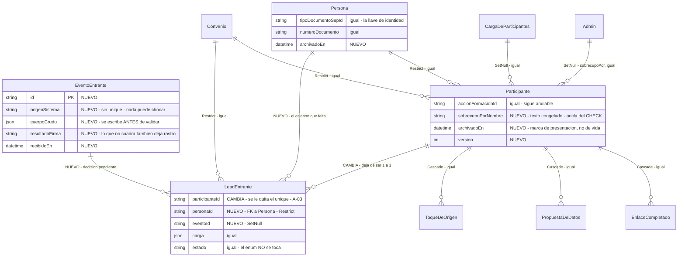
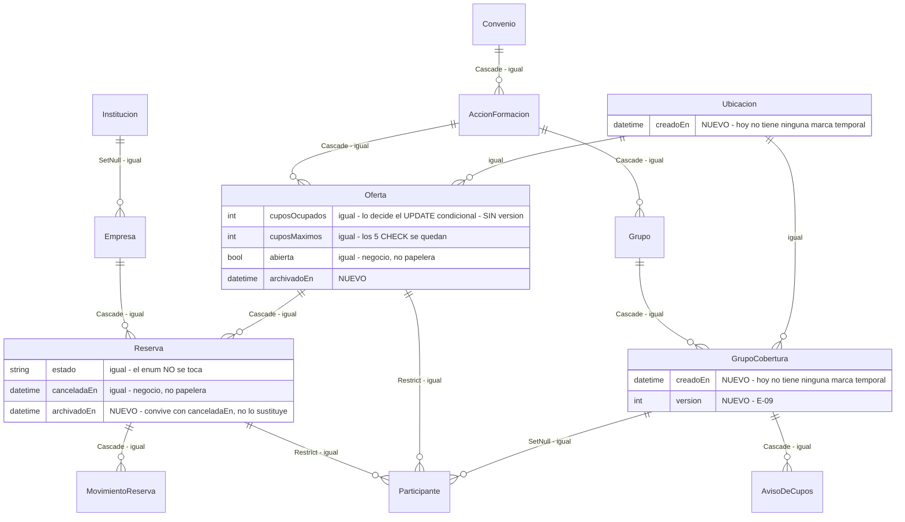
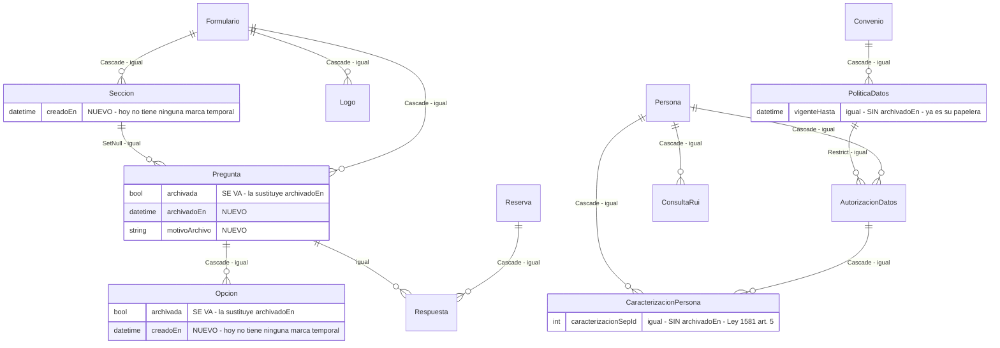
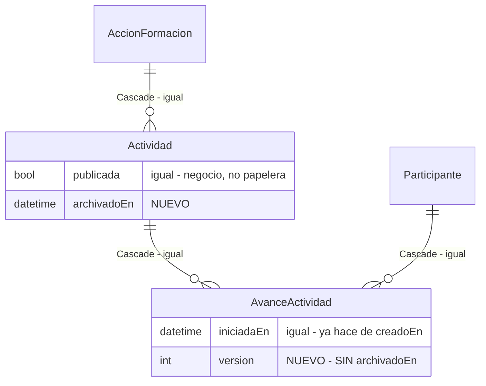
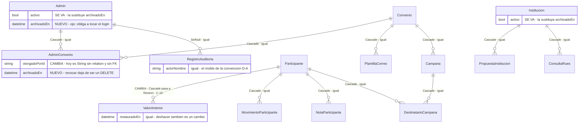

> **Fase 2 · entregable 1 de 7.** Solo lectura: no se modificó ni una línea de `backend/` ni de `frontend/`.
> **Aquí no hay migraciones.** Se describe el modelo y el porqué. El cómo y el orden son Fase 3.
> **Convención de citas.** Toda cita es `ruta:línea` **relativa a la raíz del repositorio**. Un `:NNN` suelto continúa la última ruta nombrada. `schema.prisma` sin ruta es siempre `backend/prisma/schema.prisma`. Donde no encontré algo, va el comando.

---

## Antes de nada: las tres decisiones que gobiernan todo lo demás

Si solo se lee una parte de este documento, que sea esta. Lo que viene después son consecuencias.

### D-A · el actor no puede ser solo una FK a `Admin`

Es el error que haría inútiles las ocho columnas. **Cinco de las puertas de escritura no tienen un `Admin` detrás**:

| Puerta | Dónde | ¿Hay sesión? |
|---|---|---|
| `POST /webhooks/leads/meta` | `backend/src/leads/leads.controller.ts:149` | no: sin guard, solo `firmaDeMeta` dentro del handler (`:166-174`) |
| `POST /preinscripcion/:slug` | `backend/src/preinscripcion/preinscripcion.controller.ts:22` | no |
| `POST /reservas` | `backend/src/reservas/reservas.controller.ts:27` | no |
| `PATCH /completar/:token` | `backend/src/preinscripcion/preinscripcion.controller.ts:56` | no |
| Los cinco workers | `Matricula` (`backend/src/crm/matricula.ts:29`), `VigiaDeCupos` (`backend/src/crm/vigia-de-cupos.ts:25`), `RuiWorker` (`backend/src/crm/rui/rui.worker.ts:42`), `WebWorker` (`backend/src/instituciones/web/web.worker.ts:28`), `CampanasWorker` (`backend/src/correo/campanas/campanas.worker.ts:27`) | no: no son peticiones |

Si el actor es solo `String? @relation(Admin)`, esas columnas salen **NULL exactamente en los sitios donde C-01 y C-14 dicen que hoy no hay rastro**. Se añaden ocho columnas y no se resuelve nada.

**La casa ya resolvió esto tres veces, con el mismo patrón**, y hay que copiarlo *tal como es*:

| Precedente | FK anulable | Relación | Texto congelado | Por qué, en el propio código |
|---|---|---|---|---|
| `NotaParticipante` | `autorId` (`schema.prisma:1018`) | `autor` (`:1028`) | `autorNombre` (`:1019`) | *"congelado al escribir"* |
| `CargaDeParticipantes` | `adminId` (`:632`) | `admin` (`:652`) | `autor` (`:633`) | *"el historico tiene que poder decir quien fue aunque la cuenta ya no exista"* (`:628-631`) |
| `RegistroAuditoria` | `adminId` (`:1556`) | `admin` (`:1574`) | `actorNombre` (`:1558`) | *"Congelado: la cuenta puede desaparecer."* (`:1557`) |

**Los tres usan tres nombres distintos.** Ninguno reutiliza el nombre de la relación para el texto congelado. No es un detalle de estilo: es lo único que hace que el patrón compile.

#### La convención: `<x>Id` + `<x>` + `<x>Nombre`

```prisma
creadoPorId           String?   // FK a Admin, onDelete: SetNull
creadoPor             Admin?    // la relación
creadoPorNombre       String    @default("desconocido:anterior-a-la-auditoria")
actualizadoPorId      String?
actualizadoPor        Admin?
actualizadoPorNombre  String?
archivadoPorId        String?
archivadoPor          Admin?
archivadoPorNombre    String?
```

**Por qué el texto NO puede llamarse `creadoPor`:**

- `creadoPor` **ya es la relación a `Admin`** en `PlantillaCorreo` (`schema.prisma:1700` la FK, `:1705` la relación) y en `Campana` (`:1776`, `:1784`), y los dos modelos están en el Tramo A (§2.1). Prisma no admite dos campos con el mismo nombre en un modelo: **el esquema no validaría**.
- El nombre está en uso vivo hasta el frontend: `backend/src/correo/campanas/campanas.service.ts:73`, `backend/src/correo/plantillas/plantillas-correo.service.ts:68`, `frontend/src/lib/campanas-api.ts:53`, `frontend/src/lib/plantillas-correo-api.ts:22`, `frontend/src/app/admin/campanas/page.tsx:140`, `frontend/src/app/admin/plantillas-correo/page.tsx:425-427`.
- Lo mismo con el sobrecupo: `sobrecupoPor` **ya es la relación a `Admin`** (`schema.prisma:941`), leída en `backend/src/crm/crm.service.ts:723` y tipada en `frontend/src/lib/crm-api.ts:345`. El texto congelado se llama `sobrecupoPorNombre` (§6.6).

Para `PlantillaCorreo` y `Campana` esto no es un cambio de estructura: ya tienen `creadoPorId` y `creadoPor`; solo ganan `creadoPorNombre`.

> **Coste que hay que asumir a propósito.** Convertir `creadoPorId` en FK de verdad en los 21 modelos del Tramo A obliga a declarar 21 relaciones inversas *con nombre* en `Admin`, porque Prisma no admite dos relaciones anónimas al mismo modelo. `Admin` engorda mucho. La alternativa —dejar `creadoPorId` como `String` suelto sin FK, que es lo que hoy hace `AdminConvenio.otorgadoPorId` (`schema.prisma:1230`)— evita el engorde pero renuncia a la integridad referencial. **Decisión 2, abierta.**

#### La nulabilidad, que es donde la regla 6 muerde

`creadoPorNombre String` **sin `@default` es NOT NULL sin valor**, y Postgres rechaza `ALTER TABLE … ADD COLUMN … TEXT NOT NULL` sobre una tabla que ya tiene filas. Son 21 tablas con datos de producción, no una. `backend/arrancar.sh:29` corre `pnpm exec prisma migrate deploy` bajo el `set -e` de `backend/arrancar.sh:7`: **el backend quedaría en ciclo de reinicios.** Es exactamente el fallo que la regla 6 nombra.

**Regla, para las ocho columnas y sin excepción: toda columna nueva que sea NOT NULL lleva `@default`.** Con `@default`, el `ADD COLUMN` es instantáneo en Postgres 11+ y no reescribe la tabla. El invariante «el texto congelado nunca es NULL» se conserva; lo que cambia es que las filas anteriores a la auditoría lo dicen con un valor honesto en vez de con un hueco.

Y un vocabulario cerrado para `creadoPorNombre` cuando no hay `Admin`, que es lo que convierte la columna en respuesta a *"¿quién escribió esto?"*:

```
admin:ana@…                          panel, con sesión
publico:reserva                      POST /reservas
publico:preinscripcion               POST /preinscripcion/:slug
publico:enlace                       PATCH /completar/:token
webhook:meta                         POST /webhooks/leads/meta
webhook:orquestador                  POST /webhooks/leads
worker:matricula                     Matricula
worker:vigia-de-cupos                VigiaDeCupos
carga:<cargaId>                      cargue masivo
siembra                              seed
desconocido:anterior-a-la-auditoria  el default de la migración
```

Con esto, `AvisoDeCupos` —que hoy lo escribe `VigiaDeCupos` (`backend/src/crm/vigia-de-cupos.ts:81`) y no consta— pasa a decir `worker:vigia-de-cupos`, y `Participante` creado por la preinscripción pública dice `publico:preinscripcion`. Esa columna sola responde a la mitad de D-02: **se puede saber qué filas entraron por una puerta sin guard sin abrir el código.**

> El campo del encargo se llama `creadoPor`, en singular. Aquí son tres columnas, porque una sola no puede ser a la vez FK, relación y texto libre, y porque el nombre `creadoPor` ya está ocupado. **Esto es una desviación del encargo y necesita visto bueno** (decisión 1).

### D-B · `archivadoEn` no sustituye a los estados de negocio; convive con ellos

Hay dos preguntas distintas y hoy están mezcladas en doce marcas:

- **«¿esto sigue en juego?»** — `Oferta.abierta`, `Reserva.estado=CANCELADA`, `AccionFormacion.visible`, `Formulario.publicado`, `LeadEntrante.estado=DESCARTADO`, `PoliticaDatos.vigenteHasta`. **Son de negocio. Se quedan.** Cancelar una reserva devuelve cupos y promueve la lista de espera; archivarla no. No son lo mismo y fundirlas rompería el aforo.
- **«¿esto tiene que seguir apareciendo?»** — `Convenio.activo`, `Admin.activo`, `Institucion.activo`, `PlantillaCorreo.activa`, `Pregunta.archivada`, `Opcion.archivada`. **Son papelera disfrazada de booleano, sin fecha y sin autor. Estas seis se sustituyen** por `archivadoEn` / `archivadoPorNombre` / `motivoArchivo`.

`Persona.esDePrueba` (`:845`) **no se toca**: no es papelera, es la barrera que impide consultar el RUI con cédulas inventadas, y su comentario (`:836-844`) explica el daño concreto que evita.

#### La frontera que hay que escribir en el propio esquema (regla 3)

`archivadoEn` en `Reserva` y en `Participante` es la puerta lateral por la que la regla 3 puede volver a entrar, esta vez por columna en vez de por enum. **Comprobado, y hay que dejarlo dicho antes de que alguien lo suponga:**

- `promoverListaDeEspera` filtra por `cuposEnEspera > 0` y `estado: { not: CANCELADA }` (`backend/src/reservas/reservas.service.ts:393-398`). **No hay filtro de archivo, y no debe haberlo**: mientras no esté cancelada, la reserva sigue con el cupo comprometido y se sigue promoviendo.
- Los conteos de aforo cuentan `etapa: { in: ETAPAS_VIVAS }` sin mirar el archivo, en seis sitios: `backend/src/crm/crm.service.ts:976`, `:3202`, `:3225`, `:3462`, `backend/src/cronograma/cronograma.service.ts:67`, `:201` (la lista se define en `backend/src/crm/crm.service.ts:106`). **Un participante archivado sigue ocupando silla, y así tiene que ser**: archivar no libera cupo, igual que no lo libera ocultar.

**Regla que se propone, y que va escrita en el `///` de los dos modelos:** `archivadoEn` es una marca de presentación, no de vida. Ninguna consulta de aforo, de lista de espera ni de estado de reserva la mira. Quien quiera «liberar» algo cancela o cambia de etapa; archivar no es una tercera forma de cancelar. Es la misma lección de la regla 3, dicha para una columna.

### D-C · Ni un valor nuevo en ningún enum, y ningún CHECK duro de aforo

- **Regla 3.** No se añade nada a `EstadoReserva` (`schema.prisma:257-261`, tres valores). Conté los predicados que dependen de él con

  ```
  grep -rn "CANCELADA" backend/src --include=*.ts | grep -v '\.spec\.'
  ```

  que devuelve 29 líneas: 2 comentarios, 2 escrituras (`backend/src/reservas/reservas.service.ts:244`, `backend/src/tableros/tableros.service.ts:1170`), 1 etiqueta de presentación (`backend/src/tableros/tableros.controller.ts:30`) y **24 predicados repartidos en cinco ficheros**:

  - **20 en forma «no está CANCELADA»** — `backend/src/crm/control.ts:371`, `:412`, `:638`, `:646`; `backend/src/crm/panel-de-cupos.ts:68`; `backend/src/crm/planeacion-de-pauta.ts:121`; `backend/src/reservas/reservas.service.ts:81`, `:326`, `:397`; `backend/src/tableros/tableros.service.ts:69`, `:143`, `:307`, `:361`, `:392`, `:441`, `:593`, `:669`, `:725`, `:874`, `:899`.
  - **4 que ramifican por «está CANCELADA»** — `backend/src/reservas/reservas.service.ts:166`, `:230`; `backend/src/tableros/tableros.service.ts:83`, `:1151`.

  Un estado nuevo entra vivo en los 20 primeros sin que nadie lo pida. **El hold con TTL de F-01 necesita ese estado nuevo y por eso queda FUERA de este documento**, con la cuenta ya hecha para quien lo aborde.
- **Regla 2.** Los cinco CHECK de cupos (`backend/prisma/migrations/20260729000000_modelo_inicial/migration.sql:388-412`) se quedan **como están**. No se propone ningún `sillasOcupadas <= cuposMaximos`: mataría el sobrecupo autorizado, que es deliberado y ya tiene su propio CHECK (`backend/prisma/migrations/20260814140000_crm_personas_y_participantes/migration.sql:223-225`).
- **Regla 7.** Comprobados los `Record` exhaustivos del frontend antes de escribir esto: `frontend/src/app/admin/reservas/page.tsx:23`, `frontend/src/lib/crm-api.ts:105`, `:124`, `:130`, `:173`, `:206`, `:228`, `:459`, `:469`, `:844`, `frontend/src/lib/admin-api.ts:369`, `frontend/src/lib/campanas-api.ts:8`, `frontend/src/components/admin/etapa.tsx:6`, `frontend/src/components/admin/cronograma-vista.tsx:55`. **Ninguno se rompe**, porque no se añade ningún valor. Los tipos del frontend están escritos a mano (`frontend/src/lib/api.ts:10`, `frontend/src/lib/tableros-api.ts:6`), no se generan de Prisma.

  **Dos precisiones que importan:**

  1. En el backend, `ESTADO_RESERVA` de `backend/src/tableros/tableros.controller.ts:27-31` **no es un `Record` exhaustivo**: es `Record<string, string>`. Un valor nuevo no rompería ahí la compilación — se caería en silencio, en ejecución, devolviendo `undefined`. Eso es peor, no mejor, y refuerza la regla 3 en vez de relajarla.
  2. «columnas nuevas en el esquema no llegan al frontend» es cierto para lo que se **añade**, y **falso para lo que se quita**. Las seis columnas marcadas «SE VA» en D-B las lee y las escribe el frontend hoy: `frontend/src/app/admin/participantes/nuevo/page.tsx:23` y `frontend/src/app/admin/sep/page.tsx:18` tipan `activo: boolean`; `frontend/src/app/admin/usuarios/page.tsx:201` manda `PATCH { activo: !u.activo }`; `frontend/src/app/admin/plantillas-correo/page.tsx:360`, `:395`, `:410`, `:415` manda `{ activa: true }`; `frontend/src/app/admin/formularios/[id]/page.tsx:65`, `:66`, `:370`, `frontend/src/app/admin/formularios/[id]/respuestas/page.tsx:80`, `:126`, `:138` y `frontend/src/components/admin/editor-pregunta.tsx:43`, `:68` filtran por `archivada`.

     Superficie medida con `grep -rn "activo\b\|activa\b\|archivada\b"`: **71 líneas en `backend/src`** (sin specs) y **70 en `frontend/src`**. No viola la regla 7 —no es un enum, no hay `Record` que reventar—, pero **la sustitución de los seis booleanos es un cambio de contrato de API y de frontend, no una migración interna.** Es la decisión 9.
- **Regla 4.** Los 27, 54 y 18 títulos de columna del SEP —fijados literalmente, espacios finales y dobles incluidos, en `backend/src/crm/sep/formatos.spec.ts:96`, `:100`, `:111`, `:152`, `:156`, `:160`— **no se tocan**. Nada de lo que hay aquí cambia una cabecera; lo que cambiará más adelante es qué filas se eligen, y eso es Fase 3/4.
- **Regla 5.** Nada de esto altera la respuesta del webhook. El único modelo nuevo que se propone se escribe **antes** de validar y **no puede** introducir un camino que devuelva algo distinto de lo de hoy (§5.3).

---

## 1 · El ER objetivo

**43 modelos hoy. La propuesta toca 4 y añade 1.** Los otros 39 se quedan estructuralmente iguales; lo que reciben son columnas de auditoría (§2) y, dieciséis de ellos, un índice parcial (§3).

### Leyenda

| Marca | Significado |
|---|---|
| **NUEVO** | no existe hoy |
| **CAMBIA** | la relación o la unicidad se modifica |
| *igual* | sin cambio estructural (puede recibir columnas de auditoría) |

### 1.1 · Captación e identidad — donde están los dos agujeros



El nombre del texto congelado es `sobrecupoPorNombre` y no `sobrecupoPor`: ese último ya es la relación a `Admin` en `schema.prisma:941` (§D-A, §6.6).

### 1.2 · Catálogo, oferta y aforo — sin tocar el mecanismo que funciona



`Oferta.cuposOcupados` **no lleva `version`** y es deliberado: quien decide ahí es el `UPDATE … AND "cuposOcupados" + N <= "cuposMaximos"` de `backend/src/reservas/reservas.service.ts:369-380`, que es una garantía real dentro de la propia sentencia. Una columna `version` que se incremente en cada escritura pondría un segundo árbitro más débil compitiendo con el que funciona. Lo mismo para `Reserva`: lo que le falta es tomar el candado antes de leer (F-02, G-01), no una columna.

### 1.3 · Formularios, consentimiento y datos personales



### 1.4 · Académico



### 1.5 · Administración, auditoría, directorio y correo



**El único cambio de `onDelete` que se propone** es `ValorAnterior.participanteId`: `Cascade` → `Restrict` (`schema.prisma:1914`). Es C-10 en una línea: hoy borrar una ficha se lleva el mecanismo para deshacer sus cambios. Con `Restrict`, el borrado físico de `backend/src/crm/crm.service.ts:1755` deja de compilar contra la realidad y hay que archivar — que es lo que INV-1 pide.

### 1.6 · Los 43, de un vistazo

| Se quedan estructuralmente iguales (39) |
|---|
| Convenio · AccionFormacion · Ubicacion · Grupo · GrupoCobertura · Oferta · Empresa · Reserva · MovimientoReserva · Formulario · Seccion · Pregunta · Opcion · Respuesta · Actividad · AvanceActividad · CargaDeParticipantes · ToqueDeOrigen · Persona · MovimientoParticipante · NotaParticipante · CaracterizacionPersona · AutorizacionDatos · PoliticaDatos · Tema · Admin · EnlaceCompletado · Logo · Marca · Institucion · PropuestaInstitucion · ConsultaRues · ConsultaRui · RegistroAuditoria · PropuestaDeDatos · AvisoDeCupos · PlantillaCorreo · Campana · DestinatarioCampana |

| Cambian (4) | Qué cambia |
|---|---|
| `LeadEntrante` | pierde el `@unique` de `participanteId`; gana `personaId` y `eventoId` |
| `Participante` | gana `sobrecupoPorNombre` congelado; dos índices parciales nuevos |
| `AdminConvenio` | `otorgadoPorId` pasa a ser FK de verdad |
| `ValorAnterior` | `Cascade` → `Restrict` |

| Nuevo (1) | |
|---|---|
| `EventoEntrante` | **decisión pendiente**, ver §5.3 |

---

## 2 · Los ocho campos de auditoría: dónde van y dónde no

Los ocho no son un bloque. Son **tres preguntas distintas** más una categoría que el encargo no nombra y el código exige:

- **nacimiento** — `creadoEn`, `creadoPorNombre` (+ `creadoPorId`)
- **último cambio y concurrencia** — `actualizadoEn`, `actualizadoPorNombre`, `version`
- **papelera** — `archivadoEn`, `archivadoPorNombre`, `motivoArchivo`
- **libros de asiento** — donde «actualizado» y «archivado» no significan nada, porque corregir es otra fila

### 2.0 · La consolidación que se pide

Hoy hay **doce marcas de apagado con doce nombres distintos**, y ninguna dice cuándo ni quién:

| # | Marca | Dónde | Destino |
|---|---|---|---|
| 1 | `activo` | `Convenio:41`, `Admin:1143`, `Institucion:1390` | → `archivadoEn` |
| 2 | `activa` | `PlantillaCorreo:1688` | → `archivadoEn` |
| 3 | `archivada` | `Pregunta:445`, `Opcion:473` | → `archivadoEn` |
| 4 | `visible` | `AccionFormacion:93` | **se queda** (negocio) |
| 5 | `publicado` | `Formulario:367` | **se queda** (negocio) |
| 6 | `publicada` | `Actividad:545` | **se queda** (negocio) |
| 7 | `abierta` | `Oferta:184` | **se queda** (negocio) |
| 8 | `canceladaEn` | `Reserva:292` | **se queda** (negocio: devuelve cupos) |
| 9 | `revocadaEn` | `AutorizacionDatos:1064` | **se queda** (es la prueba) |
| 10 | `vigenteHasta` | `PoliticaDatos:1089` | **se queda** (llave del índice parcial) |
| 11 | `usadoEn` / `anuladoEn` | `EnlaceCompletado:1210`, `:1212` | **se queda** (ciclo de vida propio) |
| 12 | `esDePrueba` | `Persona:845` | **se queda** (barrera del RUI, no papelera) |

**Seis marcas se sustituyen; seis se quedan porque no son papelera.** La consolidación no es fundirlas todas: es dejar de usar seis booleanos como papelera y tener una sola papelera con fecha, autor y motivo. Lo que cuesta quitar esas seis del contrato de la API está medido en §D-C, regla 7, precisión 2.

Y los **cuatro modelos sin ninguna marca temporal** —`Ubicacion:112`, `GrupoCobertura:153`, `Seccion:390`, `Opcion:466`— reciben al menos `creadoEn` / `creadoPorNombre`. Verificado con:

```
awk '/^model /{n=$2;b=""} {b=b"\n"$0} /^\}/{if(n!="" && b !~ /creadoEn/) print n; n=""}' backend/prisma/schema.prisma
```

Devuelve diez modelos, pero seis de ellos ya llevan su equivalente con otro nombre —`AvanceActividad.iniciadaEn:568`, `ToqueDeOrigen.primeraVez:682`, `LeadEntrante.recibidoEn:785`, `AutorizacionDatos.otorgadaEn:1060`, `Tema.actualizadoEn:1123`, `Marca.actualizadoEn:1284`—. **Los que no tienen nada son exactamente cuatro**, y confirman lo anotado en Fase 0 §10.10.

### 2.1 · Tramo A — los ocho completos (21 modelos)

`creadoEn` · `creadoPorNombre` · `actualizadoEn` · `actualizadoPorNombre` · `version` · `archivadoEn` · `archivadoPorNombre` · `motivoArchivo` (más las FK `creadoPorId` / `actualizadoPorId` / `archivadoPorId`, sujeto a la decisión 2)

`Convenio` · `AccionFormacion` · `Ubicacion` · `Grupo` · `GrupoCobertura` · `Oferta` · `Empresa` · `Reserva` · `Formulario` · `Seccion` · `Pregunta` · `Opcion` · `Actividad` · `Persona` · `Participante` · `Admin` · `AdminConvenio` · `Institucion` · `PlantillaCorreo` · `Campana` · `Logo`

Son las entidades que un humano crea, edita y quiere quitar de en medio sin perderlas.

**Tres excepciones dentro del tramo, y hay que respetarlas:**

- **`Oferta` no lleva `version`.** Ya explicado en §1.2: el árbitro es el `UPDATE` condicional.
- **`Reserva` no lleva `version`.** Su problema es el orden de las lecturas (`backend/src/reservas/reservas.service.ts:229` lee antes del candado de `:234`), no la ausencia de una columna.
- **`AdminConvenio` no lleva `version`.** Una concesión no se edita: se revoca y se otorga otra. Lo que sí necesita es `archivadoEn`, porque hoy revocar es un `DELETE` y no queda quién tuvo acceso a qué y hasta cuándo — que es justo lo que una auditoría de accesos pregunta.

**Y una condición que vale para los 21:** el único campo NOT NULL de los ocho es `creadoPorNombre`, y lleva `@default` (§D-A). Sin eso, la migración de este tramo tumba el arranque.

### 2.2 · Tramo B — papelera propia, **sin** `archivadoEn` (4 modelos)

`creadoEn` · `creadoPorNombre` · (`actualizadoEn` · `actualizadoPorNombre` donde ya existen). **Nada de `archivadoEn`.**

| Modelo | Su papelera ya está modelada | Por qué añadir `archivadoEn` sería un error |
|---|---|---|
| `PoliticaDatos` | `vigenteHasta` (`:1089`) | El índice `politicas_datos_una_vigente` **se apoya en `vigenteHasta`** (`backend/prisma/migrations/20260814120000_politica_por_destinatario/migration.sql:19-21`). Dos columnas para «ya no rige» = dos verdades y un índice que solo mira una. Además `backend/src/politicas/politicas.service.ts:188-192` ya se niega a borrar una política aceptada: *"No se borra una política que alguien aceptó: es la prueba de lo que leyó."* (`:190`) |
| `AutorizacionDatos` | `revocadaEn` (`:1064`), con `@@index([personaId, revocadaEn])` (`:1070`) | Es la prueba del consentimiento. Nunca se archiva: se revoca, y la fila sigue siendo la evidencia de lo que se autorizó y cuándo |
| `EnlaceCompletado` | `expiraEn:1202` / `abiertoEn:1208` / `usadoEn:1210` / `anuladoEn:1212` | Cuatro estados ya distinguidos, con el comentario de por qué existe cada uno (`:1203-1211`). Un quinto no aporta |
| `LeadEntrante` | `estado = DESCARTADO` (`:778`) + `motivo` (`:780`) | `motivo` ya es el `motivoArchivo` del lead. Añadir `archivadoEn` daría dos maneras de descartar y **D dice que hoy `DESCARTADO` no lo escribe nadie**: el trabajo pendiente es usarlo, no duplicarlo |

### 2.3 · Tramo C — libros de asiento: **solo** `creadoEn` y `creadoPorNombre` (9 modelos)

Sin `actualizadoPorNombre`, sin `version`, **sin `archivadoEn`**. Archivar una fila de un libro de asiento es exactamente lo que INV-3 prohíbe.

`MovimientoReserva` · `MovimientoParticipante` · `NotaParticipante` · `RegistroAuditoria` · `ValorAnterior` · `Respuesta` · `ToqueDeOrigen` · `CargaDeParticipantes` · `CaracterizacionPersona`

**Comprobado que son de verdad append-only, sobre los nueve** —el borrador anterior solo comprobó cinco y por eso se le escapó una excepción real:

```
for m in movimientoReserva movimientoParticipante notaParticipante registroAuditoria \
         valorAnterior respuesta toqueDeOrigen cargaDeParticipantes caracterizacionPersona; do
  echo -n "$m: "
  grep -rn "$m\.update\|$m\.upsert" backend/src --include=*.ts | grep -v '\.spec\.' | wc -l
done
```

Seis dan `0`. Los tres que no, uno por uno:

- `backend/src/crm/crm.service.ts:1434-1437` escribe en `ValorAnterior` solo `restauradoEn`/`restauradoPorId`. Es una transición de un sentido, no una mutación del valor guardado. El propio modelo lo dice: *"No se borra la fila: deshacer también es un cambio, y se tiene que poder ver."* (`schema.prisma:1907-1908`).
- `backend/src/crm/origen-del-lead.ts:92-98` hace `upsert` en `ToqueDeOrigen` para incrementar `veces`. **No es un libro: es un contador**, y sus `primeraVez`/`ultimaVez` ya son su `creadoEn`/`actualizadoEn`. Se queda como está.
- **`CargaDeParticipantes` sí se actualiza después de crearse.** `backend/src/crm/crm.service.ts:2836-2839` escribe `creados` y `fallidos` cuando termina el cargue. No es corregir el asiento: es cerrarlo, con el recuento que solo se sabe al final. **Excepción declarada dentro del Tramo C: `CargaDeParticipantes` lleva `actualizadoEn`** (y nada más de la familia «actualizado», porque el actor es el mismo que creó la fila y ya está congelado en `autor:633`). Alternativa, si se prefiere no abrir excepciones: sacarla del Tramo C y llevarla al Tramo A sin papelera. **Decisión 11, abierta.**

**Cuatro de estos nueve ya tienen el actor congelado** y por tanto ya cumplen media convención D-A: `NotaParticipante.autorNombre:1019`, `CargaDeParticipantes.autor:633`, `RegistroAuditoria.actorNombre:1558`, `ValorAnterior.actorNombre:1904`. A los otros cinco hay que ponérselo.

> **`CaracterizacionPersona` es el caso que hay que discutir aparte, y es el único sitio del sistema donde recomiendo NO archivar.** Ver §2.6.

### 2.4 · Tramo D — colas y listas operativas (7 modelos)

`creadoEn` · `creadoPorNombre`. **Sin `version`** (las colas se toman con `FOR UPDATE SKIP LOCKED`, ya hay pesimismo) y **sin `archivadoEn`** salvo donde se indica.

| Modelo | Su ciclo de vida ya está | `archivadoEn` |
|---|---|---|
| `ConsultaRui` | `estado` + `intentos` + `tomadaEn`/`resueltaEn` | no |
| `ConsultaRues` | ídem | no |
| `AvisoDeCupos` | `enviadoEn` (`:1654`) / `atendidoEn` (`:1658`) | no |
| `DestinatarioCampana` | lista congelada al lanzar; `estado` + `enviadoEn` | no |
| `AvanceActividad` | `estado` + `completadaEn` (`:569`); **sí lleva `version`** | no |
| `PropuestaDeDatos` | `estado` + `resueltoPorId` (`:1612`) + `resueltoEn` (`:1613`) | **sí** |
| `PropuestaInstitucion` | ídem | **sí** |

Las dos propuestas se llevan `archivadoEn` por un motivo concreto: **son los dos sitios donde hoy se borra una fila para reemplazarla**, `backend/src/leads/leads.service.ts:370-376` y `backend/src/preinscripcion/preinscripcion.service.ts:958-961`, los dos con el comentario *"una pendiente por ficha: la última es la que vale"*. Eso es archivar por reemplazo, y `motivoArchivo = 'reemplazada por una más reciente'` lo dice sin perder la anterior. Es lo que A-04 echa en falta.

De paso: **el comentario de `schema.prisma:1599` está desactualizado.** Dice *"Por eso se borra al resolverse."*, y `backend/src/crm/crm.service.ts:2524-2532` resuelve con `update`, no con `delete`. La fila resuelta sí se conserva. Conviene corregir el comentario.

### 2.5 · Tramo E — fila única (2 modelos)

`Tema` (dos filas fijas, `esquema @unique:1118`) y `Marca` (una fila, `id @default("unica"):1270`). **Ya tienen `actualizadoEn` + `actualizadoPorId`** (`:1124` y `:1285`, con su relación en `:1126` y `:1287`). No llevan `creadoPorNombre`, ni `version`, ni papelera: no se pueden crear ni borrar, solo editar.

### 2.6 · El único sitio donde recomiendo seguir borrando de verdad

`CaracterizacionPersona` guarda la población vulnerable: víctima del conflicto, discapacidad, pertenencia étnica. Es el dato del artículo 5 de la Ley 1581, y el código ya tiene una postura escrita sobre él, en `ClaseDeDato.SENSIBLE` (`schema.prisma:1867-1873`):

> *"Población vulnerable. NUNCA se guarda el valor: ni tapado, ni para un superadmin. Que alguien fue víctima del conflicto y lo desmarcó no puede quedar escrito en una segunda tabla — es el dato del artículo 5 de la Ley 1581, y en Colombia divulgarlo pone a alguien en riesgo. Del cambio queda la constancia, no el valor."*

Y `backend/src/preinscripcion/preinscripcion.service.ts:898-901` borra las marcas enteras al reemplazarlas, con su razón: *"Se reemplaza entera, no se suma: si la persona vuelve y quita una casilla, quitarla tiene que servir de algo."*

**Poner `archivadoEn` en esa tabla convierte «me desmarqué» en una fila que dice para siempre que estuve marcado.** Es exactamente lo que la casa se prohibió a sí misma dos párrafos más arriba. Aquí **INV-1 cede ante la Ley 1581**, y la forma de no perder trazabilidad es la que el sistema ya usa: un `RegistroAuditoria` con `camposTocados` y **sin valores** (`schema.prisma:1549-1552`: *"Quién tocó qué. Sin datos personales dentro: para los cambios en PII se guarda qué campos cambiaron, no los valores, o la auditoría acaba siendo una segunda copia de los datos que nadie recuerda proteger."*).

**Esto es una excepción declarada a INV-1 y necesita su aprobación explícita.** No la doy por tomada.

---

## 3 · Los índices únicos: los 28 actuales y cuáles se vuelven parciales

**El precedente de la casa es único en las 43 migraciones.** Verificado:

```
grep -rn -A2 "CREATE UNIQUE INDEX" backend/prisma/migrations/ | grep -i WHERE
→ una sola línea: politicas_datos_una_vigente
```

```sql
-- backend/prisma/migrations/20260814120000_politica_por_destinatario/migration.sql:19-21
CREATE UNIQUE INDEX "politicas_datos_una_vigente"
  ON "politicas_datos"("convenioId","destinatario") WHERE "vigenteHasta" IS NULL;
```

### 3.0 · La restricción técnica que hay que tener delante

**Prisma 6.19.3** (`backend/package.json:51`, `:58`) **no sabe declarar un índice único parcial.** No hay sintaxis para `WHERE` en `@@unique`. Por eso `politicas_datos_una_vigente` vive solo en el `.sql` y **no aparece en `schema.prisma`**.

Y eso tiene un precio que la casa ya pagó una vez y dejó escrito:

```
// schema.prisma:971-973
/// Lo creo su migracion y no estaba aqui: sin declararlo,
/// la siguiente migracion lo borra sola.
@@index([convenioId, origenLead])
```

**Diecisiete índices parciales viviendo fuera de `schema.prisma`** —dieciséis conversiones, y la de `Participante` se desdobla en dos (§4.1)— **son diecisiete cosas que la siguiente migración generada puede borrar sin avisar, y la papelera se abre entera sin que salte nada.** Por eso §6 no es un adorno de documentación: es la única defensa que tienen los índices de §3.

### 3.1 · Los 22 `@@unique` de tabla

| # | Modelo | Índice | `ruta:línea` | ¿Parcial sobre `archivadoEn IS NULL`? | Por qué |
|---|---|---|---|---|---|
| 1 | `AccionFormacion` | `[convenioId, codigo]` | `:106` | **Sí** | Archivar AF1 mal cargada y volver a crear AF1 es el caso normal |
| 2 | `Ubicacion` | `[nombre, tipo]` | `:122` | **Sí** | Un «Bogotá D.C.» duplicado se archiva; el bueno tiene que poder existir |
| 3 | `Grupo` | `[accionFormacionId, numero]` | `:148` | **Sí** | Un grupo que se cae y se vuelve a abrir con el mismo número |
| 4 | `GrupoCobertura` | `[grupoId, ubicacionId, modalidad]` | `:167` | **Sí** | Cobertura retirada y reabierta |
| 5 | `Oferta` | `[accionFormacionId, ubicacionId]` | `:195` | **Sí** | Cerrar es `abierta=false`; archivar es otra cosa y hoy quema el par |
| 6 | `Empresa` | `[nit]` | `:249` | **Sí — la más urgente, y la más cara: ver §3.3** | Archivar una empresa **quema su NIT para siempre**. La siguiente reserva de ese NIT explota o resucita la fila archivada |
| 7 | `Reserva` | `[empresaId, ofertaId]` | `:303` | **Sí — y hay un hallazgo, ver §3.4** | |
| 8 | `Pregunta` | `[formularioId, campoNucleo]` | `:460` | **Sí — roto hoy** | `archivada` ya existe (`:445`) y el índice no la excluye: **archivar la pregunta del NIT y añadir otra falla ya** |
| 9 | `Opcion` | `[preguntaId, valor]` | `:477` | **Sí — roto hoy** | Igual: `archivada` en `:473`, índice ciego |
| 10 | `Respuesta` | `[reservaId, preguntaId]` | `:501` | **No** | Evidencia congelada (`etiquetaPregunta` al enviar). No se archiva |
| 11 | `Actividad` | `[accionFormacionId, orden]` | `:552` | **Sí** | Archivar la actividad 3 e insertar otra con orden 3 |
| 12 | `AvanceActividad` | `[participanteId, actividadId]` | `:577` | **No** | Es el registro de lo que hizo una persona |
| 13 | `ToqueDeOrigen` | `[participanteId, origen]` | `:689` | **No** | Contador, no entidad. Y `backend/src/crm/origen-del-lead.ts:93` lo usa como llave de `upsert` |
| 14 | `LeadEntrante` | `[origenSistema, externoId]` | `:791` | **NO — y es importante que no** | **Es la llave de idempotencia.** Volverlo parcial deja que archivar un lead permita al reintento de Meta crear un duplicado. Y `backend/src/leads/leads.service.ts:118`, `:245` lo usan como llave de `findUnique` |
| 15 | `Persona` | `[tipoDocumentoSepId, numeroDocumento]` | `:856` | **NO — y es importante que no** | **Es la llave de identidad.** Volverla parcial deja convivir dos `Persona` con la misma cédula, que es partir a un ser humano en dos. Lo usan tres `upsert`: `backend/src/crm/crm.service.ts:993`, `backend/src/preinscripcion/preinscripcion.service.ts:259`, `:271` |
| 16 | `Participante` | `[accionFormacionId, personaId]` | `:955` | **Sí, y además hay que arreglarlo** | Ver §4.1 |
| 17 | `CaracterizacionPersona` | `[personaId, caracterizacionSepId]` | `:1049` | **No** | Ver §2.6: aquí sí se borra |
| 18 | `PoliticaDatos` | `[convenioId, destinatario, version]` | `:1099` | **No** | La numeración de versiones es histórica y no se reutiliza |
| 19 | `AdminConvenio` | `[adminId, convenioId, rol]` | `:1237` | **Sí** | Revocar y volver a otorgar el mismo rol es lo normal. Hoy solo funciona porque revocar borra la fila |
| 20 | `Institucion` | `[nit, razonSocial]` | `:1400` | **Sí** | `activo` ya existe (`:1390`) y el índice no lo mira |
| 21 | `AvisoDeCupos` | `[coberturaId, fechaInicioGrupo]` | `:1664` | **No** | Deliberado: *"si se corre la fecha, es un aviso nuevo y no un duplicado"* (`:1662-1663`) |
| 22 | `DestinatarioCampana` | `[campanaId, correo]` | `:1840` | **No** | Lista congelada al lanzar. Su comentario (`:1834-1839`) explica por qué es por buzón |

### 3.2 · Los 6 `@unique` en línea

| # | Campo | `ruta:línea` | ¿Parcial? | Por qué |
|---|---|---|---|---|
| 23 | `Convenio.slug` | `:30` | **Sí** | Con un aviso: el slug es una ruta pública. Reutilizarlo repunta una URL que ya circula |
| 24 | `Formulario.slug` | `:364` | **Sí** | Mismo aviso |
| 25 | `LeadEntrante.participanteId` | `:783` | **Se elimina, no se vuelve parcial** | Ver §4.2 |
| 26 | `Tema.esquema` | `:1118` | **No** | Dos filas fijas |
| 27 | `Admin.correo` | `:1139` | **Sí, pero es la que más cuidado pide** | Ver §3.5 |
| 28 | `EnlaceCompletado.token` | `:1198` | **No** | Aleatorio y largo; jamás se reutiliza |

**Recuento, contado sobre las dos tablas: 16 se vuelven parciales (1-9, 11, 16, 19, 20, 23, 24, 27), 11 se quedan duros (10, 12, 13, 14, 15, 17, 18, 21, 22, 26, 28), 1 se elimina (25).** 16 + 11 + 1 = 28.

### 3.3 · Lo que cuesta cada conversión, medido bien

Un `@@unique` de Prisma genera un accesor en el cliente. **Un índice parcial no lo genera**, así que cada `findUnique`/`upsert`/`findUniqueOrThrow` que lo use deja de compilar.

**El método del borrador anterior estaba mal y por eso el número salía a la mitad:** solo buscó llaves *compuestas* (`empresaId_ofertaId`, `nit_razonSocial`…). Un `@unique` de **una sola columna** no genera llave compuesta: genera `where: { nit }`, `{ slug }`, `{ correo }` directo, y ese grep no lo ve. Los dos greps:

```
grep -rn "empresaId_ofertaId\|nit_razonSocial\|accionFormacionId_ubicacionId\|accionFormacionId_personaId\|\
formularioId_campoNucleo\|preguntaId_valor\|convenioId_codigo\|adminId_convenioId_rol\|nombre_tipo\|\
accionFormacionId_numero\|grupoId_ubicacionId_modalidad\|accionFormacionId_orden" backend/src --include=*.ts | grep -v '\.spec\.'

grep -rn "empresa\.\(findUnique\|upsert\|findUniqueOrThrow\)\|convenio\.findUnique\|\
formulario\.findUnique\|admin\.findUnique" backend/src --include=*.ts | grep -v '\.spec\.'
```

| Llave que se convierte | Sitios que hay que reescribir |
|---|---|
| `empresaId_ofertaId` (Reserva) | `backend/src/reservas/reservas.service.ts:78` |
| `nit_razonSocial` (Institucion) | `backend/src/crm/directorio.service.ts:87` · `backend/src/instituciones/web/disparador.ts:155` · `backend/src/instituciones/web/harness.ts:43` |
| `accionFormacionId_ubicacionId` (Oferta) | `backend/src/cronograma/cronograma.service.ts:230` |
| **`nit` (Empresa)** | `backend/src/preinscripcion/preinscripcion.service.ts:1188` **(upsert)** · `:1279` **(upsert)** · `backend/src/reservas/reservas.service.ts:276` · `:489` · `:512` **(upsert)** · `:523` (`findUniqueOrThrow`) |
| `slug` (Convenio) | `backend/src/catalogo/catalogo.service.ts:32` |
| `slug` (Formulario) | `backend/src/formularios/formularios.service.ts:220` · `:837` · `backend/src/admin/admin.service.ts:377` |
| `correo` (Admin) | `backend/src/admin/admin.service.ts:116` (ver §3.5) |
| `accionFormacionId_personaId` (Participante) | **ninguno** |
| `convenioId_codigo`, `nombre_tipo`, `accionFormacionId_numero`, `grupoId_ubicacionId_modalidad`, `formularioId_campoNucleo`, `preguntaId_valor`, `accionFormacionId_orden`, `adminId_convenioId_rol` | **ninguno** |

**Son dieciséis sitios, no cinco.** Y hay un coste cualitativo peor que el recuento:

> **Tres de esos dieciséis son `upsert`, y un `upsert` no se puede reescribir como `findFirst` + `create` sin perder la atomicidad** — que es justo para lo que está. El caso peor es `backend/src/reservas/reservas.service.ts:511-526`, que **depende de la unicidad de `nit` para recuperarse de la carrera del INSERT**: hace `empresa.upsert({ where: { nit } })` y, si otra petición gana, atrapa `P2002` y cae en `findUniqueOrThrow({ where: { nit } })`. Con un índice parcial, Prisma ya no ofrece `upsert` por `nit` ni `findUniqueOrThrow` por `nit`, y hay que bajar a `INSERT … ON CONFLICT` crudo **repitiendo el predicado del índice** (`ON CONFLICT ("nit") WHERE "archivadoEn" IS NULL`). Está en la ruta pública `POST /reservas`.

Las tres llaves que más se usan —`tipoDocumentoSepId_numeroDocumento` (3 sitios), `origenSistema_externoId` (2), `participanteId_origen` (1)— **son las que NO se convierten**, y eso sigue siendo cierto. Lo que ya no se puede decir es que «el coste y el riesgo caen del mismo lado»: **`Empresa.nit` es cara y está en la ruta pública.** Por eso sale de la lista general y va con su propio visto bueno (decisión 10).

### 3.4 · El hallazgo de esta pasada: `reservas @@unique([empresaId, ofertaId])`

Este no estaba en Fase 0 ni en Fase 1. Al mirar el coste de convertir el índice apareció lo siguiente.

`backend/src/reservas/reservas.service.ts:166-169`, al editar una reserva cancelada, dice:

> *"Esta reserva está cancelada. **Haga una reserva nueva.**"*

**Pero el `@@unique([empresaId, ofertaId])` de `schema.prisma:303` prohíbe esa reserva nueva.** El código lo sabe y hace otra cosa (`backend/src/reservas/reservas.service.ts:119-130`):

```ts
const reserva = existente
  ? // se revive la fila cancelada
    await tx.reserva.update({ where: { id: existente.id }, data: datos })
  : await tx.reserva.create({
      data: { empresaId: empresa.id, ofertaId: oferta.id, ...datos },
    });

if (respuestas.length) {
  // al revivir, las respuestas viejas sobran
  if (existente) {
    await tx.respuesta.deleteMany({ where: { reservaId: reserva.id } });
  }
```

Revivir **pisa sobre la misma fila** `contactoNombre`, `contactoCorreo`, `contactoCelular`, `contactoCargo`, `politicaDatosId`, `ipOrigen` y `cuposSolicitados` (el objeto `datos`, `:102-117`), y **borra físicamente las `Respuesta` de la primera reserva**. Sobrevive el `MovimientoReserva`, pero no sobrevive **qué contestó la empresa la primera vez ni qué versión exacta de la política aceptó** — y `politicaDatosId` es precisamente lo que `backend/src/politicas/politicas.service.ts:190` llama *"la prueba de lo que leyó"*.

> **Hay una violación de INV-1 escondida dentro de un índice único.** Ninguna consulta a `registros_auditoria` la encontraría, porque el borrado es de `respuestas` y no deja huella.

**Con el índice parcial sobre `canceladaEn IS NULL`, el arreglo es no revivir**: la reserva cancelada se queda como registro inmutable y la nueva es una fila nueva. Es compatible con la regla 3: **no hace falta ningún estado nuevo**, porque los 24 predicados de §D-C ya filtran por `CANCELADA` y seguirían **contando** bien con dos filas conviviendo.

**Pero cuentan bien y ordenan distinto, y eso hay que decirlo antes de aprobarlo.** `promoverListaDeEspera` reparte los cupos que se liberan por `orderBy: { creadoEn: 'asc' }` (`backend/src/reservas/reservas.service.ts:399`). Hoy, revivir la fila cancelada **conserva su `creadoEn` original**, así que la empresa que cancela y vuelve **mantiene su puesto en la cola**. Con una fila nueva, pasa al final. Puede ser lo justo —cancelar y volver a pedir no debería guardar el turno—, pero **es un cambio de comportamiento de la lista de espera**, no una consecuencia neutra, y es la lista de espera lo que la regla 3 protege. Va en la decisión 8, dicho.

Aquí el predicado del índice es `canceladaEn IS NULL`, no `archivadoEn IS NULL` — o los dos, si se quiere que archivar también libere el par. Es una decisión de detalle para Fase 3.

### 3.5 · `Admin.correo`: recomendado, pero con una advertencia de seguridad

`backend/src/admin/admin.service.ts:115-124`:

```ts
const admin = await this.prisma.admin.findUnique({ where: { correo } });

// mismo error: no decir que correos existen
const generico = new UnauthorizedException('Correo o contraseña incorrectos.');
if (!admin || !admin.activo) {
  // hash de descarte: que tarde lo mismo
  await verificarClave(clave, 'scrypt$AAAA$AAAA');
  throw generico;
}
```

Si `correo` pasa a ser parcial, ese `findUnique` deja de compilar. **Reescribirlo como `findFirst({ where: { correo } })` sin el filtro de archivo abre un fallo real**: con un admin archivado y otro vivo con el mismo buzón, `findFirst` puede devolver el archivado y dejar fuera al vivo.

La reescritura correcta —`findFirst({ where: { correo, archivadoEn: null } })`— **tiene que ir en el mismo cambio que el índice, nunca después.** Es la única conversión de las dieciséis que toca la ruta de autenticación, y por eso va la última de la lista y con su propio visto bueno.

### 3.6 · Regla 6: cuál de estos cambios puede tumbar el contenedor

`backend/arrancar.sh:29` corre `pnpm exec prisma migrate deploy` con el `set -e` de `backend/arrancar.sh:7` en cada arranque. Una migración que falle deja el backend en ciclo de reinicios.

**No pueden fallar por datos:**

- **Las dieciséis conversiones de único total a único parcial.** Un índice parcial restringe **menos** filas que el total del que sale: todo lo que hoy pasa, sigue pasando.
- **Quitar el `@unique` de `LeadEntrante.participanteId`**: relaja.
- **Las columnas de auditoría**, *a condición de que se cumpla la regla de §D-A*: la única NOT NULL es `creadoPorNombre` y lleva `@default`. **Sin ese `@default`, este punto se invierte y son 21 tablas las que tumban el arranque.** No es una advertencia teórica: es lo que decía la versión anterior de este documento.

**Pueden fallar dos, y las dos necesitan trabajo previo dentro de la misma migración:**

1. **El índice nuevo de §4.1**, `UNIQUE("convenioId","personaId") WHERE "accionFormacionId" IS NULL`, porque es genuinamente más estricto que lo de hoy y **es probable que haya duplicados en la base** (§4.1 explica por qué y da la consulta para contarlos). Necesita depuración previa y no puede crearse a ciegas dentro del arranque.
2. **El reanclaje del CHECK `participantes_sobrecupo_justificado` de §6.6.** Hoy hay filas con `sobrecupoPorId` y `sobrecupoMotivo` puestos —los escriben `backend/src/crm/crm.service.ts:1048-1049` y `:3510-3511`—. La columna de texto nueva nacería NULL en todas ellas, así que `ADD CONSTRAINT (("sobrecupoPorNombre" IS NULL) = ("sobrecupoMotivo" IS NULL))` **falla en el momento de crearse**. Exige **backfill desde `Admin.nombre` en la misma migración y antes del `ADD CONSTRAINT`**, con un valor de reserva para las filas cuyo admin ya no exista.

---

## 4 · Los dos agujeros de unicidad

### 4.1 · `@@unique([accionFormacionId, personaId])` con `accionFormacionId` anulable

**El hecho.** `schema.prisma:875` declara `accionFormacionId String?` y `:955` declara `@@unique([accionFormacionId, personaId])`. Postgres trata cada NULL como distinto: mientras el campo sea NULL, la misma persona puede tener N fichas.

**Y tampoco hay red en el código.** `backend/src/crm/crm.service.ts:1022-1036`:

```ts
if (oferta) {
  const repetido = await tx.participante.findFirst({
    where: {
      personaId: persona.id,
      accionFormacionId: oferta.accionFormacionId,
    },
    select: { id: true },
  });
  if (repetido) {
    throw new ConflictException(
      'Esta persona ya está en esa acción de formación. ' +
        'Nadie cuenta dos veces contra la meta.',
    );
  }
}
```

**El chequeo entero está dentro de un `if (oferta)`.** Cuando se da de alta sin oferta, no hay comprobación ni en la base ni en el código.

**Quién puede llegar ahí, dicho con precisión** —el borrador anterior decía «cinco puertas» y «la fase del embudo por la que entra todo el mundo», y **eso no es lo que dice el código**:

- **Solo hay dos puertas que crean `Participante`**: `backend/src/crm/crm.service.ts:1038` y `backend/src/preinscripcion/preinscripcion.service.ts:328`. Verificado con `grep -rn "participante\.create\|participante\.upsert" backend/src backend/prisma --include=*.ts | grep -v '\.spec\.'`, que además solo añade el seed (`backend/prisma/seed/prueba.ts:1142`). El propio código lo dice: *"la unica puerta que crea gente"* (`backend/src/crm/crm.service.ts:2827-2828`).
- **El webhook no crea fichas.** `backend/src/leads/leads.service.ts:342` solo enlaza a una que ya existe.
- **La preinscripción pública nunca deja la ficha sin asignar**: escribe `accionFormacionId: oferta.accionFormacionId` siempre (`backend/src/preinscripcion/preinscripcion.service.ts:333`).
- **Las únicas que pueden dejar `accionFormacionId = NULL` son el alta del panel y el cargue masivo**, y el cargue llama a la misma `crear` (`backend/src/crm/crm.service.ts:2799`). O sea: **una ruta, con dos entradas.**

El agujero es real y hay que cerrarlo; lo que no se sostiene es el argumento de volumen con el que se pedía la depuración previa. **Cuántos duplicados hay es una pregunta abierta que solo contesta la base** (la consulta está más abajo), y la depuración se justifica por la regla 6, no por una estimación.

**Descartado: `UNIQUE NULLS NOT DISTINCT`.** Postgres 17 lo soporta (`docker-compose.yml:29`, `docker-compose.prueba.yml:42`), y en una línea trataría los NULL como iguales. Pero sobre `(accionFormacionId, personaId)` significaría **una sola ficha sin asignar por persona en todo el sistema**, y `Participante.convenioId` (`:866`) existe porque **son dos gremios**: la misma persona puede ser lead de britcham-adee y de adecopria a la vez. Esa línea elegante mezcla los dos convenios. Descartada por eso.

**Propuesta: dos índices parciales, cada uno con una frase inequívoca.**

```sql
-- 1) lo de hoy, intacto, más la papelera
--    «nadie cuenta dos veces en la misma acción de formación»
CREATE UNIQUE INDEX "participantes_uno_por_accion"
  ON "participantes"("accionFormacionId","personaId")
  WHERE "accionFormacionId" IS NOT NULL AND "archivadoEn" IS NULL;

-- 2) el hueco, cerrado, sin mezclar gremios
--    «una sola ficha sin asignar por persona y por convenio»
CREATE UNIQUE INDEX "participantes_una_sin_asignar"
  ON "participantes"("convenioId","personaId")
  WHERE "accionFormacionId" IS NULL AND "archivadoEn" IS NULL;
```

No relaja nada de lo que hoy se cumple, cierra el caso NULL, mantiene separados los dos gremios y no necesita ninguna función de Postgres 15+.

**Aviso operativo (regla 6):** el segundo índice **falla si hay duplicados**. Cuántos hay no se sabe desde el repositorio; hay que contarlos contra la base real antes de crearlo:

```sql
SELECT "convenioId", "personaId", count(*)
FROM "participantes"
WHERE "accionFormacionId" IS NULL
GROUP BY 1,2 HAVING count(*) > 1;
```

**Y una advertencia sobre la fusión:** juntar dos fichas no es borrar una. Cada `Participante` arrastra `MovimientoParticipante`, `NotaParticipante`, `ValorAnterior`, `ToqueDeOrigen`, `AvanceActividad`, `EnlaceCompletado` y `PropuestaDeDatos`, todos `Cascade`. Fusionar borrando es D-01 otra vez. Cómo se hace es Fase 3; que no se haga con un `DELETE` es de aquí.

### 4.2 · `LeadEntrante.participanteId String? @unique` — A-03

**El hecho.** `schema.prisma:783`. Un `@unique` en una FK anulable declara *"un participante, como mucho un lead"*. El dominio dice lo contrario, y el propio informe de Fase 1 lo escribe: *"Que la misma persona llene el formulario dos veces es lo normal, no el caso raro."*

**Dónde revienta**, exactamente. `backend/src/leads/leads.service.ts:339-349`:

```ts
await tx.leadEntrante.update({
  where: { id: leadId },
  data: {
    participanteId: coincide.participanteId,
    /// CONVERTIDO: este lead YA es una ficha. No se creó
    /// una nueva porque ya existía, que es justo lo que
    /// este cruce evita —el solapamiento de leads.
    estado: 'CONVERTIDO',
    motivo: porDondeSeEncontro(coincide),
  },
});
```

El segundo lead de una persona ya fichada viola el índice, sale 500 crudo —no hay `ExceptionFilter`— y el lead queda `PENDIENTE` para siempre. Y se autooculta: el reintento del emisor entra por la guarda de idempotencia y devuelve 200 con `repetido: true`.

**Propuesta: eliminar el `@unique` y dejar índice normal.** La relación pasa a 1 `Participante` → N `LeadEntrante`.

```prisma
participanteId String?     // sin @unique
participante   Participante? @relation(fields: [participanteId], references: [id], onDelete: SetNull)
@@index([participanteId])
```

**Tres razones de que sea el arreglo correcto y no un parche:**

1. **La idempotencia no la daba este índice.** La da `@@unique([origenSistema, externoId])` (`:791`), que sí impide que la misma emisión se guarde dos veces. Este otro no evitaba ningún duplicado real: impedía un lead legítimo distinto.
2. **No hay que volverlo parcial.** Un parcial sobre `archivadoEn IS NULL` seguiría prohibiendo dos leads vivos de la misma persona, que es justo el caso que hay que permitir.
3. **Cuesta cero en código.** El lado inverso `Participante.lead LeadEntrante?` (`:952`) pasa a `leads LeadEntrante[]`, lo que cambia el tipo generado. Buscado quién lo usa:
   ```
   grep -rn "include:.*lead\|lead: true" backend/src frontend/src → 0 resultados
   ```
   **Ni un sitio de llamada.** Lo único que lee la columna es `backend/src/leads/conversion.service.ts:74`, `:86`, que mira `lead.participanteId` desde el lado del lead y no cambia.

**Efecto secundario que hay que asumir a propósito:** hoy A-02 está acotado *porque* este índice revienta —el refutador de Fase 1 lo dijo: *"el radio es 1, no 20"*—. Al quitarlo, el cruce flojo por correo podrá atar N leads a una ficha ajena. **El arreglo de A-03 y el cableado del `firme` de `backend/src/leads/cruzar-con-el-crm.ts` tienen que ir juntos**, o se cambia un 500 visible por un cruce silencioso. Lo bueno: ese cableado ya está diseñado y `docs/arquitectura/respuesta-a-jose.md:191` lo cifra en media hora, porque `firme: true/false` ya se calcula y solo falta que `backend/src/leads/leads.service.ts:155` ramifique por él.

---

## 5 · La cadena de INV-7: qué relación falta

### 5.1 · Lo que ya existe

Corrigiendo lo que dije en Fase 0: **`LeadEntrante` sí apunta a `Participante`** (`:783`, `:789`), y por ahí se llega a la reserva, porque `Participante.reservaId` (`:869`) es `Restrict` (`:935`) y tiene índice (`:960`). El nodo «webhook» tampoco falta del todo: el cuerpo entero está en `LeadEntrante.carga` (`:774-776`), con `(origenSistema, externoId)` como identificador de la emisión.

### 5.2 · La relación que falta: `LeadEntrante.personaId`

```prisma
model LeadEntrante {
  personaId String?
  persona   Persona? @relation(fields: [personaId], references: [id], onDelete: Restrict)
  @@index([personaId])
}
```

**Cuatro razones, en orden de peso:**

1. **El eslabón actual se corta solo, y en silencio.** `schema.prisma:789` es `onDelete: SetNull`. D-01 lo dice: borrar un participante pone a NULL `leads_entrantes.participanteId` y **corta la cadena sin dejar nada**. Un `personaId` con `Restrict` no se puede cortar: `Persona` ya está protegida por el `Restrict` de `Participante.persona` (`:933`).
2. **Antes de que exista la ficha no hay a qué agarrarse.** Un lead `PENDIENTE` o `DESCARTADO` no tiene `Participante` — nunca lo tendrá. Hoy esos leads **no se pueden unir a ninguna persona por ninguna consulta**, y son justo los que A-01 dice que nadie puede ver.
3. **`Participante` no es la persona.** Es la persona *en una formación y en un convenio*. La misma persona tiene N fichas; `participanteId` elige una arbitrariamente. Con `personaId`, «cuántos leads ha mandado este ser humano» se contesta con un `GROUP BY`, que es la pregunta que la métrica de coste por inscrito necesita.
4. **El valor ya está calculado y se está tirando a la basura.** `backend/src/leads/cruzar-con-el-crm.ts` lo devuelve en su tipo de retorno (`:28`) y lo rellena en las tres ramas del cruce (`:72`, `:91`, `:108`). `backend/src/leads/leads.service.ts:304` lo usa: `where: { id: coincide.personaId }`. **Y en el `update` de `:339-349` no se escribe.** No hay que averiguar nada nuevo: hay que guardar lo que ya se tiene en la mano.

**Con eso, la cadena se recorre en una consulta:**

```
EventoEntrante → LeadEntrante → Persona → Participante → Reserva → Oferta → AccionFormacion
                       ↑
              (origenSistema, externoId)
```

```sql
-- «de este anuncio, ¿qué salió?»
SELECT l."externoId", pe."numeroDocumento", pa."etapa", r."estado", o."id"
FROM   "leads_entrantes" l
JOIN   "personas"        pe ON pe."id" = l."personaId"
LEFT   JOIN "participantes" pa ON pa."personaId" = pe."id"
LEFT   JOIN "reservas"      r  ON r."id"  = pa."reservaId"
LEFT   JOIN "ofertas"       o  ON o."id"  = pa."ofertaId"
WHERE  l."origenSistema" = 'meta';
```

Hoy ese `JOIN` no se puede escribir.

### 5.3 · `EventoEntrante`: lo propongo, no lo doy por hecho

Los cuatro nodos que pide el encargo se recorren solo con `personaId`. Pero el nodo «webhook» hoy es una columna `Json` **que solo existe si el mensaje pasó la firma**: cuando la firma no cuadra, `backend/src/leads/leads.controller.ts:166-174` lanza `UnauthorizedException` y **no queda nada, ni siquiera una línea de log**. Eso es INV-6 sin cumplir.

```prisma
/// El sobre, antes de abrirlo. Se escribe SIEMPRE y ANTES de validar.
model EventoEntrante {
  id             String   @id @default(cuid())
  origenSistema  String
  cuerpoCrudo    Json
  cabeceras      Json?
  resultadoFirma String   /// VALIDA | INVALIDA | AUSENTE
  recibidoEn     DateTime @default(now())
  procesadoEn    DateTime?
  leads          LeadEntrante[]
  @@index([origenSistema, recibidoEn])
  @@index([resultadoFirma, recibidoEn])
}
```

**Regla 5, que es la que manda aquí.** `backend/src/leads/leads.controller.ts:176-181` dice que Meta reintenta si no recibe 200 y apaga el webhook si insiste sin éxito. Por eso este modelo se diseña para **no poder** introducir un fallo nuevo:

- **Sin ningún `@unique`.** Nada que pueda chocar y lanzar. La idempotencia se queda donde está, en `leads_entrantes(origenSistema, externoId)`.
- **Sin FK obligatoria hacia afuera.** No depende de que exista ningún convenio ni persona.
- **Solo columnas anulables o con valor por omisión**, salvo el cuerpo.
- Y su escritura **no puede ser el motivo de un no-200**: si falla, se responde 200 igual y se registra.

#### La superficie nueva que abre, y cómo se acota

Escribir antes de validar es lo que hace útil al modelo, y es también **una escritura sin autenticar en una ruta pública**, que este documento tiene que nombrar. `POST /webhooks/leads/meta` (`backend/src/leads/leads.controller.ts:149`) **no tiene guard**: la firma se comprueba dentro del handler (`:166-174`). Su hermano `POST /webhooks/leads` (`:66`) sí lleva `LlaveDeLeadsGuard` (`:67`). Escribir el cuerpo crudo antes de la firma convierte una ruta pública en un `INSERT` de `Json` por petición.

No rompe la regla 5 —la respuesta sigue siendo la de hoy, 200 o 401, y no cambia—, pero **no se puede aprobar sin estas tres cotas, que van en la misma decisión**:

1. **Tope de tamaño del cuerpo**, comprobado *antes* del `INSERT`; por encima se descarta y se anota el descarte, no el cuerpo.
2. **Purga por antigüedad** de las filas con `resultadoFirma <> 'VALIDA'`, con el plazo escrito en el `///` del modelo.
3. **Ninguna lectura del panel sobre `cuerpoCrudo`** sin pasar por la misma redacción de PII que el resto: es contenido no verificado y no debe pintarse tal cual.

**Esto es un modelo nuevo y el encargo dice que no rehaga el sistema. Lo dejo como decisión pendiente**, no como parte del modelo objetivo aprobado. Si se rechaza, §5.2 se sostiene solo y `LeadEntrante.eventoId` desaparece de los diagramas.

---

## 6 · Los 17 CHECK, visibles desde el esquema

### 6.1 · El censo, contado

`grep -rn "CHECK" backend/prisma/migrations/` → **17** (más una línea de comentario), repartidos en siete migraciones. Las rutas van abreviadas por el nombre de la migración; todas cuelgan de `backend/prisma/migrations/`.

| # | Nombre de la restricción | Tabla | Qué dice | Dónde |
|---|---|---|---|---|
| 1 | `ofertas_cupos_dentro_del_tope` | `ofertas` | `cuposOcupados` entre 0 y `cuposMaximos` | `20260729000000_modelo_inicial/migration.sql:388-390` |
| 2 | `ofertas_tope_no_negativo` | `ofertas` | `cuposMaximos >= 0` | `:392-394` |
| 3 | `reservas_cupos_no_negativos` | `reservas` | los tres contadores `>= 0` | `:396-398` |
| 4 | `reservas_reparto_coherente` | `reservas` | `confirmados + espera <= solicitados` | `:403-405` |
| 5 | `reservas_cancelada_sin_cupos` | `reservas` | cancelada no retiene cupos | `:410-412` |
| 6 | `politicas_datos_version_positiva` | `politicas_datos` | `version >= 1` | `20260814120000_politica_por_destinatario/migration.sql:24-25` |
| 7 | `politicas_datos_vigencia_coherente` | `politicas_datos` | no se cierra antes de empezar | `:28-30` |
| 8 | `participantes_asistencia_valida` | `participantes` | `porcentajeAsistencia` 0..100 o NULL | `20260814140000_crm_personas_y_participantes/migration.sql:213-215` |
| 9 | `participantes_nota_valida` | `participantes` | `notaFinal >= 0` o NULL | `:218-220` |
| 10 | `participantes_sobrecupo_justificado` | `participantes` | `(sobrecupoPorId IS NULL) = (sobrecupoMotivo IS NULL)` | `:223-225` |
| 11 | `participantes_retiro_fechado` | `participantes` | `RETIRADO` exige `fechaRetiro` | `:228-230` |
| 12 | `avances_calificacion_valida` | `avances_actividad` | 0..100 o NULL | `20260814160000_lms_actividades_y_avance/migration.sql:68-70` |
| 13 | `avances_completada_fechada` | `avances_actividad` | salir de `EN_CURSO` exige `completadaEn` | `:73-75` |
| 14 | `actividades_orden_positivo` | `actividades` | `orden >= 1` | `:79` |
| 15 | `personas_estrato_valido` | `personas` | estrato 1..6 o NULL | `20260815040000_campos_del_sep/migration.sql:54-56` |
| 16 | `personas_tipo_documento_conocido` | `personas` | id en la lista del SEP | `20260815060000_documento_por_id_del_sep/migration.sql:31-33` |
| 17 | `carga_recuentos_no_negativos` | `cargas_de_participantes` | los seis contadores `>= 0` | `20260830140000_historico_de_importaciones/migration.sql:27-32` |

### 6.2 · La propuesta, con una comprobación empírica detrás

**Bloque `///` inmediatamente encima de `model X {`**, no dentro del cuerpo. La diferencia importa y la comprobé en el cliente ya generado, que está en el repo:

| Dónde está el `///` | ¿Llega a `backend/generated/prisma/index.d.ts`? |
|---|---|
| **encima de `model Participante {`** (`schema.prisma:862`) | **Sí** — `backend/generated/prisma/index.d.ts:136` |
| **encima de un campo, o al final de su línea** (`schema.prisma:30`, `:93`, `:799`) | **Sí** — `index.d.ts:6795`, `:8345`, `:30964` |
| **dentro del cuerpo, junto a `@@index`/`@@unique`** (`schema.prisma:961-972`) | **No** — no aparece (`grep -c "sin declararlo" backend/generated/prisma/index.d.ts` → `0`) |

Es decir: **un `///` bien colocado sale en el tooltip del editor cada vez que alguien escribe `prisma.participante.`** No es documentación aparte; es documentación en la mano de quien escribe la consulta. Y los `///` que hoy explican los índices **no llegan a ninguna parte**, que es en parte por qué nadie los ve.

Forma propuesta, con la restricción real como texto:

```prisma
/// La persona en una formacion concreta.
///
/// REGLAS EN LA BASE (no las expresa Prisma; viven en el .sql):
///   participantes_asistencia_valida      porcentajeAsistencia BETWEEN 0 AND 100 OR NULL
///   participantes_nota_valida            notaFinal >= 0 OR NULL
///   participantes_sobrecupo_justificado  (sobrecupoPorNombre IS NULL) = (sobrecupoMotivo IS NULL)
///   participantes_retiro_fechado         etapa <> 'RETIRADO' OR fechaRetiro IS NOT NULL
/// INDICES PARCIALES (tampoco los expresa Prisma):
///   participantes_uno_por_accion         UNIQUE(accionFormacionId, personaId)
///                                          WHERE accionFormacionId IS NOT NULL AND archivadoEn IS NULL
///   participantes_una_sin_asignar        UNIQUE(convenioId, personaId)
///                                          WHERE accionFormacionId IS NULL AND archivadoEn IS NULL
/// archivadoEn NO es una marca de vida: ninguna consulta de aforo la mira (D-B).
model Participante {
```

Los diecisiete caben en siete bloques, porque están concentrados en siete tablas.

### 6.3 · Que no se desincronice: fijarlos con una prueba, como los títulos del SEP

Un comentario que nadie vigila envejece. La casa ya tiene la respuesta a esto para su otro contrato que no puede desviarse —los títulos de columna del SEP— y es una prueba que los fija literalmente:

```ts
// backend/src/crm/sep/formatos.spec.ts:96
it('tiene las 27 columnas del cliente, en su orden y con su título', () => {
// :100  it('conserva el espacio final de «Estrato socio-económico »')
// :160  it('conserva el doble espacio de "DE LA  EMPRESA"')
```

**Propuesta: un spec que hace lo mismo con las reglas de la base.** Lee los `.sql` de `backend/prisma/migrations/`, extrae todo `ADD CONSTRAINT … CHECK` y todo `CREATE UNIQUE INDEX … WHERE`, lee los bloques `///` de `schema.prisma`, y **falla si las dos listas no coinciden**. Añadir un CHECK sin documentarlo rompe la prueba; documentar uno que no existe, también.

**Y protege algo más que los comentarios.** Como los índices parciales **no se pueden declarar en `schema.prisma`** (§3.0) y `schema.prisma:971-973` deja escrito que *"sin declararlo, la siguiente migracion lo borra sola"*, ese spec es lo único que se daría cuenta de que la papelera se quedó sin índices.

Va en `pnpm test`, con las demás pruebas del backend. **No hay CI** (Fase 0, crítico 3), así que es un anzuelo imperfecto — pero es el mismo que ya protege los títulos del SEP, y es el único que existe.

### 6.4 · Complemento: extender `verificar-invariantes.ts`

`backend/prisma/verificar-invariantes.ts` ya existe y ya hace lo correcto: intenta escribir lo prohibido y comprueba que la base se niega (`esperaFallo`, `:6-14`). Tiene seis casos, y cubren **tres** de los diecisiete CHECK —`ofertas_cupos_dentro_del_tope` (`:25`, `:35`), `reservas_cancelada_sin_cupos` (`:61`) y `reservas_reparto_coherente` (`:80`)— más dos índices únicos (`:43`, `:99`). Extenderlo a los diecisiete más los índices parciales nuevos da la prueba contra una base de verdad. Es un guion `ts-node` manual, así que **complementa el spec, no lo sustituye**.

### 6.5 · Lo que descarto

**Un `.md` aparte con las reglas.** Es lo más fácil y no resuelve el problema enunciado: quien abre `schema.prisma` para entender las reglas de cupos no abre otro fichero. Y hay precedente del fallo en la casa: `scripts/generar-catalogos-sep.py` genera las 1.302 líneas de `backend/src/crm/catalogos-sep.generado.ts` y nadie las regenera automáticamente; `docs/arquitectura/respuesta-a-jose.md:45` documenta que hoy ese guion ni siquiera corre —falta `openpyxl` y no hay `requirements.txt` en ninguna parte del repositorio—. **Un artefacto que depende de que alguien se acuerde, no cuenta como defensa.**

### 6.6 · Un CHECK que conviene reanclar mientras se documenta

`participantes_sobrecupo_justificado` compara dos columnas: `(sobrecupoPorId IS NULL) = (sobrecupoMotivo IS NULL)`. Pero la relación `sobrecupoPor` es `onDelete: SetNull` (`schema.prisma:941`). Si algún día se borra el admin que autorizó, la fila queda `(NULL, 'motivo')` — **viola el CHECK y hace fallar la operación**. Está anotado sin resolver en `docs/arquitectura/respuesta-a-jose.md:93`.

**El arreglo es la convención D-A aplicada aquí:** añadir **`sobrecupoPorNombre String?`** congelado —el nombre de quien autorizó, como `NotaParticipante.autorNombre`; **no puede llamarse `sobrecupoPor`, que ya es la relación**— y **anclar el CHECK al texto congelado en vez de a la FK**. El texto no se puede poner a NULL solo. La garantía no se debilita: se refuerza, porque hoy la autorización depende de una FK que puede desaparecer y pasaría a depender de un dato que no.

**Y no puede hacerse a ciegas.** Hoy hay filas con los dos campos puestos (`backend/src/crm/crm.service.ts:1048-1049`, `:3510-3511`); si la columna nueva nace NULL en ellas, el `ADD CONSTRAINT` falla al crearse y con `set -e` tumba el arranque (§3.6). **El backfill desde `Admin.nombre` va en la misma migración y antes del `ADD CONSTRAINT`**, con un valor de reserva para las filas cuyo admin ya no exista.

Es un cambio de CHECK y por tanto de migración: **Fase 3**. Aquí queda dicho el porqué y la condición.

---

## Lo que NO propongo, y por qué

| No propongo | La regla que lo impide |
|---|---|
| Ningún valor nuevo en `EstadoReserva` | Regla 3. 24 predicados en cinco ficheros dicen *"no está CANCELADA"* o ramifican por ella, no *"está viva"*. Un estado nuevo entra vivo en los 20 negativos |
| El hold con TTL de F-01 | Necesita ese estado nuevo. Queda fuera, con la cuenta hecha para quien lo aborde |
| Ningún valor nuevo en `EtapaParticipante`, `EstadoLeadEntrante` ni ningún otro enum | Reglas 6 y 7. `ALTER TYPE … ADD VALUE` no se puede usar en la misma transacción —ya reventó en producción— y rompería los `Record` exhaustivos del frontend |
| Ningún CHECK que ate `sillasOcupadas <= cuposMaximos` | Regla 2. Mataría el sobrecupo autorizado. Los cinco CHECK de cupos se quedan tal cual |
| Ningún cambio en `COLUMNAS` de los tres formatos SEP | Regla 4. Fijados en `backend/src/crm/sep/formatos.spec.ts:96`, `:111`, `:152` |
| Ningún cambio en el contrato del webhook | Regla 5. `EventoEntrante` está diseñado para no poder causar un no-200, y su superficie nueva va acotada en §5.3 |
| Usar `archivadoEn` como filtro de aforo o de lista de espera | Regla 3 por la puerta de la columna. Ver D-B |
| Fundir `Empresa` e `Institucion` | Fase 0 §10.5 señala que modelan lo mismo. Es cierto y es una refactorización grande: no cabe en «no rehagas el sistema» y merece su propio ADR |
| Un enum para `RegistroAuditoria.accion`/`entidad` (§10.8) ni para `AvisoDeCupos.canal` (§10.4) | Son enums nuevos: reglas 6 y 7. Se anotan como deuda |
| Un enum de estado para `CargaDeParticipantes` (§10.7) | Igual |
| Tocar `backend/src/crm/rui/` | Prohibido por el encargo |
| Cualquier migración | Fase 3 |

---

## NO ENCONTRADO

| Qué busqué | Comando | Resultado |
|---|---|---|
| `archivadoEn`, `archivadoPor`, `motivoArchivo` | `grep -rn "archivadoEn\|archivadoPor\|motivoArchivo" backend/prisma backend/src frontend/src` | **cero coincidencias.** Los tres campos son enteramente nuevos |
| Una columna `version` usada como control optimista | `grep -ni "version" backend/prisma/schema.prisma` | Solo `PoliticaDatos.version:1085` (numeración de negocio), `Logo.version:1257` y `Campana.bannerVersion:1756` (romper caché). **Ninguna es control optimista** |
| Índices únicos parciales, aparte del precedente | `grep -rn -A2 "CREATE UNIQUE INDEX" backend/prisma/migrations/ \| grep -i WHERE` | **Uno solo**: `politicas_datos_una_vigente` |
| `NULLS NOT DISTINCT` | `grep -rn "NULLS NOT DISTINCT" backend/prisma/` | cero |
| `LeadEntrante.personaId` | lectura íntegra de `schema.prisma:750-794` | no existe |
| Sitios que usen `Participante.lead` | `grep -rn "include:.*lead\|lead: true" backend/src frontend/src` | cero. Por eso quitar el `@unique` cuesta cero |
| Un sitio de llamada de `accionFormacionId_personaId` | `grep -rn "accionFormacionId_personaId" backend/src` | cero |
| Otras puertas que creen `Participante` | `grep -rn "participante\.create\|participante\.upsert" backend/src backend/prisma --include=*.ts \| grep -v '\.spec\.'` | tres: `backend/src/crm/crm.service.ts:1038`, `backend/src/preinscripcion/preinscripcion.service.ts:328` y el seed (`backend/prisma/seed/prueba.ts:1142`) |
| Triggers, funciones o vistas en las 43 migraciones | (heredado de Fase 0, no recontado) | cero |
| Cuántas fichas duplicadas sin acción hay hoy | solo se contesta contra la base (consulta en §4.1) | **sin dato.** No se puede saber desde el repositorio, y de eso depende la decisión 7 |
| Qué versión de Postgres corre en las tres sedes | `docker-compose.yml:29` y `docker-compose.prueba.yml:42` dicen `postgres:17-alpine` | **Es lo que declara el repositorio, no una comprobación en la máquina.** Queda por confirmar en el servidor |

---

## Lo que necesito aprobado antes de seguir

| # | Decisión | Mi recomendación |
|---|---|---|
| 1 | **El actor se desdobla en `<x>Id` (FK) + `<x>` (relación) + `<x>Nombre` (texto congelado)**, para los cuatro campos de actor | **Sí.** Sin esto las ocho columnas salen NULL en las cinco puertas que hoy no auditan. Los tres nombres son obligatorios: `creadoPor` y `sobrecupoPor` ya son relaciones y el esquema no validaría (§D-A) |
| 2 | **¿`creadoPorId` es FK de verdad en los 21 modelos del Tramo A, o `String` suelto sin FK?** | **Abierta, sin recomendación firme.** FK da integridad y obliga a 21 relaciones inversas con nombre en `Admin`; `String` suelto evita el engorde y es lo que ya hace `AdminConvenio.otorgadoPorId`. Es una decisión de estilo con consecuencias reales y no la tomo yo |
| 3 | **`CaracterizacionPersona` sigue borrándose de verdad** — excepción declarada a INV-1 por Ley 1581 art. 5, con constancia en `RegistroAuditoria` sin valores | **Sí**, pero es su llamada, no la mía. Es la única excepción a INV-1 de todo el documento |
| 4 | **`Admin.correo` pasa a índice parcial**, con la reescritura de `backend/src/admin/admin.service.ts:116` a `findFirst({ correo, archivadoEn: null })` en el mismo cambio | **Sí, y de última.** Es la única conversión que toca la autenticación |
| 5 | **Se crea `EventoEntrante`** (1 modelo nuevo), **con las tres cotas de §5.3** (tope de cuerpo, purga por antigüedad, sin pintar `cuerpoCrudo` en crudo) | **Sí con las cotas; no sin ellas.** Es lo más discutible del documento: el encargo pide no rehacer el sistema, y abre una escritura sin autenticar en una ruta pública. Si se rechaza, §5.2 se sostiene sola |
| 6 | **`ValorAnterior.participanteId` pasa de `Cascade` a `Restrict`** | **Sí.** Es C-10 en una línea. Hará fallar el borrado de `backend/src/crm/crm.service.ts:1755`, que es el objetivo |
| 7 | **El `@unique` de `LeadEntrante.participanteId` se elimina a la vez que se cablea el `firme` de `backend/src/leads/cruzar-con-el-crm.ts`** | **Sí, y juntos.** Por separado, arreglar A-03 agrava A-02 |
| 8 | **La depuración de fichas duplicadas sin acción precede al índice `participantes_una_sin_asignar`**, y no se hace borrando | **Sí, y lo primero es contarlas** (§4.1). Junto con el reanclaje del CHECK (§6.6), es uno de los dos únicos cambios que pueden tumbar el contenedor en el arranque (§3.6) |
| 9 | **En `reservas`, dejar de revivir la fila cancelada** y permitir una segunda reserva del mismo par — **sabiendo que la empresa que cancela y vuelve pierde su puesto en la lista de espera** (`orderBy creadoEn`, `backend/src/reservas/reservas.service.ts:399`) | **Sí**, y el cambio de turno me parece lo justo, pero es un cambio de comportamiento de la lista de espera y no lo doy por aprobado |
| 10 | **Sustituir los seis booleanos de papelera es un cambio de contrato de API y de frontend**, no una migración interna: 71 líneas en `backend/src`, 70 en `frontend/src` (§D-C, regla 7) | **Sí, pero por fases y con el frontend en el mismo tren.** Empezar por `Pregunta`/`Opcion`, que además tienen el índice roto hoy (§3.1, filas 8 y 9) |
| 11 | **`Empresa.nit` a índice parcial**, aceptando bajar tres `upsert` a `INSERT … ON CONFLICT` crudo, incluida la recuperación por P2002 de `backend/src/reservas/reservas.service.ts:511-526`, en la ruta pública `POST /reservas` | **Sí, pero sola y con pruebas de carrera.** El problema que resuelve es real (archivar quema el NIT), y el coste está en la ruta pública. No va en el mismo cambio que las otras quince conversiones |
| 12 | **`CargaDeParticipantes`: ¿excepción dentro del Tramo C con `actualizadoEn`, o se pasa al Tramo A sin papelera?** | **Excepción en Tramo C**, porque el `update` de `backend/src/crm/crm.service.ts:2836-2839` cierra el asiento, no lo corrige. Pero es discutible y prefiero que se decida en voz alta |

**Sigo sin tocar código de producción.** Todo lo anterior es descripción y justificación; nada está escrito en `backend/` ni en `frontend/`.